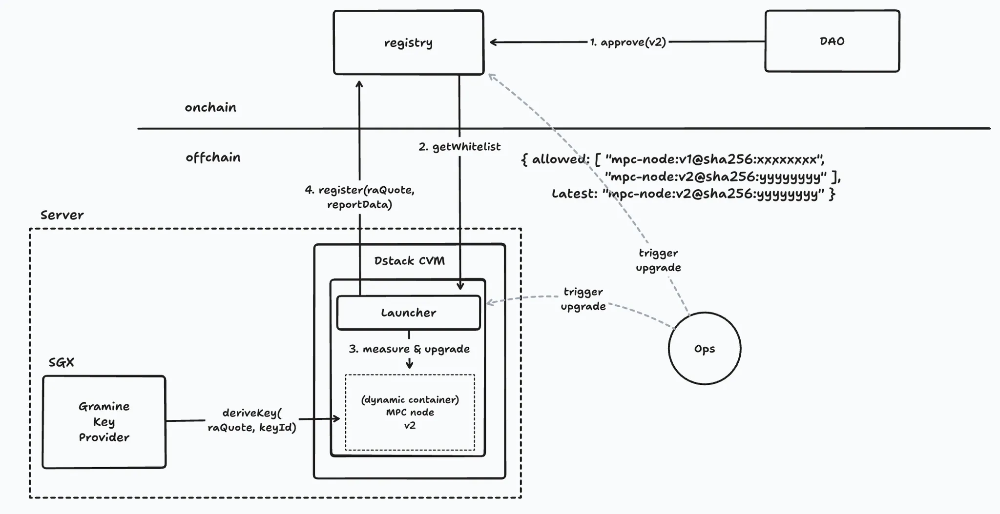
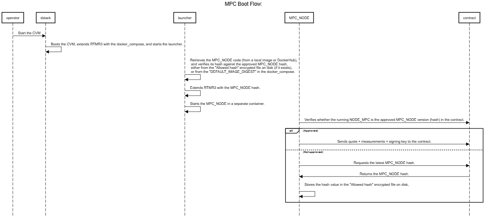
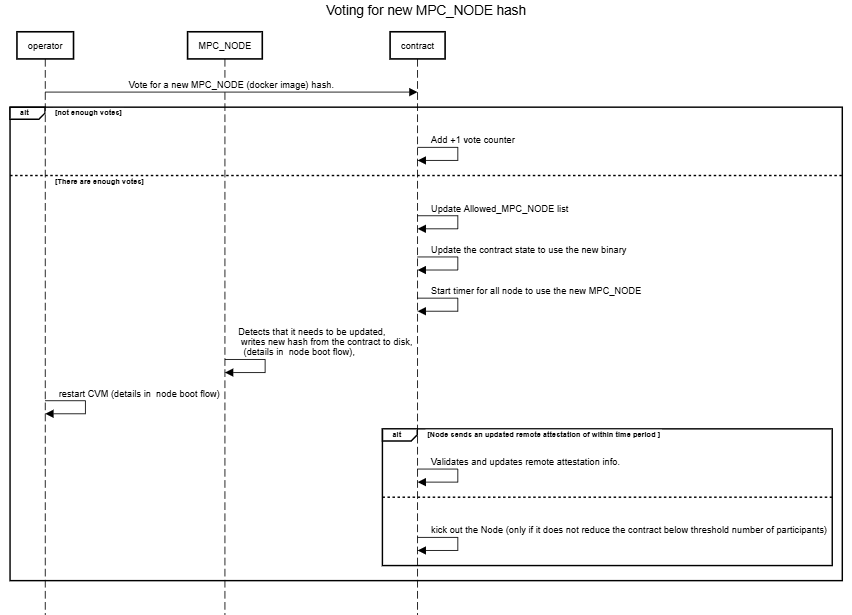
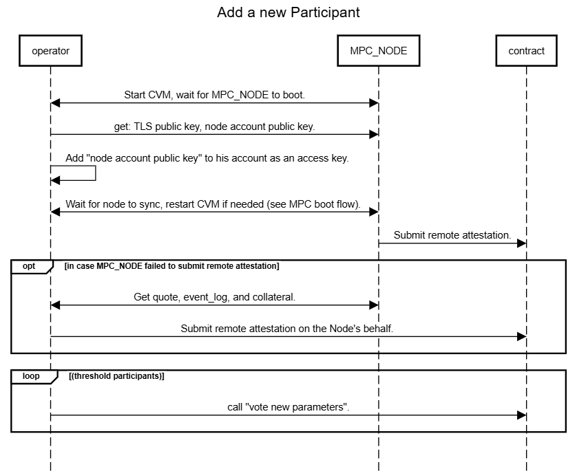

# Integrate TEE into MPC network

# Introduction and Background

This document describes the high level design for integrating a Trusted Execution Environment (TEE) into the existing Multi-Party Computation (MPC) network.


## Multi-Party Computation (MPC)

NEAR's Multi-Party Computation (MPC) network enables secure, decentralized key management and cryptographic operations without relying on a single trusted party. By distributing trust across independent participants, the MPC network removes single points of failure and strengthens both security and resilience.

For additional information about the MPC network see [Chain-signatures](https://docs.near.org/chain-abstraction/chain-signatures).


## **T**rusted **E**xecution **E**nvironment (TEE) 


A Trusted Execution Environment (TEE) is an isolated execution environment that runs separately from the host operating system. A TEE provides strong guarantees of confidentiality and integrity for the code and data it executes.

## Benefits of TEEs in MPC


These guarantees are valuable to the MPC network for two reasons:


1. **Enforcing backward secrecy** — TEEs ensure that nodes don't expose the secret key shares (and other assets) to their operators. Thus removing the need to trust the operators. Departed nodes cannot retain plaintext secret-shares, making collusion attacks (by the operators) after departure infeasible.
2. **Relaxing threat models** — TEEs allow the network to assume honest-but-curious adversaries instead of malicious ones, enabling the use of more efficient MPC protocols.

Our primary goal is to ensure that every MPC node runs inside a TEE—specifically Intel TDX in the current phase. Running nodes within TEEs enhances network security by providing strong assurances of both integrity and confidentiality.

# System Design

 

## **Launcher** Pattern 

We are using the **Launcher** **Pattern** described below as the base design to support secure upgrades of the MPC nodes. The real design is a bit more complicated and will be described in more detail afterwards. 


 


1. DAO → Registry (step 1 in the diagram):  DAO approves a new MPC Docker image hash.


2. Dstack → Gramine Key Provider: Retrieves decryption key (the key is derived from the launcher docker-compose measurements) 
3. Dstack: Decrypts the drive, Pulls the Launcher from dockerhub, extends RTMR3 with the Launcher's measurements , and starts the Launcher.  
4. Launcher → Retrieves the approved whitelist of MPC hashes from the registry(step2), Pulls the MPC docker image, verifies the MPC Docker image hash against the approved hash, measures it into RTMR3 (step 3) , and starts the MPC container.
5. MPC node → Registry: Registers  remote attestation information on the registry.(step 4)


## Actual design:


In **Launcher Design** above, the Launcher code can't be upgraded easily, and is expected not to change. So, in order to simplify the  **Launcher's** code, the responsibility to retrieve the whitelisted MPC hashes from the registry is moved to the MPC node itself.

Steps 1–3 are the same, while steps 4–6 are different:


1. DAO → Registry (step 1 in the diagram):  DAO approves a new MPC Docker image hash.
2. Dstack → Gramine Key Provider: Retrieves decryption key (the key is derived from the launcher docker-compose measurements) 
3. Dstack: Decrypts the drive, Pulls the Launcher from dockerhub, extends RTMR3 with the Launcher's measurements , and starts the launcher.  
4. Launcher → If a MPC image hash exists on disk, use it. Otherwise, it uses a hard-coded initial  MPC hash to Pull the MPC docker image, verifies the MPC Docker image hash against the hard-coded initial MPC hash, measures it into RTMR3, and starts the MPC container.
5. MPC node → Registry: Checks if the MPC node is using the latest voted version on the registry. If not, it pulls the latest hash from the registry and saves it to disk (note - the CVM disk is encrypted using the key from step 2). In this case the Operator needs to restart the CVM, so steps 2–5 will be re-run.
6. MPC node → Registry: Registers remote attestation information on the registry.

Note - In some section of the document, we may refer to **Registry** as **Contract.** 

## Component breakdown and responsibilities:


* **Launcher** – Verifies the MPC Docker image hash against an approved hash value, measures it into RTMR3, and starts the container.
* **[Gramine Key Provider](https://github.com/MoeMahhouk/gramine-sealing-key-provider)** – Generates a sealing key for encrypting the TDX VM filesystem. The encryption key is derived from TDX VM measurements (including Launcher compose file, but not including the MPC nodes hash) , ensuring secrets at rest remain protected.
* **Dstack** – Performs initial RTMR measurements, manages encryption/decryption of the filesystem, starts the launcher script, and provides both quote generation APIs and external logs.
* **MPC node** – Executes MPC operations. It synchronizes the approved MPC Docker image hash with the contract state and produces remote attestation quotes for the contract and operator.
* **Registry/Contract (on-chain)** – Maintains the list of approved MPC Docker image hashes, enforces that MPC nodes are verified via TDX remote attestation, and provides existing MPC methods.
* **DAO - (on-chain)** – **Decentralized Autonomous Organization** , A collection of authorized operators/participants. They approve and vote for new MPC Docker image hashes, in addition to their existing governance responsibilities (such as voting participants in or out).

*Note* - In our MPC solution, those are referenced as **Participants** or **Operators.**


# Threat Model


## Assets

* TLS key
* Node Account key
* key share
* triples / pre signatures

At run time - Assets are protected by TDX HW that encrypts the CVM memory and provides an isolated execution environment.

At rest - Assets are saved encrypted on the disk. The key that encrypts the disk is generated by the SGX Local Key Store, and is derived based on the CVM measurements.

## Key Management Assumptions

There are two distinct Near Account Keys with different responsibilities:

* **Node key**
  * Used by the MPC node to perform specific contract calls (e.g., submitting attestation quotes, updating state).
  * Stays within the TEE boundary.
  * Integrity and correct usage depend on the TEE guarantees and the node execution environment.
* **Operator key**
  * Held by the operator outside of the TEE.
  * Used for governance actions such as DAO voting and approving new MPC Docker image hashes.
  * Requires explicit trust in the operator to safeguard this key, since it is not TEE-protected.


---

## Trust Assumptions

* **Operator**
  * Trusted to protect the operator key.
  * Not trusted with the TLS (`sign_pk`) key or the `Node Account Key`, which never leaves the TEE.
  * Not trusted to securely run the MPC node.
* **dstack**
  * Trusted as the software framework used to deploy MPC nodes.

    
* **MPC node code & NEAR node**
  * Code is Trusted.


---

## TEE Model Assumptions

* We conservatively assume the TEE protects **integrity** but not **confidentiality**.
  * In principle, TEEs are designed to guarantee both confidentiality (e.g., preventing the host from reading Enclave/CVM memory) and integrity.
  * However, due to a history of practical exploits (e.g., side-channel attacks such as cache timing, speculative execution leaks, and microarchitectural vulnerabilities), we choose not to rely on confidentiality guarantees.
  * This conservative stance mainly affects the types of MPC protocol optimizations we may choose to apply in the future, since we cannot assume secret values remain fully hidden from a powerful host adversary.
* Standard TEE threat model applies:
  * A privileged attacker with host-level (root) access can interrupt execution, inspect memory (but can't decrypt the CVM memory), and control scheduling.
  * Side-channel and hardware-based attacks are considered out of scope.


---

## Identified Risks

* **Rollback & asset reuse**
  * An entire MPC node disk may be replaced with a previous snapshot, leading to reuse of cryptographic assets (e.g., triples, presignatures).
  * Currently, these assets are persisted on disk — mitigation will be required in future iterations.

# High Level Flows


In this section, a more detailed description of the main flows is provided:

* MPC Node Boot flow  - Describes the boot sequence from the MPC Node's perspective.
* Voting for a new MPC node hash - describes the flow for voting for a new MPC docker image hash on the contract, and the effects on the MPC node.
* Adding a new participant  - describes the flow to add a new participant on the contract, including remote attestation from the node. 

## MPC boot flow


 


### MPC Boot Flow (Step-by-Step)


1. **Operator → Dstack**: The operator starts the CVM.
2. **Dstack**: Boots the CVM, extends RTMR3 with the `docker_compose`, and starts the Launcher container.
3. **Launcher**: Retrieves the MPC node code (either from a local image or DockerHub) and verifies its hash against the approved MPC node hash:
   * If the "Allowed hash" encrypted file exists on disk, use it.
   * Otherwise, fall back to the `DEFAULT_IMAGE_DIGEST` in the `docker_compose`.
4. **Launcher**: Extends RTMR3 with the verified MPC node hash.
5. **Launcher**: Starts the MPC node in a separate container.
6. **MPC Node → Contract**: Verifies whether the running MPC node hash matches the approved version recorded in the contract.
   * **If approved:**
     * The MPC node sends its attestation Information(Quote+reportData, collateral, TCBinfo),  and signing key to the contract.
   * **If not approved:**
     * The MPC node requests the latest approved MPC node hash from the contract.
     * The contract returns the approved hash.
     * The MPC node stores this hash value in the encrypted "Allowed hash" file on disk.
     * The **Operator** will need to restart the CVM (so it can be updated).


## Voting for a new MPC node hash

 


### Voting for a New MPC Node Hash (Step-by-Step)


1. **Operator → Contract**: The operator votes for a new MPC node Docker image hash.
2. **Contract**:
   * If there are **not enough votes yet**, increment the vote counter by +1.
   * If there **are enough votes** (threshold reached):

     
     1. Update the `Allowed_MPC_NODE` list with the new hash.
     2. Update the contract state to require this new hash.
     3. Start a timer for all nodes to upgrade to the new MPC node version.
3. **MPC Node**: Detects it must be updated. It then pulls and writes the new hash from the contract to disk (as described in the *Node Boot Flow*).
4. **Operator**: Restarts the CVM (see *Node Boot Flow* for details).
5. **MPC Node → Contract**:
   * If the node sends an updated remote attestation **within the required time period**, the contract validates and updates the node's attestation info.
   * Otherwise, if the node does not comply, the contract may remove ("kick out") the node — but only if doing so does not drop the total participants below the required threshold.

## Adding a New Participant

 


### Adding a New Participant (Step-by-Step)


1. **Operator ↔ MPC Node**: Start the CVM and waits for the MPC node to boot.
2. **Operator → MPC Node**: Retrieve the TLS public key and the node account public key.
3. **Operator**: Adds the node account public key to their operator account as an access key.
4. **Operator ↔ MPC Node**: Wait for the node to fully sync. If needed, restart the CVM (see *MPC Boot Flow*).
5. **MPC Node → Contract**: Submits its remote attestation.
6. **(Optional – if the MPC Node fails to submit remote attestation):**
   * Operator ↔ MPC Node: Collects the quote, event log, and collateral from the node.
   * Operator → Contract: Submits the remote attestation on behalf of the node.
7. **Loop (until threshold participants are reached):**
   * Operator → Contract: Calls `vote_new_parameters` to update the active participant set.


# Secret key Handling

The MPC node has two key pairs to protect: 

* Account key 

* P2P TLS Key


In contrast to the pre-TEE design, where those keys were generated by the operator,  in the TEE base design, both keys will be generated inside the CVM. 

The private key never leaves the CVM. While the public key can be exported from the CVM via an HTTP endpoint <IP>/public_data

The Operator will then register the node's account key as an additional access key for the node's near account, and provide it with the following permissions (TODO - add list of contract APIs) 

In addition - The node will generate multiple responder account keys as well. These are used to increase throughout when posting generated MPC signatures to the chain.

*Note - We plan (in future release) to add a restriction that some of  contract API can only be invoked with the node key and not the operators key, those enhancing the security and separation of duty.*

#  Design Details 

## Smart Contract API Changes

* New methods: Voting on the whitelisted docker images, retrieving whitelisted hashes, submitting participant (attestation) info, and removing  participants with invalid/stale attestation.
* Existing vote_new_parameters API:  keep the same interface , but voting will also include a verification of the remote attestation information of each node.

  ```rust
  pub struct Contract {
   
   
    /// (Prospective) Participants can submit their tee participant information through this
    /// endpoint.
   pub fn submit_participant_info(
          &mut self,
          #[serializer(borsh)] proposed_participant_attestation: Attestation,
          #[serializer(borsh)] tls_public_key: PublicKey,
      ) -> Result<(), Error>
      
   
     /// Propose a new set of parameters (participants and threshold) for the MPC network.
      /// If a threshold number of votes are reached on the exact same proposal, this will transition
      /// the contract into the Resharing state.
      ///
      /// The epoch_id must be equal to 1 plus the current epoch ID (if Running) or prospective epoch
      /// ID (if Resharing). Otherwise the vote is ignored. This is to prevent late transactions from
      /// accidentally voting on outdated proposals.   
   pub fn vote_new_parameters(
          &mut self,
          prospective_epoch_id: EpochId,
          proposal: ThresholdParameters,
      ) -> Result<(), Error> 
      
   
   ///If the vote threshold is reached and the new Docker image hash
   ///   is allowed by the TEE's RTMR3 measurement, the proposed hash is added
   ///   to the whitelist of approved MPC Docker images.   
   pub fn vote_code_hash(&mut self, code_hash: MpcDockerImageHash) -> Result<(), Error> 
   
    ///Returns all whitelisted Docker image hashes that have been approved
    ///     by the DAO and verified by the TEE.
    pub fn allowed_code_hashes(&mut self) -> Result<Vec<MpcDockerImageHash>, Error>
    
    /// Returns the last entry in the whitelist of allowed hashes.
    /// - Panics if the whitelist is empty (there must always be at least one hash).
    pub fn latest_code_hash(&mut self) -> Result<MpcDockerImageHash, Error>
    
      /// Verifies if all current participants have an accepted TEE state.
      /// Automatically enters a resharing, in case one or more participants do not have an accepted
      /// TEE state.
      /// Returns `false` and stops the contract from accepting new signature requests or responses,
      /// in case less than `threshold` participants run in an accepted Tee State.
      pub fn verify_tee(&mut self) -> Result<bool, Error>
  ```

  

*Note*: submit_participant_info - can be called either by the node or by the operator.

## MPC Node changes:

* Generate sign key (TLS p2p key) and account key by the node.
* Export public keys via <ip>/public_data HTTP endpoint
* Export remote attestation information via the same endpoint.
* Send remote attestation to the contract (via submit_participant_info) 
  *  On each boot (after state sync is completed)
  * Every 7 days.
* Call verify_tee every 7 days - in order to trigger a re-validation of attestation information on the contract.
* Monitor contract state - and if a new MPC docker image hash was voted successfully, pull that image and store on disk (so that the Launcher will use it for next boot)  

## Attestation Generation by MPC Node

The node will use the Dstack APIs in order to generate the remote attestation information including:

* A TDX quote (including RTMRs and reportData)
  * reportData ==  Version || SHA384(node's TLS P2P public  key)

    *Note* - In a future release, we plan to add the hash of node's public account key as well - in order to be able to add restriction on the operator calling some of the contract APIs 
* Collateral - the node will retrieve this from Phala's collateral endpoint [https://proof.t16z.com](https://proof.t16z.com/api/upload)

  *Note - In a future release we may move to other* Collateral *retrieval methods, like self hosted* DCAP, or on chain collateral.


*  Dstack TCP info + Event log. containing a list of Dstack configuration and list of events that extended the RTMRs.

For more information see Phala's attestation web page: <https://docs.phala.com/phala-cloud/attestation/overview>  

## Attestation verification on the contract:


Review Dstack [RMTR calculation and attestation](https://github.com/Dstack-TEE/dstack/blob/6b77340cf530b4532c5815039a74bb3a60302378/attestation.md) for more information


Those are the high level steps the contract does in order to verify the attestation quote generated by the MPC node.


1. Verify TDX quote (according to intel spec, mainly validating signatures and chain of trust). 
2. Verify Reportdata  ==  Version || SHA384(node's public signing key)

   byte Version=2 bytes, big endian.
3. Verify MRDT and RTMRs 0-2 against expected hard coded values.
4. Replay RTMR3 from the event log, and verify it matches the RTMR3 from the quote.
5. Re-create and verify app_compose and docker_compose against expect whitelist docker_compose values. 
6. Check for specific events in the event log and compare against expected values in the contract.

## Detailed Attestation verification


### MRTD  and RTMRs:0-2

For a specific Dstack version, and specific memory size and CPU number,  MRTD and RTMRs:0-2 should be fixed. 

In the contract we will have hard coded approved values for MRTD  and RTMRs:0-2.

In order to simplify the attestation code in the contract, we enforce the following configuration: 

* vCPU number = 8
* Memory size =64GB


Those values are measured into RTMR2, and can't be changed. 


### **RMTR3 expected Events**


The event log consists of a sorted list of entries of the form `imr: [0-3], event_type: <int>, digest: <hex string/sha384>, event: <string>, event_payload: <hex string>`. 

For example `{"imr":3,"event_type":134217729,"digest":"0f96812....","event":"mpc-hash","event_payload":"c97d9523b67...."}` is the event we defined to measure the mpc image digest the launcher starts. 


The contract will replay (recalculate) the expected RTMR3 value from the event log, and make sure it matches the **signed** RTMR3 from the TDX quote.  
Then it will look for specific events in the RTMR3 log, and make sure the a value measured into RTMR3, matches expected values.

List of important RTMR3 events:

* SGX Key Provider 
* MPC_docker_image_hash
* App compose / Docker Compose


**SGX Key Provider**  
Check that the `event_payload` of the key-provider event equals the expected hash:

```json
{
  "name": "local-sgx",
  "id": "<mr_enclave of the provider>"
}
```

**MPC_docker_image_hash**

The contract keep a list of approved MPC docker image hashes.
The contract will check that the event_log contains an RTMR3 entry `mpc-hash `that matches one of the  approved  hashes.

**Docker Compose**

Check that the event log contains an entry `compose-hash` that matches one of the approved (Launcher) docker_compose items in the contract.

**Details**

The Contract has a template of an approved (launcher)docker_compose file that was used to deploy the Launcher . An actual docker_compose file  can defer by exactly 1 line each. The line start with `DEFAULT_IMAGE_DIGEST=sha256:….` 

Each time a new MPC docker image hash is voted, The contract creates a new launcher compose file (from the template) that has the new hash, and adds it to the list.  
A valid Docker compose file to start the MPC node might look like the following

```javascript
version: '3.8'

services:
  web:
    image: barakeinavnear/launcher:latest
    container_name: launcher
    environment:
      - DOCKER_CONTENT_TRUST=1
      - DEFAULT_IMAGE_DIGEST=sha256:4b08c2745a33aa28503e86e33547cc5a564abbb13ed73755937ded1429358c9d # nearone/mpc-node-gcp:testnet-release

volumes:
      - /var/run/docker.sock:/var/run/docker.sock
      - /var/run/dstack.sock:/var/run/dstack.sock
      - /tapp:/tapp:ro
      - shared-volume:/mnt/shared:ro
volumes:
  shared-volume:
    name: shared-volume
```


Given this Docker compose file, the resulting `app-compose.json` might look like this. On the host, the app-compose file can be found in `meta-dstack/build/run/vm/*/shared/app-compose.json` while in the guest it is available at `/tapp/` and `/dstack/`.

```javascript
{
  "manifest_version": 2,
  "name": "launcher-mpc-node-0",
  "runner": "docker-compose",
  "docker_compose_file": "version: '3.8'\n\nservices:\n  web:\n    image: barakeinavnear/launcher:latest\n    container_name: launcher\n    environment:\n      - DOCKER_CONTENT_TRUST=1\n      - DEFAULT_IMAGE_DIGEST=sha256:4b08c2745a33aa28503e86e33547cc5a564abbb13ed73755937ded1429358c9d # nearone/mpc-node-gcp:testnet-release\n    volumes:\n      - /var/run/docker.sock:/var/run/docker.sock\n      - /var/run/dstack.sock:/var/run/dstack.sock\n      - /tapp:/tapp:ro\n      - shared-volume:/mnt/shared:ro\nvolumes:\n  shared-volume:\n    name: shared-volume",
  "docker_config": {

  },
  "kms_enabled": false,
  "gateway_enabled": false,
  "public_logs": true,
  "public_sysinfo": true,
  "local_key_provider_enabled": true,
  "allowed_envs": [],
  "no_instance_id": true
}
```

The specific format of `app-compose.json` depends on dstack (and version of dstack).  
This may change in the future (see dstack update section).


# MPC Node Upgradability


## Bootstrapping

On first boot, the launcher uses the environment variable `DEFAULT_IMAGE_DIGEST` (specified in the \`docker-compose.yaml\`) to determine which version of the MPC node to start. A key requirement here is that the default MPC image hash is included in the TDX quote measurement. Since the env variables are part of the `docker-compose.yaml` , which is measured as part of the dstack-specific `app-compose.yaml` file, this meets our requirement. Providing different default image hashes via this measured environment variables allows future MPC participants to start with a current MPC node version. At the same time, it allows us to detect if an MPC operator tries to join the MPC network with an arbitrary MPC image since this will fail remote attestation.

The contract can compute the expected TDX identity given an image hash. Since image hashes are voted for, the contract can compute the TDX identity for all valid image hashes. The expected TDX identity is compared against the identity of newly joining node.


## Upgrade of the MPC Node

Follow the launcher approach specified in <https://phalanetwork.notion.site/NEAR-One-MPC-node-in-Dstack-1c20317e04a1809bb955d6ec2dad9bfc>. The upgrade flow works as follows:

* A Participant proposes a new version of docker image hash onchain (in the smart contract).
* All Participants vote, and at some point there are sufficient votes for the proposed docker image hash and the vote passes.
* At this point, all nodes detect that a new version of docker image hash has been voted (because they index the chain) and write this new docker image hash to a file on disk with a hardcoded filename (`new_docker_image_hash` for example) 


* Upon restart:
  * the Launcher pulls docker image from a registry.
  * Verifies that the hash of the pulled docker image matches what is stored locally on `new_docker_image_hash`
  * Extends RTMR3 with the new  `new_docker_image_hash` 
  * Launches the MPC docker image

## Kicking out nodes with invalid attestation 

After a new MPC docker image hash has been successfully voted by Threshold participants.   
The old MPC docker image hash will still be valid for 7 days.  
After 7 days, any call to the contract API `verify_tee` will removing the old MPC hash from the approved list, and trigger a check for the validity of the registered attestation for each one of the participants.  

*Note* - Each MPC node will periodically call the `verify_tee`every 7 days.

If any participant fails this check (since it did not submit a remote attestation with the new MPC docker image hash), then this participant will be automatically kicked out from the network, and a key re-sharing between the remaining participants will start.  
Note - In case the number of remaining participants is less that the threshold. The node will not be kicked out, instead the contract will stop to accept signing requests until this is solved.

# MPC Network Upgrade from Non TEE to TEE

The approach is to support a 2 phase upgrade process.

**First contract upgrade:**

The contract will support both TEE and non TEE participants.  
If a node submitted a remote attestation to the contract, it must be valid, otherwise he can not join the network.  
But we will also allow participants to join without summiting remote attestation.  In this phase, all participants, **one by one**, will be moved to a TDX based MPC node. 

Then they will be removed from the network and added again while submitting their remote attestation

*Note - The move to TDX based MPC node, will force a change in the TLS and node account keys, therefor the removal and re-adding from the contract is necessary.*  
After all node have been migrated to TDX, and network is deemed stable (enough time has passed and enough test have been run). We will move to the second phase.


**Second contract upgrade**

In this upgrade, the contract will enforce that only nodes with valid remote attestation can join the network. 

In addition, any node without a valid attestation will be kick out.

TODO: there is an alternative option in discussion.

# Looking Ahead

In this section we are describing possible scenarios we might need to address in the future such as:  **Updating Dstack version** or **updating the Launcher**.

A possible security enhancement that are not planned for the first release such as **Node to Node RA-TLS.**

## Node to Node Authentication with RA-TLS


**Note** - not implemented in the current version

**Note**: the following is necessary only if we don't trust the confidentiality of a TEE. Specifically, we can have the `sign_pk` (network key) always generated inside the TEE and the node operator cannot move it outside without breaking the confidentiality of a TEE. In the smart contract changes proposed above, `sign_pk` would get verified when a node joins as part of its remote attestation.

MPC nodes authenticate each other upon connection. The expected behavior upon connection is as follows:

* They exchange a handshake message that contains the remote attestation
* Each node verifies the other node's remote attestation
* If verification passes then the handshake is successful. Otherwise the connection is dropped
* We should check whether we can use [the existing implementation](https://github.com/Dstack-TEE/dstack/tree/master/ra-tls) in dstack for this.

 

## Dstack version and upgrade:

We use a fixed Dstack version and OS image, and this version is reflected in the hardcoded expected RTMR values in the contract.  
Dstack upgrad is not supported in the first release.  
Future release:  
In case there is a need to upgrade Dstack, (e.g security bug or additional features)

The expected values of RTMRs:1-3 may change.  
In order to support this, a new contract with support for multiple allowed values of those RTMRs will be needed. 

## Launcher upgrade

The Launcher pattern was chosen since we want:  
1. To be able to upgrade the MPC node.
2. Prevent an upgrade to a malicious MPC node, that will read the keys from the encrypted disk and send them to the operator.

The Launcher is responsible for this logic, and the Launcher's code is measured and is used to derive the disk encryption key. Thus, it is not possible to upgrade the Launcher without losing the secrets on the disk: (key share, account/P2P keys)   

How do we upgrade the Launcher in case there is a critical bug:

1.  Need to upgrade the contract to accept both new and old Launcher measurements.
Then, for each node, (**one by one**) in a loop: 
2. Create a new CVM with the new Launcher code  -thus losing all the secrets.
3. Vote out and then back in each.


4. Depending on the implementation ,either 

   
   * Update the contract to enforce only the new launcher measurements (similar to the  non TEE to TEE upgrade process).   
   or  
   * Add a mechanism to kick out the node, after some time (as we do for old MPC node hash)

Note - An Alternative solution is to use the **back up key service** that is under design.

# Q&A (Reference Notes)

### Dstack & Builds
- **Q: What Dstack version should we use?**  
  **A:** Use version `0.52`. Commit `be9d0476a63e937eda4c13659547a25088393394` is the audited commit for Phala.  

- **Q: Does Dstack have a reproducible build?**  
  **A:** Yes. (Note: there was an issue in build 0.5; needs validation on 0.52.)  

- **Q: How do we create a reproducible build of the MPC binary?**  
  **A:**  
  - Use the [`Makefile`](https://github.com/Near-One/mpc/blob/6d5a3764dc745e8ade84356619f04d4bbceef6a5/Makefile), [`Dockerfile-gcp`](https://github.com/Near-One/mpc/blob/6d5a3764dc745e8ade84356619f04d4bbceef6a5/deployment/Dockerfile-gcp), and [`build-image.sh`](https://github.com/Near-One/mpc/blob/6d5a3764dc745e8ade84356619f04d4bbceef6a5/deployment/build-image.sh) (launcher branch).  
  - Running `./build-image.sh` in different environments should yield identical image digests.  
  - The Dockerfile pins dependencies (e.g., `openssl=3.0.15-1~deb12u1`, base image with sha256 digest).  
  - Makefile ensures reproducible Rust builds.  

---

### Availability & Registries
- **Q: What happens if DockerHub is not available?**  
  **A:**  
  - First release: Launcher can be configured to pull from an alternative registry.  
  - Future release: Support manual builds and pulling from host OS instead of DockerHub.  

---

### Attestation & Verification
- **Q: Who should send the quote and event log to the contract?**  
  **A:**  
  - Periodic or after hash change: the **node**.  
  - When adding participants: the **operator**.  

- **Q: Do we need a dedicated contract API for periodic verification?**  
  **A:** Not in the first release. However, `submit_attestation_report` will exist and can be reused.  

- **Q: How do we handle quote collateral?**  
  **A:**  
  - First release: Retrieve from Phala endpoint <https://proof.t16z.com/>.  
  - Future releases: Options include self-hosted DCAP, operator-provided services, or on-chain storage.  

- **Q: What do we vote for in the contract — MPC node hash, docker-compose hash, or both?**  
  **A:** Vote for the **MPC node docker image hash** (digest).  

- **Q: What about the launcher docker image hash?**  
  **A:** Keep as text for reproducibility; can reconstruct per MPC docker hash.  

- **Q: Do we validate that the participant’s signing key is in the quote.reportData?**  
  **A:** Yes. This should be done when adding a participant and during periodic attestation.  

---

### Upgrade & Hash Management
- **Q: How do we handle the period between updating the digest hash and all nodes upgrading?**  
  **A:** Both old and new hashes remain valid temporarily. Need to track which nodes submitted attestation for the new hash.  

- **Q: Should we vote for RTMR3 values directly or compute them in the contract?**  
  **A:** Either:  
  - Operators compute and vote on expected RTMR3 values.  
  - Or vote for image digest and have contract replay RTMR3.  
  → (Patrick to check gas costs of replaying RTMR3.)  

- **Q: How to ensure operator talks to their own node, not another?**  
  **A:** Node generates attestation with TLS + account keys in `reportData`. Operator uses this to authenticate. (No nonce-signing step yet, but integrity of node code in RTMR3 is relied upon.)  

---

### Miscellaneous
- **Q: What should we do with timestamps?**  
  **A:** Use block time.  

- **Q: Periodic verification of MPC node in TEE — how often?**  
  **A:** Not part of first release. Future contract API will define interval.  

- **Q: Do user config options (log level, rust_backtrace, home dir) pose risks?**  
  **A:** Needs review, since these are not measured and could introduce vulnerabilities.  

- **Q: Security of docker image hash verification (via `docker pull`)?**  
  **A:** Needs deeper audit — verify how Docker ensures image digest integrity.  
