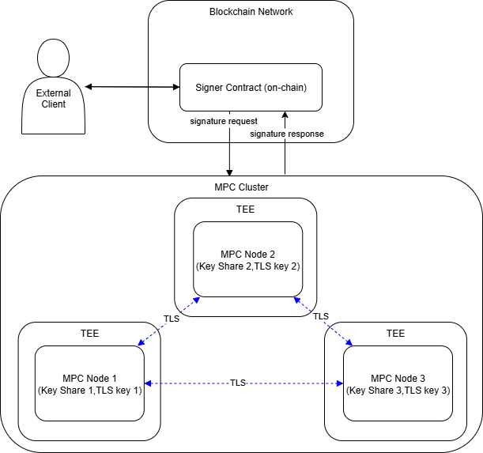
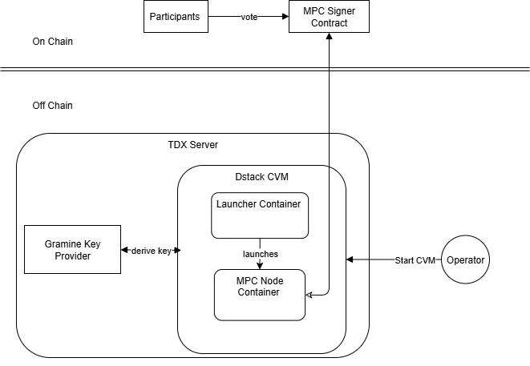
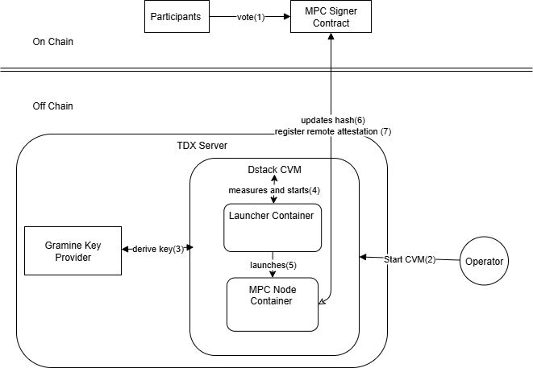
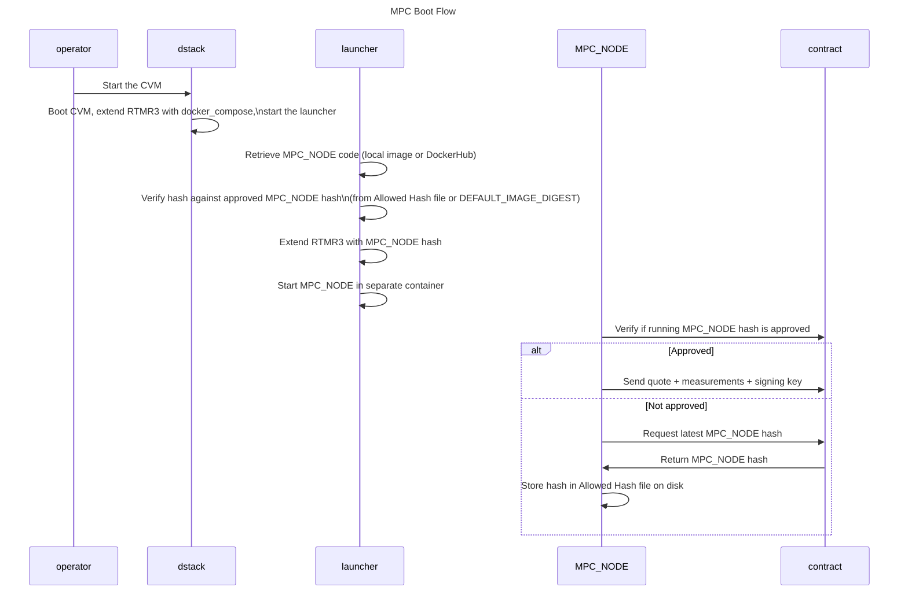
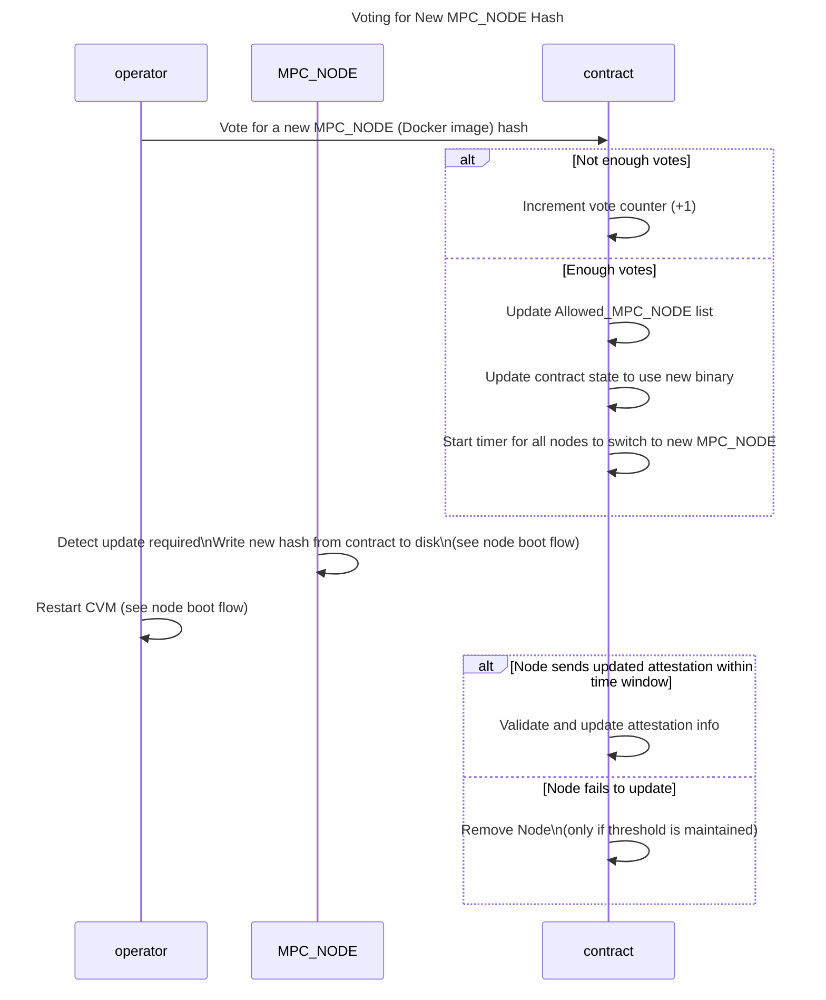
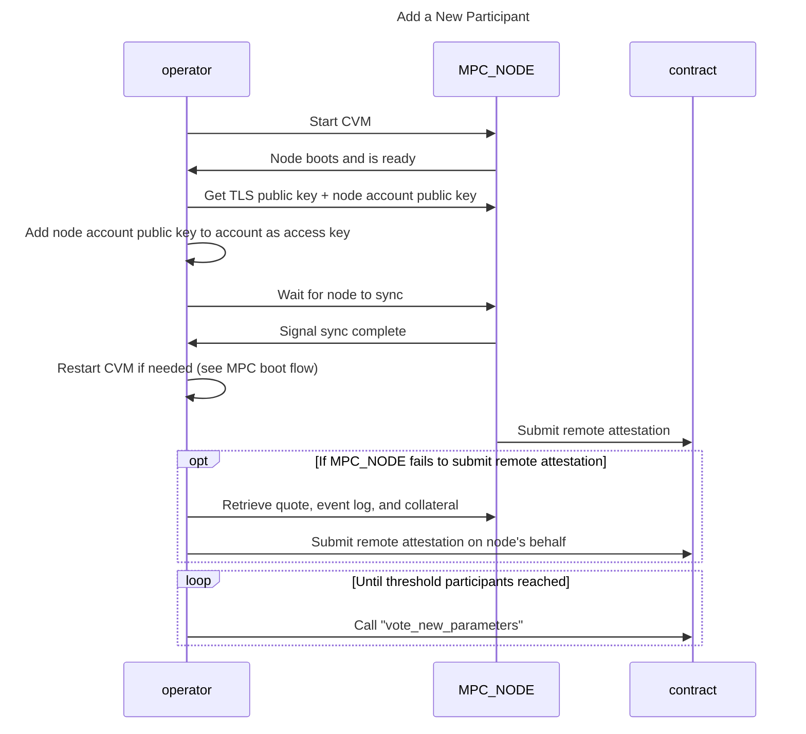

# Integrate TEE into MPC network

# Introduction and Background

This document describes the high level design for integrating a Trusted Execution Environment (TEE) into the existing Multi-Party Computation (MPC) network.

## Multi-Party Computation (MPC)

NEAR's Multi-Party Computation (MPC) network enables secure, decentralized key management and cryptographic operations without relying on a single trusted party. By distributing trust across independent participants, the MPC network removes single points of failure and strengthens both security and resilience.

For additional information about the MPC network see [Chain-signatures](https://docs.near.org/chain-abstraction/chain-signatures).

## **T**rusted **E**xecution **E**nvironment (TEE)

A **t**rusted **e**xecution **e**nvironment (TEE) is an environment isolated from the host operating system. A TEE provides security guarantees about confidentiality and integrity of the code and memory executed inside it.

## Benefits of TEEs in MPC

The security guarantees provided by TEEs are attractive to the MPC network for two reasons:

1. They help enforce **backward secrecy**. Since TEEs can guarantee that former nodes never gain lasting possession of plain text secret-shares, collusion attacks after departure become infeasible.
2. They allow to _relax the threat models_ (e.g. honest-but-curious instead of malicious adversaries). This allows the adoption of significantly more efficient MPC protocols.

Our primary goal is to ensure that every MPC node runs inside a TEE—specifically Intel TDX in the current phase. Running nodes within TEEs enhances network security by providing strong assurances of both integrity and confidentiality.

# System Design

## High-Level System Components

The MPC network is composed of the following key components:



### External Clients

- Application/Users with a NEAR account
- Send signature requests to the MPC Signer contract.

### MPC Signer Contract

- Maintains a record of all participants in the MPC network.
- Provides on-chain synchronization for MPC nodes, ensuring consistency across the network.
- Acts as the coordination layer between external clients and MPC nodes.

### MPC Nodes

- Execute the MPC algorithm to collectively generate cryptographic signatures.
- Submit generated signatures back to the blockchain via the contract.
- Operate in a decentralized manner to enhance security and resilience.

## TEE Design Overview

This is a more detailed component view of the MPC solution, covering both on-chain and off-chain elements, and focusing on the MPC node and how it is secured using **Intel TDX**.



### MPC Signer Contract (On-Chain)

- Maintains the list of approved MPC Docker image hashes.
- Enforces TDX remote attestation for MPC nodes.
- Exposes existing MPC methods for network operation.

### Participants (On-Chain)

- Authorized members of the network.
- Approve and vote on new MPC Docker image hashes.
- Handle governance responsibilities (e.g., voting participants in or out).

### TDX Server

- A Confidential Virtual Machine (CVM) host running on **Intel TDX-capable hardware**.
- Provides hardware-enforced isolation between the TDX VM (running the MPC node stack) and the untrusted host environment.
- Generates **measurement registers (MRTD, RTMRs)** that reflect the loaded software stack.
- Produces **attestation quotes** that can be verified remotely by the MPC Signer Contract and Participants.
- Ensures confidentiality and integrity of both data and code running inside the CVM.
- More Details can be found here [Intel TDX](https://www.intel.com/content/www/us/en/developer/tools/trust-domain-extensions/overview.html)

### Dstack

- Acts as the runtime TDX orchestrator for the CVM.
- Abstracts and orchestrates many of the TDX interfaces.
- Performs initial **RTMR measurements**.
- Manages encryption and decryption of the filesystem.
- Starts the Launcher.
- Provides **quote generation APIs** and external logs.
- More details can be found here: [Dstack](https://github.com/Dstack-TEE/dstack).

### Gramine Key Provider

- Generates a sealing key for encrypting the TDX VM filesystem.
- Derives the encryption key from TDX VM measurements (including the Launcher compose file, but excluding the MPC node hash).
- Ensures secrets at rest remain protected.
- More details can be found here: [Gramine Key Provider](https://github.com/MoeMahhouk/gramine-sealing-key-provider).

### Launcher

- Verifies the MPC Docker image hash against an approved hash value.
- Measures the verified hash into **RTMR3**.
- Starts the MPC node container.

### MPC Node

- Executes MPC operations.
- Synchronizes the approved MPC Docker image hash with the on-chain contract state.
- Produces remote attestation quotes for both the contract and the operator.

#### Node Behavior

##### Participant Set Management

A node must only participate in the MPC protocol if it is in the set of active participants of the current running or resharing epoch. The TLS key of a node acts as a unique identifier for this purpose _(implemented in [#1032](https://github.com/near/mpc/pull/1032/files#diff-c54adafe6cebf73c37af97ce573a28c60593be635aa568ec93e912b8f286aa83R181))_.

##### Connection Management

Due to limitations of the current implementation, nodes need to drop and re-establish all connections whenever there is a change in the participant set. Before the migration feature was added, this was only possible when the epoch ID changed, which happened only during a protocol state change.

Now, nodes are able to recognize and re-establish connections when the participant set changes without an epoch incrementing. This enables node migrations without requiring a full resharing process _(implemented in [#1061](https://github.com/near/mpc/pull/1061) and [#1032](https://github.com/near/mpc/pull/1032))_.

##### Migration Handling

When a node is removed from the participant set during a migration process, all remaining nodes must remove any triples and pre-signatures that involve the removed node _(implemented in [#1032](https://github.com/near/mpc/pull/1032))_.

#### Web Endpoints

The MPC node exposes web endpoints over which the backup service can submit requests. These endpoints require mutual TLS authentication using the published P2P keys.

The exposed endpoints are:

- **GET /get_keyshares** - Returns the encrypted keyshares if a valid backup service is registered in the contract.
- **PUT /set_keyshares** - Accepts encrypted keyshares from the backup service to restore a recovering node.

### Operators

- Manage the CVM and the MPC nodes.

> **Note:** In this MPC solution, _Participants_ also act as _Operators_.

## **Launcher** Pattern

We are using modified version of the **Launcher** **Pattern** described below in order to allow secure upgrades of the MPC node.



1. **Participants → MPC Signer Contract**

   - Participants approve a new MPC Docker image hash.

2. **Operator**

   - Starts the CVM.

3. **Dstack → Gramine Key Provider**

   - Retrieves the decryption key.
   - The key is derived from the Launcher's docker-compose measurements.

4. **Dstack**

   - Decrypts the drive.
   - Pulls the Launcher from DockerHub.
   - Extends **RTMR3** with the Launcher's measurements.
   - Starts the Launcher.

5. **Launcher**

   - If an MPC image hash exists on disk, it uses that hash.
   - Otherwise, it falls back to a hard-coded initial MPC hash:
     - Pulls the MPC Docker image.
     - Verifies the MPC Docker image hash against the initial hash.
     - Measures the hash into **RTMR3**.
     - Starts the MPC container.

6. **MPC Node → MPC Signer Contract**

   - Checks if the MPC node is running the latest approved version on-chain.
   - If not, it pulls the latest hash from the MPC Signer Contract and saves it to disk.
   - (Note: The CVM disk is encrypted with the key retrieved in step 3).
   - In this case, the **Operator** must restart the CVM, causing steps 2–6 to be re-run.

7. **MPC Node → MPC Signer Contract**
   - Registers its remote attestation information on-chain.

# High Level Flows

In this section, a more detailed description of the main flows is provided:

- MPC Node Boot flow - Describes the boot sequence from the MPC Node's perspective.
- Voting for a new MPC node hash - describes the flow for voting for a new MPC docker image hash on the contract, and the effects on the MPC node.
- Adding a new participant - describes the flow to add a new participant on the contract, including remote attestation from the node.

## MPC boot flow



### MPC Boot Flow (Step-by-Step)

1. **Operator → Dstack**: The operator starts the CVM.
2. **Dstack**: Boots the CVM, extends RTMR3 with the `docker_compose`, and starts the Launcher container.
3. **Launcher**: Retrieves the MPC node code (either from a local image or DockerHub) and verifies its hash against the approved MPC node hash:
   - If the "Allowed hash" encrypted file exists on disk, use it.
   - Otherwise, fall back to the `DEFAULT_IMAGE_DIGEST` in the `docker_compose`.
4. **Launcher**: Extends RTMR3 with the verified MPC node hash.
5. **Launcher**: Starts the MPC node in a separate container.
6. **MPC Node → Contract**: Verifies whether the running MPC node hash matches the approved version recorded in the contract.
   - **If approved:**
     - The MPC node sends its attestation Information(Quote+reportData, collateral, TCBinfo), and signing key to the contract.
   - **If not approved:**
     - The MPC node requests the latest approved MPC node hash from the contract.
     - The contract returns the approved hash.
     - The MPC node stores this hash value in the encrypted "Allowed hash" file on disk.
     - The **Operator** will need to restart the CVM (so it can be updated).

## Voting for a new MPC node hash



### Voting for a New MPC Node Hash (Step-by-Step)

1. **Operator → Contract**: The operator votes for a new MPC node Docker image hash.
2. **Contract**:

   - If there are **not enough votes yet**, increment the vote counter by +1.
   - If there **are enough votes** (threshold reached):

     1. Update the `Allowed_MPC_NODE` list with the new hash.
     2. Update the contract state to require this new hash.
     3. Start a timer for all nodes to upgrade to the new MPC node version.

3. **MPC Node**: Detects it must be updated. It then pulls and writes the new hash from the contract to disk (as described in the _Node Boot Flow_).
4. **Operator**: Restarts the CVM (see _Node Boot Flow_ for details).
5. **MPC Node → Contract**:
   - If the node sends an updated remote attestation **within the required time period**, the contract validates and updates the node's attestation info.
   - Otherwise, if the node does not comply, the contract may remove ("kick out") the node — but only if doing so does not drop the total participants below the required threshold.

## Adding a New Participant



### Adding a New Participant (Step-by-Step)

1. **Operator ↔ MPC Node**: Start the CVM and waits for the MPC node to boot.
2. **Operator → MPC Node**: Retrieve the TLS public key and the node account public key.
3. **Operator**: Adds the node account public key to their operator account as an access key.
4. **Operator ↔ MPC Node**: Wait for the node to fully sync. If needed, restart the CVM (see _MPC Boot Flow_).
5. **MPC Node → Contract**: Submits its remote attestation.
6. **(Optional – if the MPC Node fails to submit remote attestation):**
   - Operator ↔ MPC Node: Collects the quote, event log, and collateral from the node.
   - Operator → Contract: Submits the remote attestation on behalf of the node.
7. **Loop (until threshold participants are reached):**
   - Operator → Contract: Calls `vote_new_parameters` to update the active participant set.

# Design Details

This section is intended for readers who want to **deep dive into the technical design choices** of the MPC solution.  
It expands on the high-level architecture by covering specific implementation details such as key handling,  
smart contract APIs, MPC node behavior, attestation generation and verification, and upgrade mechanisms.

## Smart Contract

This section describes the API and functionality with respect to TEE.

### Smart Contract APIs

- New methods: Voting on the whitelisted docker images, retrieving whitelisted hashes, submitting participant (attestation) info, and removing participants with invalid/stale attestation.
- Existing vote_new_parameters API: keep the same interface , but voting will also include a verification of the remote attestation information of each node.

```rust
pub struct Contract {

    /// (Prospective) Participants can submit their tee participant information through this
    /// endpoint.
    pub fn submit_participant_info(
           &mut self,
           #[serializer(borsh)] proposed_participant_attestation: Attestation,
           #[serializer(borsh)] tls_public_key: PublicKey,
       ) -> Result<(), Error>

    /// Propose a new set of parameters (participants and threshold) for the MPC network.
    /// If a threshold number of votes are reached on the exact same proposal, this will transition
    /// the contract into the Resharing state.
    ///
    /// The epoch_id must be equal to 1 plus the current epoch ID (if Running) or prospective epoch
    /// ID (if Resharing). Otherwise the vote is ignored. This is to prevent late transactions from
    /// accidentally voting on outdated proposals.
    pub fn vote_new_parameters(
           &mut self,
           prospective_epoch_id: EpochId,
           proposal: ThresholdParameters,
       ) -> Result<(), Error>

    ///If the vote threshold is reached and the new Docker image hash
    ///   is allowed by the TEE's RTMR3 measurement, the proposed hash is added
    ///   to the whitelist of approved MPC Docker images.
    pub fn vote_code_hash(&mut self, code_hash: MpcDockerImageHash) -> Result<(), Error>

    ///Returns all whitelisted Docker image hashes that have been approved
    ///     by the DAO and verified by the TEE.
    pub fn allowed_docker_image_hashes(&mut self) -> Result<Vec<MpcDockerImageHash>, Error>

    /// Verifies if all current participants have an accepted TEE state.
    /// Automatically enters a resharing, in case one or more participants do not have an accepted
    /// TEE state.
    /// Returns `false` and stops the contract from accepting new signature requests or responses,
    /// in case less than `threshold` participants run in an accepted Tee State.
    pub fn verify_tee(&mut self) -> Result<bool, Error>
}
```

_Note_: submit_participant_info - can be called either by the node or by the operator.

## MPC Node changes:

- Generate sign key (TLS p2p key) and account key by the node.
- Export public keys via <ip>/public_data HTTP endpoint
- Export remote attestation information via the same endpoint.
- Send remote attestation to the contract (via submit_participant_info)
  - On each boot (after state sync is completed)
  - Every 7 days.
- Call verify_tee every 7 days - in order to trigger a re-validation of attestation information on the contract.
- Monitor contract state - and if a new MPC docker image hash was voted successfully, pull that image and store on disk (so that the Launcher will use it for next boot)

### Secret key Handling

The MPC node has two key pairs to protect:

- Account key

- P2P TLS Key

In contrast to the pre-TEE design, where those keys were generated by the operator, in the TEE base design, both keys will be generated inside the CVM.

The private key never leaves the CVM. While the public key can be exported from the CVM via an HTTP endpoint <IP>/public_data

The Operator will then register the node's account key as an additional access key for the node's near account, and provide it with the following permissions (TODO: add list of contract APIs)

In addition - The node will generate multiple responder account keys as well. These are used to increase throughout when posting generated MPC signatures to the chain.

_Note - We plan (in future release) to add a restriction that some of contract API can only be invoked with the node key and not the operators key, those enhancing the security and separation of duty._

## Remote Attestation

This section covers both sides of the **remote attestation process** in the MPC solution:

1. **Attestation Generation by the MPC Node** – how the node produces a TDX attestation quote and supporting evidence using Dstack. This ensures that the node’s runtime environment, configuration, and MPC Docker image are correctly measured and can be proven to external verifiers.

2. **Attestation Verification by the Contract** – how the MPC Signer Contract validates the attestation data submitted by nodes. The contract checks measurement registers (MRTD, RTMRs), event logs, and cryptographic signatures against expected values to guarantee that only verified and approved MPC nodes participate in the network.

### Attestation Generation by MPC Node

The node will use the Dstack APIs in order to generate the remote attestation information including:

- A TDX quote (including RTMRs and reportData)

  - reportData == Version || SHA384(node's TLS P2P public key)

    _Note_ - In a future release, we plan to add the hash of node's public account key as well - in order to be able to add restriction on the operator calling some of the contract APIs

- Collateral - the node will retrieve this from Phala's collateral endpoint [https://proof.t16z.com](https://proof.t16z.com/api/upload)

  _Note - In a future release we may move to other_ Collateral _retrieval methods, like self hosted_ DCAP, or on chain collateral.

- Dstack TCP info + Event log. containing a list of Dstack configuration and list of events that extended the RTMRs.

For more information see Phala's attestation web page: <https://docs.phala.com/phala-cloud/attestation/overview>

## Attestation verification on the contract:

Review Dstack [RMTR calculation and attestation](https://github.com/Dstack-TEE/dstack/blob/6b77340cf530b4532c5815039a74bb3a60302378/attestation.md) for more information

Those are the high level steps the contract does in order to verify the attestation quote generated by the MPC node.

1. Verify TDX quote (according to intel spec, mainly validating signatures and chain of trust).
2. Verify Reportdata  == Version || SHA384(node's public signing key)

   byte Version=2 bytes, big endian.

3. Verify MRDT and RTMRs 0-2 against expected hard coded values.
4. Replay RTMR3 from the event log, and verify it matches the RTMR3 from the quote.
5. Re-create and verify app_compose and docker_compose against expect whitelist docker_compose values.
6. Check for specific events in the event log and compare against expected values in the contract.

## Detailed Attestation verification

### MRTD and RTMRs:0-2

For a specific Dstack version, and specific memory size and CPU number, MRTD and RTMRs:0-2 should be fixed.

In the contract we will have hard coded approved values for MRTD and RTMRs:0-2.

In order to simplify the attestation code in the contract, we enforce the following configuration:

- vCPU number = 8
- Memory size =64GB

Those values are measured into RTMR2, and can't be changed.

### **RMTR3 expected Events**

The event log consists of a sorted list of entries of the form `imr: [0-3], event_type: <int>, digest: <hex string/sha384>, event: <string>, event_payload: <hex string>`.

For example `{"imr":3,"event_type":134217729,"digest":"0f96812....","event":"mpc-hash","event_payload":"c97d9523b67...."}` is the event we defined to measure the mpc image digest the launcher starts.

The contract will replay (recalculate) the expected RTMR3 value from the event log, and make sure it matches the **signed** RTMR3 from the TDX quote.  
Then it will look for specific events in the RTMR3 log, and make sure the a value measured into RTMR3, matches expected values.

List of important RTMR3 events:

- SGX Key Provider
- MPC_docker_image_hash
- App compose / Docker Compose

**SGX Key Provider**  
Check that the `event_payload` of the key-provider event equals the expected hash:

```json
{
  "name": "local-sgx",
  "id": "<mr_enclave of the provider>"
}
```

**MPC_docker_image_hash**

The contract keep a list of approved MPC docker image hashes.
The contract will check that the event_log contains an RTMR3 entry `mpc-hash `that matches one of the approved hashes.

**Docker Compose**

Check that the event log contains an entry `compose-hash` that matches one of the approved (Launcher) docker_compose items in the contract.

**Details**

The Contract has a template of an approved (launcher)docker_compose file that was used to deploy the Launcher . An actual docker_compose file can defer by exactly 1 line each. The line start with `DEFAULT_IMAGE_DIGEST=sha256:….`

Each time a new MPC docker image hash is voted, The contract creates a new launcher compose file (from the template) that has the new hash, and adds it to the list.  
A valid Docker compose file to start the MPC node might look like the following

```yaml
version: '3.8'

services:
  web:
    image: barakeinavnear/launcher:latest
    container_name: launcher
    environment:
      - DOCKER_CONTENT_TRUST=1
      - DEFAULT_IMAGE_DIGEST=sha256:4b08c2745a33aa28503e86e33547cc5a564abbb13ed73755937ded1429358c9d # nearone/mpc-node-gcp:testnet-release

volumes:
      - /var/run/docker.sock:/var/run/docker.sock
      - /var/run/dstack.sock:/var/run/dstack.sock
      - /tapp:/tapp:ro
      - shared-volume:/mnt/shared:ro
volumes:
  shared-volume:
    name: shared-volume
```

Given this Docker compose file, the resulting `app-compose.json` might look like this. On the host, the app-compose file can be found in `meta-dstack/build/run/vm/*/shared/app-compose.json` while in the guest it is available at `/tapp/` and `/dstack/`.

```json
{
  "manifest_version": 2,
  "name": "launcher-mpc-node-0",
  "runner": "docker-compose",
  "docker_compose_file": "version: '3.8'\n\nservices:\n  web:\n    image: barakeinavnear/launcher:latest\n    container_name: launcher\n    environment:\n      - DOCKER_CONTENT_TRUST=1\n      - DEFAULT_IMAGE_DIGEST=sha256:4b08c2745a33aa28503e86e33547cc5a564abbb13ed73755937ded1429358c9d # nearone/mpc-node-gcp:testnet-release\n    volumes:\n      - /var/run/docker.sock:/var/run/docker.sock\n      - /var/run/dstack.sock:/var/run/dstack.sock\n      - /tapp:/tapp:ro\n      - shared-volume:/mnt/shared:ro\nvolumes:\n  shared-volume:\n    name: shared-volume",
  "docker_config": {},
  "kms_enabled": false,
  "gateway_enabled": false,
  "public_logs": true,
  "public_sysinfo": true,
  "local_key_provider_enabled": true,
  "allowed_envs": [],
  "no_instance_id": true
}
```

The specific format of `app-compose.json` depends on dstack (and version of dstack).  
This may change in the future (see dstack update section).

# MPC Node Upgradability

## Bootstrapping

On first boot, the launcher uses the environment variable `DEFAULT_IMAGE_DIGEST` (specified in the \`docker-compose.yaml\`) to determine which version of the MPC node to start. A key requirement here is that the default MPC image hash is included in the TDX quote measurement. Since the env variables are part of the `docker-compose.yaml` , which is measured as part of the dstack-specific `app-compose.yaml` file, this meets our requirement. Providing different default image hashes via this measured environment variables allows future MPC participants to start with a current MPC node version. At the same time, it allows us to detect if an MPC operator tries to join the MPC network with an arbitrary MPC image since this will fail remote attestation.

The contract can compute the expected TDX identity given an image hash. Since image hashes are voted for, the contract can compute the TDX identity for all valid image hashes. The expected TDX identity is compared against the identity of newly joining node.

## Upgrade of the MPC Node

Follow the launcher approach specified in <https://phalanetwork.notion.site/NEAR-One-MPC-node-in-Dstack-1c20317e04a1809bb955d6ec2dad9bfc>. The upgrade flow works as follows:

- A Participant proposes a new version of docker image hash onchain (in the smart contract).
- All Participants vote, and at some point there are sufficient votes for the proposed docker image hash and the vote passes.
- At this point, all nodes detect that a new version of docker image hash has been voted (because they index the chain) and write this new docker image hash to a file on disk with a hardcoded filename (`new_docker_image_hash` for example)

- Upon restart:
  - the Launcher pulls docker image from a registry.
  - Verifies that the hash of the pulled docker image matches what is stored locally on `new_docker_image_hash`
  - Extends RTMR3 with the new `new_docker_image_hash`
  - Launches the MPC docker image

## Kicking out nodes with invalid attestation

After a new MPC docker image hash has been successfully voted by Threshold participants.  
The old MPC docker image hash will still be valid for 7 days.  
After 7 days, any call to the contract API `verify_tee` will removing the old MPC hash from the approved list, and trigger a check for the validity of the registered attestation for each one of the participants.

_Note_ - Each MPC node will periodically call the `verify_tee`every 7 days.

If any participant fails this check (since it did not submit a remote attestation with the new MPC docker image hash), then this participant will be automatically kicked out from the network, and a key re-sharing between the remaining participants will start.  
Note - In case the number of remaining participants is less that the threshold. The node will not be kicked out, instead the contract will stop to accept signing requests until this is solved.

# Threat Model

This section outlines the threat model and key security considerations behind the solution design.

## Assets

- TLS key
- Node Account key
- key share
- triples / pre signatures

At run time - Assets are protected by TDX HW that encrypts the CVM memory and provides an isolated execution environment.

At rest - Assets are saved encrypted on the disk. The key that encrypts the disk is generated by the SGX Local Key Store, and is derived based on the CVM measurements.

## Key Management Assumptions

There are two distinct Near Account Keys with different responsibilities:

- **Node key**
  - Used by the MPC node to perform specific contract calls (e.g., submitting attestation quotes, updating state).
  - Stays within the TEE boundary.
  - Integrity and correct usage depend on the TEE guarantees and the node execution environment.
- **Operator key**
  - Held by the operator outside of the TEE.
  - Used for governance actions such as DAO voting and approving new MPC Docker image hashes.
  - Requires explicit trust in the operator to safeguard this key, since it is not TEE-protected.

---

## Trust Assumptions

- **Operator**
  - Trusted to protect the operator key.
  - Not trusted with the TLS (`sign_pk`) key or the `Node Account Key`, which never leaves the TEE.
  - Not trusted to securely run the MPC node.
- **dstack**
  - Trusted as the software framework used to deploy MPC nodes.
- **MPC node code & NEAR node**
  - Code is Trusted.

---

## TEE Model Assumptions

- We conservatively assume the TEE protects **integrity** but not **confidentiality**.
  - In principle, TEEs are designed to guarantee both confidentiality (e.g., preventing the host from reading Enclave/CVM memory) and integrity.
  - However, due to a history of practical exploits (e.g., side-channel attacks such as cache timing, speculative execution leaks, and microarchitectural vulnerabilities), we choose not to rely on confidentiality guarantees.
  - This conservative stance mainly affects the types of MPC protocol optimizations we may choose to apply in the future, since we cannot assume secret values remain fully hidden from a powerful host adversary.
- Standard TEE threat model applies:
  - A privileged attacker with host-level (root) access can interrupt execution, inspect memory (but can't decrypt the CVM memory), and control scheduling.
  - Side-channel and hardware-based attacks are considered out of scope.

---

## Identified Risks

- **Rollback & asset reuse**
  - An entire MPC node disk may be replaced with a previous snapshot, leading to reuse of cryptographic assets (e.g., triples, presignatures).
  - Currently, these assets are persisted on disk — mitigation will be required in future iterations.
