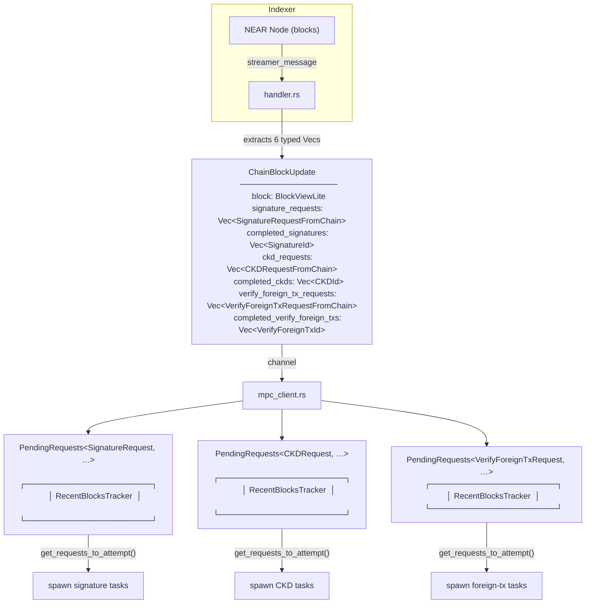
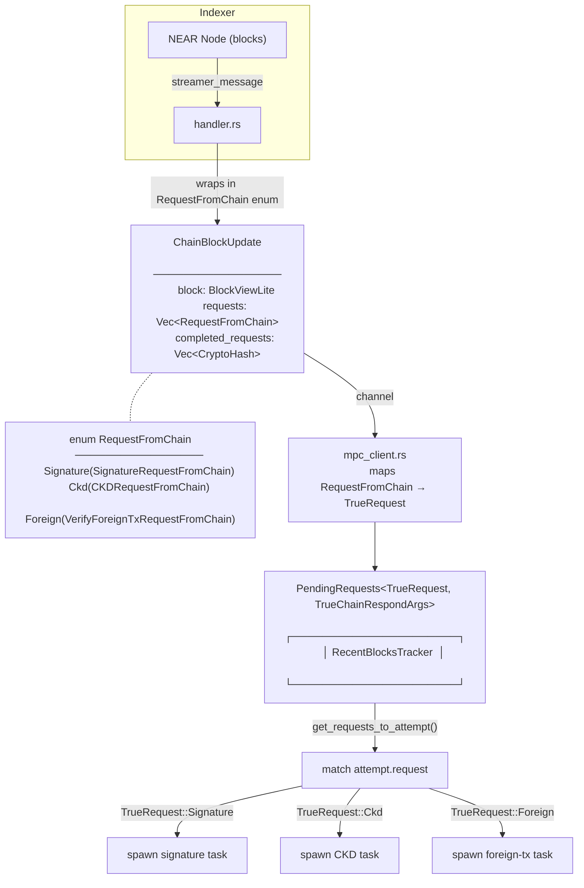

# Simplify Blocks Tracker: Consolidate PendingRequests Queues

## What is `RecentBlocksTracker`?

`RecentBlocksTracker<T>` tracks the topology of recently observed blocks within a sliding window (default 200 blocks). It maintains a tree of `BlockNode`s connected by parent pointers, indexed by a `hash_to_node: HashMap<CryptoHash, Arc<BlockNode>>`. Each node stores the block's height, hash, parent hash, and children.

Its main jobs:

- **`add_block`** — inserts a new block into the tree, attaches it to its parent, advances the canonical/final heads, and prunes blocks that fall below the sliding window.
- **`classify_block`** — given a block hash, returns whether the block is `RecentAndFinal`, `OptimisticAndCanonical`, `OptimisticButNotCanonical`, `OlderThanRecentWindow`, `NotIncluded`, or `Unknown`. This is how the queue decides which requests are safe to attempt.
- **`prune_old_blocks`** — walks the tree once to remove nodes whose height is below `canonical_head.height - window_size`.

**Compute profile:** Not compute-intensive. `add_block` does HashMap lookups/inserts plus walks the parent chain (bounded by window size). `classify_block` is a single HashMap lookup plus a few field reads. `prune_old_blocks` walks the tree once to trim nodes below the window. All operations are O(window_size) worst case, typically O(1)–O(few) on the common no-fork path. Memory is bounded by window_size blocks × number of forks (rare).

Because each `PendingRequests` queue owns its own `RecentBlocksTracker`, having three queues means maintaining three independent copies of this block tree—tripling the work for every `add_block` and `prune_old_blocks` call on every block. Consolidating to a single queue eliminates this redundancy.

## Before: Three Separate Queues

Each queue independently:
1. Receives its own typed slice of the block update via `notify_new_block`
2. Maintains its own `RecentBlocksTracker` (duplicate block-tree work)
3. Produces its own `get_requests_to_attempt()` results
4. Has a dedicated task-spawn loop

## After: Single Unified Queue

The single queue:
1. Receives all request types in one `notify_new_block` call
2. Maintains one `RecentBlocksTracker` (block tree work done once)
3. Produces one combined `get_requests_to_attempt()` result
4. A single loop dispatches via `match` on `TrueRequest` variants

## Summary

| Aspect | Before | After |
|--------|--------|-------|
| `PendingRequests` instances | 3 (one per request type) | 1 (`TrueRequest` enum) |
| `RecentBlocksTracker` instances | 3 (duplicate block-tree work) | 1 |
| `ChainBlockUpdate` fields | 6 typed Vecs (2 per request type) | 2 (`Vec<RequestFromChain>` + `Vec<CryptoHash>`) |
| `notify_new_block` calls per block | 3 | 1 |
| `get_requests_to_attempt` calls | 3 | 1 |
| Task-spawn loops | 3 separate loops | 1 loop with `match` dispatch |
| `Request::get_type()` | Static method | Instance method (`&self`) |
| Completion IDs | 3 typed ID types (`SignatureId`, `CKDId`, …) | Unified `CryptoHash` |
