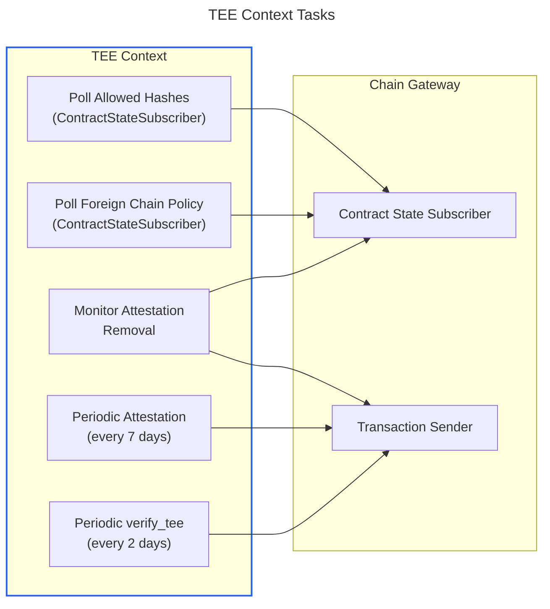

# TEE Context

The TEE Context is a shared crate managing the TEE attestation lifecycle. The MPC node already implements the attestation tasks in [`remote_attestation.rs`][remote-attestation] and [`allowed_image_hashes_watcher.rs`][allowed-hashes-watcher]; they will be extracted into a standalone crate, depending on [`tee-authority`] and [`mpc-attestation`], reusable by all services. In the MPC node, the [MPC Context][mpc-context] depends on the TEE Context for attestation and adds MPC-specific orchestration on top. Other services (Archive Signer, backup service) use the TEE Context directly.

For the shared boot, attestation, governance, and upgrade patterns that the TEE Context builds on, see [TEE Lifecycle][tee-lifecycle].

[tee-lifecycle]: tee-lifecycle.md
[mpc-context]: indexer-design.md
[`tee-authority`]: https://github.com/near/mpc/tree/ce53324f472aa89fdf702d7482211bbdb6a44967/crates/tee-authority
[`mpc-attestation`]: https://github.com/near/mpc/blob/ce53324f472aa89fdf702d7482211bbdb6a44967/crates/mpc-attestation/src/attestation.rs#L29

[remote-attestation]: https://github.com/near/mpc/blob/ce53324f472aa89fdf702d7482211bbdb6a44967/crates/node/src/tee/remote_attestation.rs
[allowed-hashes-watcher]: https://github.com/near/mpc/blob/ce53324f472aa89fdf702d7482211bbdb6a44967/crates/node/src/tee/allowed_image_hashes_watcher.rs#L103
[periodic-attestation]: https://github.com/near/mpc/blob/ce53324f472aa89fdf702d7482211bbdb6a44967/crates/node/src/tee/remote_attestation.rs#L140
[monitor-attestation-removal]: https://github.com/near/mpc/blob/ce53324f472aa89fdf702d7482211bbdb6a44967/crates/node/src/tee/remote_attestation.rs#L187
[verify-tee-loop]: https://github.com/near/mpc/blob/ce53324f472aa89fdf702d7482211bbdb6a44967/crates/node/src/mpc_client.rs#L133
[verify-tee-contract]: https://github.com/near/mpc/blob/ce53324f472aa89fdf702d7482211bbdb6a44967/crates/contract/src/lib.rs#L1380

The TEE Context uses [`tee-authority`] to generate TDX attestation quotes and submits them to the governance contract, which verifies them using DCAP logic from [`mpc-attestation`]. For verification details, see [Attestation verification on the contract][attestation-verification].

[attestation-verification]: securing-mpc-with-tee-design-doc.md#attestation-verification-on-the-contract

## Interface

```rust
/// Allowed TEE hashes fetched from the governance contract.
pub struct AllowedTeeHashes {
    pub allowed_docker_image_hashes: Vec<MpcDockerImageHash>,
    pub allowed_launcher_compose_hashes: Vec<LauncherDockerComposeHash>,
}

/// Identity of this node and which governance contract to monitor.
pub struct TeeNodeIdentity {
    pub node_account_id: AccountId,
    pub tls_public_key: Ed25519PublicKey,
    pub account_public_key: Ed25519PublicKey,
    /// e.g. v1.signer (MPC node) or the HOT governance contract (Archive Signer).
    pub governance_contract: AccountId,
}

/// Attestation parameters.
pub struct AttestationInfo {
    pub tee_authority: TeeAuthority,
    pub current_image: MpcDockerImageHash,
}

impl TeeContext {
    /// Subscribes to the governance contract, spawns background tasks, and
    /// waits for the first successful poll of contract state before returning.
    /// After construction, allowed_tee_hashes() is guaranteed to return data.
    pub async fn new(
        chain_gateway: ChainGateway,
        node_identity: TeeNodeIdentity,
        attestation_info: AttestationInfo,
    ) -> Result<Self, Error>;

    /// Returns the latest allowed TEE hashes (synchronous).
    pub fn allowed_tee_hashes(&self) -> Result<AllowedTeeHashes, Error>;

    /// Resolves when the allowed TEE hashes change.
    /// Returns Err if the underlying subscription closes.
    pub async fn allowed_tee_hashes_changed(&self) -> Result<(), Error>;

    /// Returns the latest foreign chain policy (synchronous).
    pub fn foreign_chain_policy(&self) -> Result<ForeignChainPolicy, Error>;

    /// Resolves when the foreign chain policy changes.
    /// Returns Err if the underlying subscription closes.
    pub async fn foreign_chain_policy_changed(&self) -> Result<(), Error>;
}
```

The accessor pattern follows the [`ContractStateStream<T>`][contract-state-stream] interface from the Chain Gateway: synchronous reads return the last-seen value, `_changed()` methods resolve on the next update and return `Result<(), Error>` to signal subscription closure. The TEE Context does not write to disk — persistence is the caller's responsibility.

[contract-state-stream]: indexer-design.md#contract-state-subscriber

Each service points the TEE Context at its own governance contract via `TeeNodeIdentity::governance_contract`. All governance contracts expose the same TEE view/call methods since they share [`TeeState`][tee-state].

[tee-state]: https://github.com/near/mpc/blob/ce53324f472aa89fdf702d7482211bbdb6a44967/crates/contract/src/tee/tee_state.rs#L92

### Usage: MPC Node

The MPC node wraps the TEE Context inside the [MPC Context][mpc-context]. It spawns a task on `allowed_tee_hashes_changed()` to write hashes to disk for the Launcher:

```rust
let tee_ctx = TeeContext::new(chain_gateway, node_identity, attestation_info).await?;
tokio::spawn(async move {
    loop {
        tee_ctx.allowed_tee_hashes_changed().await?;
        let hashes = tee_ctx.allowed_tee_hashes()?;
        write_hashes_to_disk(&hashes.allowed_docker_image_hashes).await?;
    }
});
```

### Usage: Archive Signer

The [Archive Signer][archive-signer] uses the TEE Context directly. Since `new()` waits for the first poll, the image hash check at boot is straightforward:

[archive-signer]: hot-tee-signing-design.md

```rust
let tee_ctx = TeeContext::new(chain_gateway, node_identity, attestation_info).await?;
let hashes = tee_ctx.allowed_tee_hashes()?;
if !hashes.allowed_docker_image_hashes.contains(&current_image) {
    bail!("image not approved");
}
// Attestation submission and verify_tee run automatically in background.
start_http_server(tee_ctx).await?;
```

## Tasks

The TEE Context runs five long-lived async tasks:



1. **Poll allowed hashes** — Subscribes to [`allowed_docker_image_hashes()`][allowed-docker-image-hashes] and [`allowed_launcher_compose_hashes()`][allowed-launcher-compose-hashes] via the [Contract State Subscriber][contract-state-subscriber]. Updated hashes are exposed through `allowed_tee_hashes()` and `allowed_tee_hashes_changed()`. (Reference: [`monitor_allowed_image_hashes`][allowed-hashes-watcher])

2. **Periodic attestation** — Every 7 days, generates a fresh TDX attestation quote and submits it to the governance contract via [`submit_participant_info()`][submit-participant-info]. Includes exponential backoff retries. (Reference: [`periodic_attestation_submission`][periodic-attestation])

3. **Monitor attestation removal** — Watches the contract's attested-nodes list via the Contract State Subscriber. If this node's attestation is removed (e.g., due to image hash rotation), resubmits immediately. (Reference: [`monitor_attestation_removal`][monitor-attestation-removal])

4. **Periodic `verify_tee`** — Every 2 days, sends a [`verify_tee()`][verify-tee-contract] transaction to the governance contract. Triggers on-chain re-validation of all stored attestations and removal of nodes with expired image hashes. Currently lives in the [MPC node][verify-tee-loop]; moving it into the TEE Context makes it available to all services.

5. **Poll foreign chain policy** — Subscribes to the governance contract's [`get_foreign_chain_policy()`][get-foreign-chain-policy] view method via the Contract State Subscriber. Exposed through `foreign_chain_policy()` and `foreign_chain_policy_changed()` — for the MPC node this feeds [foreign transaction verification][foreign-tx-verification], for the Archive Signer it configures the validation SDK's RPC providers. (Reference: the MPC node currently fetches this [on-demand in the coordinator][coordinator-fcp]; the TEE Context will move it to continuous polling.)

[foreign-tx-verification]: foreign-chain-transactions.md
[contract-state-subscriber]: indexer-design.md#contract-state-subscriber

[foreign-chain-policy-type]: https://github.com/near/mpc/blob/ce53324f472aa89fdf702d7482211bbdb6a44967/crates/contract-interface/src/types/foreign_chain.rs#L570
[coordinator-fcp]: https://github.com/near/mpc/blob/ce53324f472aa89fdf702d7482211bbdb6a44967/crates/node/src/coordinator.rs#L378
[allowed-docker-image-hashes]: https://github.com/near/mpc/blob/ce53324f472aa89fdf702d7482211bbdb6a44967/crates/contract/src/lib.rs#L1624
[allowed-launcher-compose-hashes]: https://github.com/near/mpc/blob/ce53324f472aa89fdf702d7482211bbdb6a44967/crates/contract/src/lib.rs#L1638
[submit-participant-info]: https://github.com/near/mpc/blob/ce53324f472aa89fdf702d7482211bbdb6a44967/crates/contract/src/lib.rs#L820
[get-foreign-chain-policy]: https://github.com/near/mpc/blob/ce53324f472aa89fdf702d7482211bbdb6a44967/crates/contract/src/lib.rs#L1663
