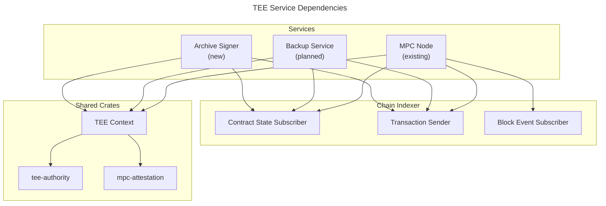
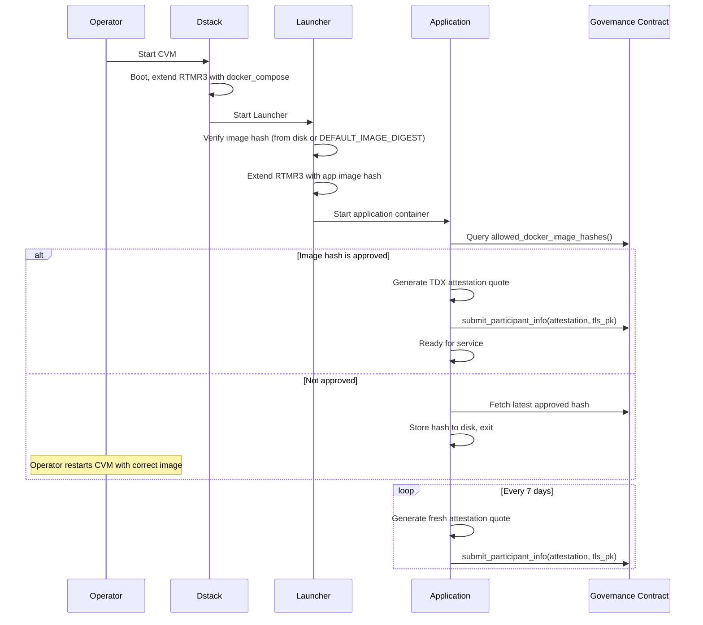
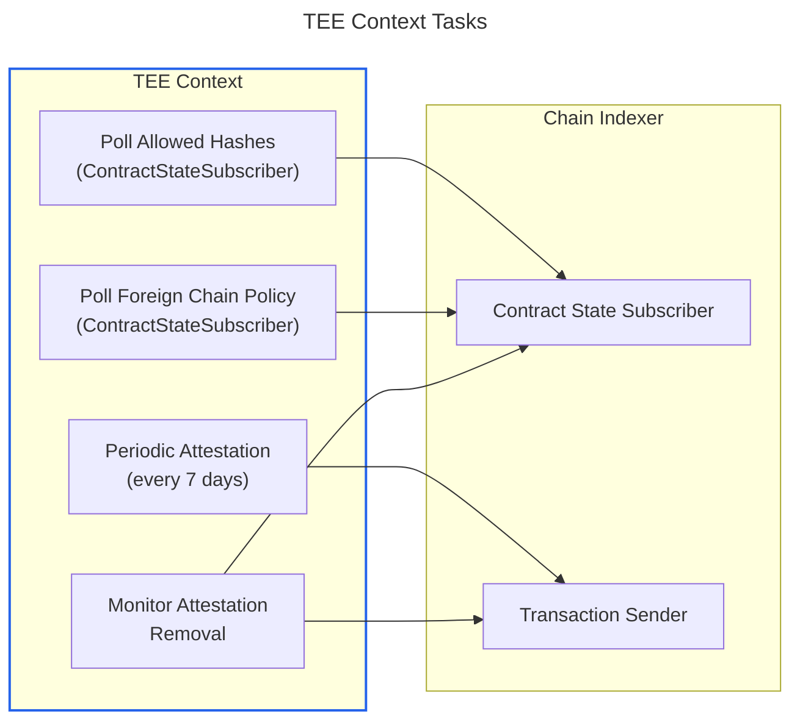

# TEE Lifecycle

This document describes the generic TEE attestation, governance, and upgrade patterns shared by all TEE services in this repository:
- The MPC node
- The backup service
- The [Archive Signer][archive-signer]

For MPC-network-specific TEE integration (threat model, participant management, resharing), see [Securing MPC with TEE][securing-mpc-with-tee].

[archive-signer]: hot-tee-signing-design.md
[securing-mpc-with-tee]: securing-mpc-with-tee-design-doc.md

## Overview

All TEE services run inside a [Dstack][dstack] CVM on Intel TDX hardware. They share a common attestation lifecycle managed by reusable crates and the [Chain Indexer][chain-indexer]:

| Component | Purpose |
|-----------|---------|
| [`tee-authority`][tee-authority] | Attestation generation (TDX quotes, collateral retrieval) |
| [`mpc-attestation`][mpc-attestation] | On-chain attestation verification (DCAP, RTMR replay) |
| TEE Context | Shared crate orchestrating the attestation lifecycle tasks |
| [Contract State Subscriber][contract-state-subscriber] | Polls governance contract state |
| [Transaction Sender][transaction-sender] | Submits attestation transactions to the governance contract |

[dstack]: https://github.com/Dstack-TEE/dstack
[chain-indexer]: indexer-design.md
[tee-authority]: https://github.com/near/mpc/tree/main/crates/tee-authority
[mpc-attestation]: https://github.com/near/mpc/blob/main/crates/mpc-attestation/src/attestation.rs
[contract-state-subscriber]: indexer-design.md#contract-state-subscriber
[transaction-sender]: indexer-design.md#transaction-sender

### Crate Dependencies



## CVM Boot Sequence (Launcher Pattern)

Every TEE service follows the same boot sequence. The [Launcher pattern][launcher-pattern] ensures that only approved images run inside the CVM, with measurements recorded in the TDX attestation.



Individual services may add steps between "Start application container" and the image hash check — for example, the Archive Signer performs [key import][key-import] on first boot.

[launcher-pattern]: securing-mpc-with-tee-design-doc.md#launcher-pattern
[key-import]: hot-tee-signing-design.md#key-import-process

## TEE Context

The TEE Context is a shared crate managing the TEE attestation lifecycle. The MPC node already implements the attestation tasks in [`remote_attestation.rs`][remote-attestation] and [`allowed_image_hashes_watcher.rs`][allowed-hashes-watcher]; they will be extracted into a standalone crate reusable by all services. In the MPC node, the [MPC Context][mpc-context] depends on the TEE Context for attestation and adds MPC-specific orchestration on top. Other services (Archive Signer, backup service) use the TEE Context directly.

[mpc-context]: indexer-design.md

[remote-attestation]: https://github.com/near/mpc/blob/main/crates/node/src/tee/remote_attestation.rs
[allowed-hashes-watcher]: https://github.com/near/mpc/blob/main/crates/node/src/tee/allowed_image_hashes_watcher.rs

### Tasks

The TEE Context runs four long-lived async tasks:



1. **Poll allowed hashes** — Periodically queries the governance contract for `allowed_docker_image_hashes()` and `allowed_launcher_compose_hashes()` via the [Contract State Subscriber][contract-state-subscriber]. Writes updates to disk for the Launcher to use on next boot. (Reference: [`monitor_allowed_image_hashes`][allowed-hashes-watcher])

2. **Periodic attestation** — Every 7 days, generates a fresh TDX attestation quote and submits it to the governance contract via `submit_participant_info()`. Includes exponential backoff retries. (Reference: [`periodic_attestation_submission`][remote-attestation])

3. **Monitor attestation removal** — Watches the contract for changes to the attested nodes list. If this node's attestation is removed (e.g., due to image hash rotation), resubmits immediately. (Reference: [`monitor_attestation_removal`][remote-attestation])

4. **Poll foreign chain policy** — Subscribes to the governance contract's `get_foreign_chain_policy()` view method via the Contract State Subscriber. Provides the active [`ForeignChainPolicy`][foreign-chain-policy-type] to consumers — for the MPC node this feeds [foreign transaction verification][foreign-tx-verification], for the Archive Signer it configures the validation SDK's RPC providers. (Reference: the MPC node currently fetches this [on-demand in the coordinator][coordinator-fcp]; the TEE Context will move it to continuous polling.)

[foreign-tx-verification]: foreign-chain-transactions.md

[foreign-chain-policy-type]: https://github.com/near/mpc/blob/main/crates/contract-interface/src/types/foreign_chain.rs
[coordinator-fcp]: https://github.com/near/mpc/blob/main/crates/node/src/coordinator.rs

## Attestation

### Generation

The [`TeeAuthority`][tee-authority] crate generates attestation quotes. The flow is identical across all services:

1. Contact Dstack via Unix socket (`/var/run/dstack.sock`) to get [`TcbInfo`][tcb-info].
2. Request TDX quote with `report_data = Version || SHA384(tls_public_key)`.
3. Upload quote to Phala's collateral endpoint for verification collateral.
4. Package into an [`Attestation`][attestation-type] with a [`DstackAttestation`][dstack-attestation] `{ quote, collateral, tcb_info }`.

[tcb-info]: https://github.com/near/mpc/blob/main/crates/attestation/src/tcb_info.rs
[attestation-type]: https://github.com/near/mpc/blob/main/crates/mpc-attestation/src/attestation.rs
[dstack-attestation]: https://github.com/near/mpc/blob/main/crates/contract-interface/src/types/attestation.rs

### On-Chain Verification

The governance contract verifies attestations using the DCAP verification logic from the [`mpc-attestation`][mpc-attestation] crate:

1. Verify TDX quote cryptographic integrity.
2. Verify `report_data` matches `Version || SHA384(tls_public_key)`.
3. Verify MRTD and RTMRs 0-2 against expected values.
4. Replay RTMR3 from the event log and verify it matches the quote.
5. Check Docker image hash against allowed list.
6. Check launcher compose hash against allowed list.

For the full verification details, see [Attestation verification on the contract][attestation-verification].

[attestation-verification]: securing-mpc-with-tee-design-doc.md#attestation-verification-on-the-contract

## Launcher Compose Hash Derivation

When a Docker image hash is voted in and reaches the vote threshold, the governance contract automatically derives the corresponding **launcher compose hash**:

1. A YAML template ([example: `launcher_docker_compose.yaml.template`][launcher-template]) contains a `{{DEFAULT_IMAGE_DIGEST_HASH}}` placeholder.
2. The placeholder is replaced with the approved Docker image hash.
3. The filled YAML is SHA256-hashed to produce the [`LauncherDockerComposeHash`][launcher-compose-hash].

During attestation verification, the contract replays the TDX event log to reconstruct RTMR3 and checks that both the Docker image hash and launcher compose hash match the allowed lists. This ensures the attesting CVM is running an approved image via an approved launcher configuration.

Each service has its own launcher compose template — the application Docker Compose configuration differs between the MPC node, backup service, and Archive Signer.

[launcher-compose-hash]: https://github.com/near/mpc/blob/main/crates/primitives/src/hash.rs#L121
[launcher-template]: https://github.com/near/mpc/blob/main/crates/contract/assets/launcher_docker_compose.yaml.template

Reference implementation: [`AllowedDockerImageHashes::get_docker_compose_hash`][tee-proposal].

[tee-proposal]: https://github.com/near/mpc/blob/main/crates/contract/src/tee/proposal.rs

## Application Upgrade

Application upgrades follow the Launcher pattern:

1. Governors vote for a new Docker image hash on-chain via `vote_code_hash()`.
2. When `vote_threshold` is reached, the new hash is added to the allowed list.
3. The running app's Contract State Subscriber detects the new allowed hash.
4. The app stores the new hash to an encrypted file on disk.
5. The operator restarts the CVM.
6. On restart, the Launcher pulls the new image, verifies the hash, extends RTMR3, starts the container.
7. The new app submits a fresh attestation.
8. After the upgrade deadline (configurable, default 7 days), old image hashes expire. Any node still running an old image that has not reattested will be removed on the next `verify_tee()` call.

For the MPC-specific details (node kicking and resharing), see [Kicking out nodes with invalid attestation][kicking-nodes].

[kicking-nodes]: securing-mpc-with-tee-design-doc.md#kicking-out-nodes-with-invalid-attestation

## Governance Contract

Every TEE governance contract reuses the [`TeeState`][tee-state] structure from the MPC contract, along with the [`ForeignChainPolicy`][foreign-chain-policy-type] for cross-chain RPC governance. The policy maps [`ForeignChain`][foreign-chain] variants to sets of [`RpcProvider`][rpc-provider]s:

```rust
pub struct TeeState {
    pub(crate) allowed_docker_image_hashes: AllowedDockerImageHashes,
    pub(crate) allowed_launcher_compose_hashes: Vec<LauncherDockerComposeHash>,
    pub(crate) votes: CodeHashesVotes,
    pub(crate) stored_attestations: BTreeMap<near_sdk::PublicKey, NodeAttestation>,
}

/// Trusted RPC providers per chain. Governors vote on which providers
/// to trust for cross-chain operations (foreign TX verification,
/// off-chain authorization, etc.).
pub struct ForeignChainPolicy {
    pub chains: BTreeMap<ForeignChain, NonEmptyBTreeSet<RpcProvider>>,
}
```

[tee-state]: https://github.com/near/mpc/blob/main/crates/contract/src/tee/tee_state.rs
[foreign-chain]: https://github.com/near/mpc/blob/main/crates/contract-interface/src/types/foreign_chain.rs#L490
[rpc-provider]: https://github.com/near/mpc/blob/main/crates/contract-interface/src/types/foreign_chain.rs#L540

### Common Methods

| Method | Type | Description |
|--------|------|-------------|
| `vote_code_hash(code_hash)` | Call | Vote for a new Docker image hash |
| `vote_foreign_chain_policy(policy)` | Call | Vote on trusted RPC providers per chain |
| `submit_participant_info(attestation, tls_public_key)` | Call | Submit TEE attestation |
| `verify_tee()` | Call | Re-validate all stored attestations |
| `allowed_docker_image_hashes()` | View | Query approved image hashes |
| `allowed_launcher_compose_hashes()` | View | Query approved launcher hashes |
| `get_tee_accounts()` | View | Query nodes with valid attestations |
| `get_foreign_chain_policy()` | View | Query active foreign chain RPC configuration |

Service-specific contracts add their own methods on top: the MPC signer contract adds `vote_new_parameters` for threshold changes; the HOT governance contract adds `vote_update_governors` for governor management.
