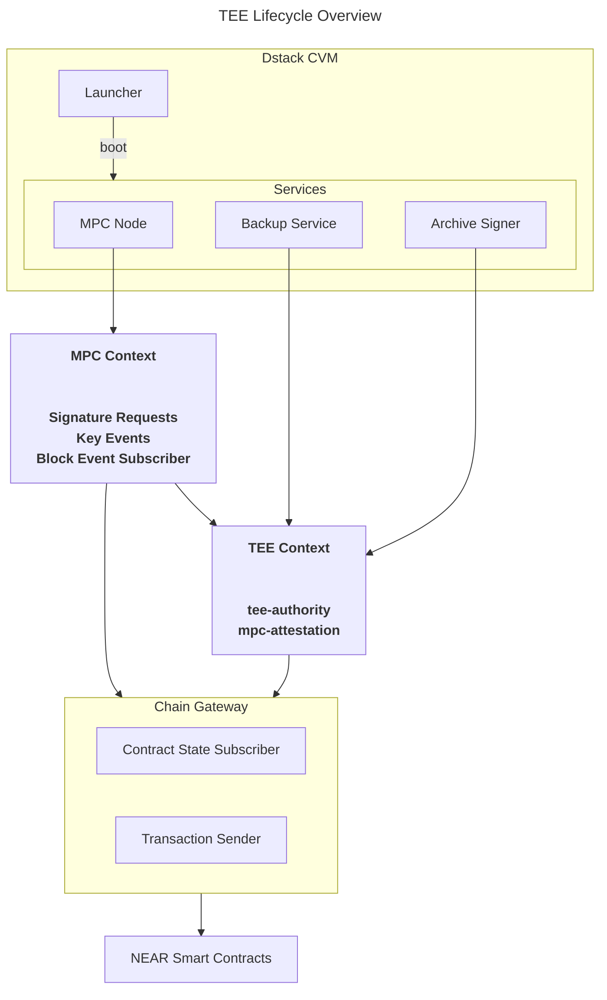
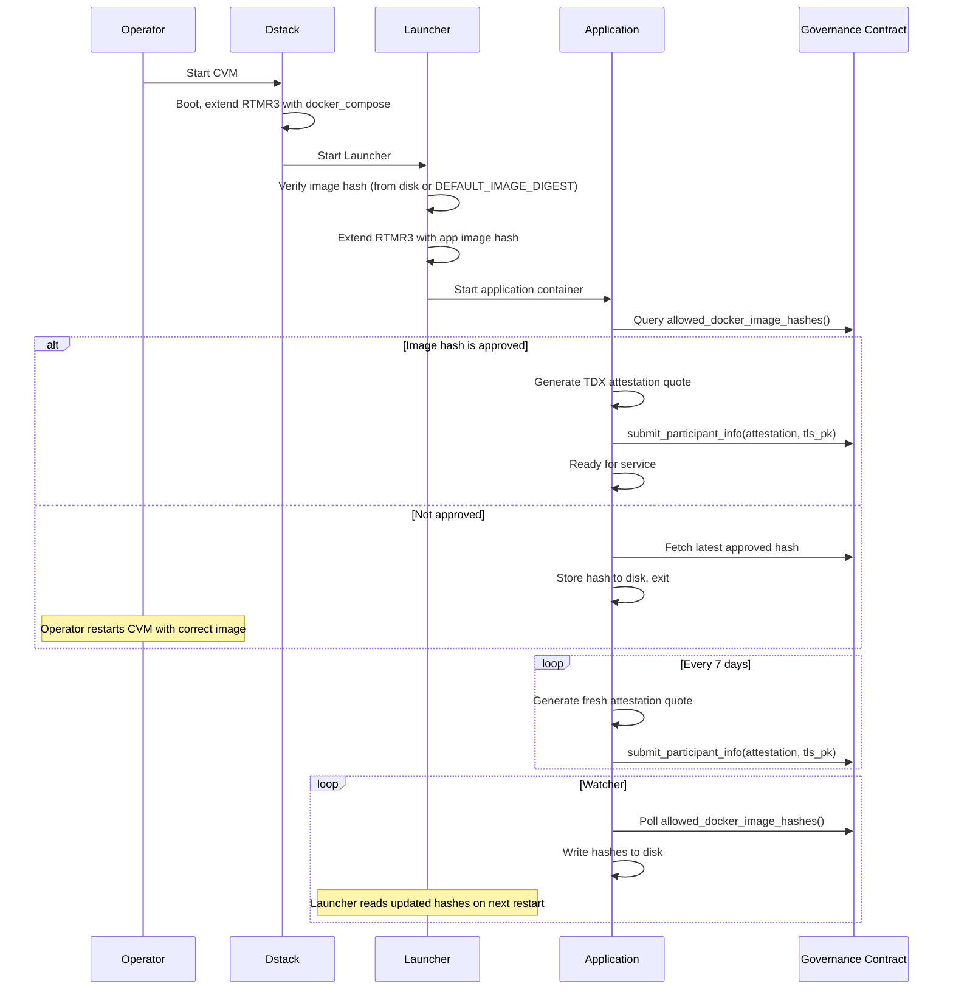
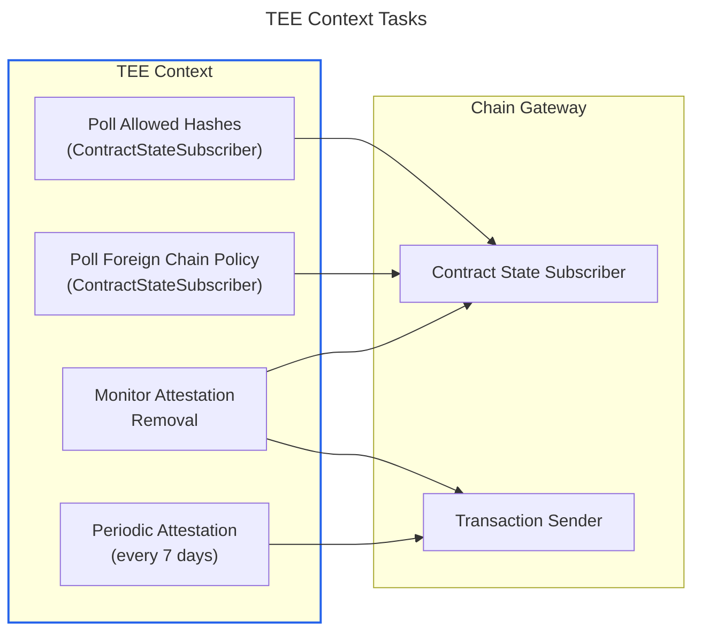
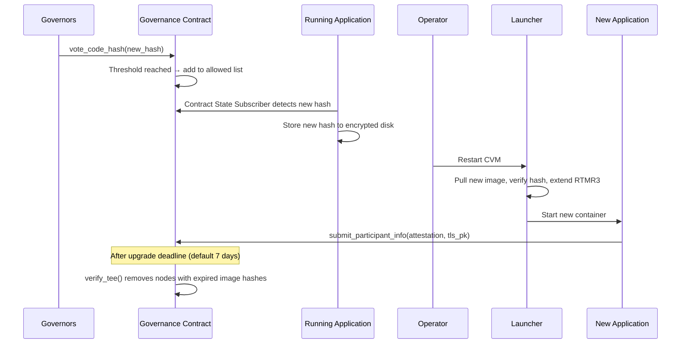

# TEE Lifecycle

Multiple TEE services in this repository — the [MPC node][mpc-node], the [Backup Service][backup-service], and the [Archive Signer][archive-signer] — run inside [Dstack][dstack] CVMs on Intel TDX hardware. They share the same [boot](#boot), [attestation](#attestation), [governance](#governance-contract), and [upgrade](#upgrade) patterns. This document is the single source of truth for those shared patterns.

For MPC-network-specific TEE integration (threat model, participant management, resharing), see [Securing MPC with TEE][securing-mpc-with-tee].

[mpc-node]: https://github.com/near/mpc/tree/ce53324f472aa89fdf702d7482211bbdb6a44967/crates/node
[backup-service]: https://github.com/near/mpc/tree/ce53324f472aa89fdf702d7482211bbdb6a44967/crates/backup-cli
[archive-signer]: hot-tee-signing-design.md
[securing-mpc-with-tee]: securing-mpc-with-tee-design-doc.md
[dstack]: https://github.com/Dstack-TEE/dstack

## Overview

Services run inside Dstack CVMs, booted through a [Launcher][launcher] that measures the application image (see [Boot](#boot)). All services share a dependency on the [TEE Context][tee-context-design] for attestation lifecycle management. TEE Context relies on [`tee-authority`] for TDX quote generation, [`mpc-attestation`] for on-chain DCAP verification, and the [Chain Gateway][chain-indexer] ([Contract State Subscriber][contract-state-subscriber] + [Transaction Sender][transaction-sender]) for governance contract communication.

| Component | Purpose |
|-----------|---------|
| [`tee-authority`][tee-authority] | Attestation generation (TDX quotes, collateral retrieval) |
| [`mpc-attestation`][mpc-attestation] | On-chain attestation verification (DCAP, RTMR replay) |
| TEE Context | Shared crate orchestrating the attestation lifecycle tasks |
| [Contract State Subscriber][contract-state-subscriber] | Polls governance contract state |
| [Transaction Sender][transaction-sender] | Submits attestation transactions to the governance contract |

[dstack]: https://github.com/Dstack-TEE/dstack
[chain-indexer]: chain-gateway-design.md
[tee-authority]: https://github.com/near/mpc/tree/ce53324f472aa89fdf702d7482211bbdb6a44967/crates/tee-authority
[`tee-authority`]: https://github.com/near/mpc/tree/ce53324f472aa89fdf702d7482211bbdb6a44967/crates/tee-authority
[mpc-attestation]: https://github.com/near/mpc/blob/ce53324f472aa89fdf702d7482211bbdb6a44967/crates/mpc-attestation/src/attestation.rs#L29
[`mpc-attestation`]: https://github.com/near/mpc/blob/ce53324f472aa89fdf702d7482211bbdb6a44967/crates/mpc-attestation/src/attestation.rs#L29
[contract-state-subscriber]: chain-gateway-design.md#state-viewer
[transaction-sender]: chain-gateway-design.md#transaction-sender
[tee-context-design]: tee-context-design.md
[mpc-context]: chain-gateway-design.md
[launcher]: securing-mpc-with-tee-design-doc.md#launcher-pattern

### Crate Dependencies

```mermaid
---
title: TEE Lifecycle Overview
---
flowchart TB

subgraph CVM["Dstack CVM"]
    LAUNCHER["Launcher"]

    subgraph SERVICES["Services"]
        direction LR
        MPC_NODE["MPC Node"]
        BACKUP["Backup Service"]
        HOT_APP["Archive Signer"]
    end

    LAUNCHER -->|boot| SERVICES
end

MPC_CTX[
<b>MPC Context</b><br/><br/>
<b>Signature Requests</b>
<b>Key Events</b>
<b>Block Event Subscriber</b>
]

TEE_CTX[
<b>TEE Context</b><br/><br/>
<b>tee-authority</b>
<b>mpc-attestation</b>
]

subgraph CHAIN["Chain Gateway"]
    direction LR
    CSUB["Contract State Subscriber"]
    TSEND["Transaction Sender"]
end

CONTRACTS["NEAR Smart Contracts"]

MPC_NODE --> MPC_CTX
BACKUP --> TEE_CTX
HOT_APP --> TEE_CTX

MPC_CTX --> TEE_CTX
MPC_CTX --> CHAIN

TEE_CTX --> CHAIN
CHAIN --> CONTRACTS
```

Depending on the service, the contract the _Chain Gateway_ communicates with is either the MPC signer contract (which embeds [governance](#governance-contract) alongside signing logic) or a standalone governance contract such as the [HOT TEE Governance][hot-tee-governance].

[hot-tee-governance]: hot-tee-signing-design.md#on-chain-contract-hot-tee-governance

## Boot

Every TEE service follows the same boot sequence. The [Launcher][launcher] ensures that only approved images run inside the CVM, with measurements recorded in the TDX attestation.

```mermaid
sequenceDiagram
    participant OP as Operator
    participant DS as Dstack
    participant LA as Launcher
    participant APP as Application
    participant SC as Governance Contract

    OP ->> DS: Start CVM
    DS ->> DS: Boot, extend RTMR3 with docker_compose
    DS ->> LA: Start Launcher
    LA ->> LA: Verify image hash (from disk or DEFAULT_IMAGE_DIGEST)
    LA ->> LA: Extend RTMR3 with app image hash
    LA ->> APP: Start application container

    APP ->> SC: Query allowed_docker_image_hashes()
    alt Image hash is approved
        APP ->> APP: Generate TDX attestation quote
        APP ->> SC: submit_participant_info(attestation, tls_pk)
        APP ->> APP: Ready for service
    else Not approved
        APP ->> SC: Fetch latest approved hash
        APP ->> APP: Store hash to disk, exit
        Note over OP: Operator restarts CVM with correct image
    end

    loop Every 7 days
        APP ->> APP: Generate fresh attestation quote
        APP ->> SC: submit_participant_info(attestation, tls_pk)
    end

    loop Watcher
        APP ->> SC: Poll allowed_docker_image_hashes()
        APP ->> APP: Write hashes to disk
        Note over LA: Launcher reads updated hashes on next restart
    end
```

Individual services may add steps between "Start application container" and the image hash check — for example, the Archive Signer performs [key import][key-import] on first boot.

[launcher-pattern]: securing-mpc-with-tee-design-doc.md#launcher-pattern
[key-import]: hot-tee-signing-design.md#key-import-process

## TEE Context

The [TEE Context][tee-context-design] is a shared crate managing the TEE attestation lifecycle. The MPC node already implements the attestation tasks in [`remote_attestation.rs`][remote-attestation] and [`allowed_image_hashes_watcher.rs`][allowed-hashes-watcher]; they will be extracted into a standalone crate, depending on [`tee-authority`][tee-authority] and [`mpc-attestation`][mpc-attestation], reusable by all services.

[mpc-context]: chain-gateway-design.md

[remote-attestation]: https://github.com/near/mpc/blob/ce53324f472aa89fdf702d7482211bbdb6a44967/crates/node/src/tee/remote_attestation.rs
[allowed-hashes-watcher]: https://github.com/near/mpc/blob/ce53324f472aa89fdf702d7482211bbdb6a44967/crates/node/src/tee/allowed_image_hashes_watcher.rs#L103
[periodic-attestation]: https://github.com/near/mpc/blob/ce53324f472aa89fdf702d7482211bbdb6a44967/crates/node/src/tee/remote_attestation.rs#L140
[monitor-attestation-removal]: https://github.com/near/mpc/blob/ce53324f472aa89fdf702d7482211bbdb6a44967/crates/node/src/tee/remote_attestation.rs#L187

### Tasks

The TEE Context runs four long-lived async tasks:

```mermaid
---
title: TEE Context Tasks
---
flowchart LR

subgraph TEE_CTX["TEE Context"]
    POLL_HASHES["Poll Allowed Hashes<br/>(ContractStateSubscriber)"]
    POLL_FCP["Poll Foreign Chain Policy<br/>(ContractStateSubscriber)"]
    MONITOR["Monitor Attestation<br/>Removal"]
    ATTEST["Periodic Attestation<br/>(every 7 days)"]
end

subgraph CHAIN["Chain Gateway"]
    CSUB["Contract State Subscriber"]
    TSEND["Transaction Sender"]
end

POLL_HASHES --> CSUB
POLL_FCP --> CSUB
ATTEST --> TSEND
MONITOR --> CSUB
MONITOR --> TSEND

classDef ctx stroke:#2563eb,stroke-width:2px;
class TEE_CTX ctx;
```

1. **Poll allowed hashes** — Periodically queries the governance contract for [`allowed_docker_image_hashes()`][allowed-docker-image-hashes] and [`allowed_launcher_compose_hashes()`][allowed-launcher-compose-hashes] via the [Contract State Subscriber][contract-state-subscriber]. Writes updates to disk for the Launcher to use on next boot. (Reference: [`monitor_allowed_image_hashes`][allowed-hashes-watcher])

2. **Periodic attestation** — Every 7 days, generates a fresh TDX attestation quote and submits it to the governance contract via [`submit_participant_info()`][submit-participant-info]. Includes exponential backoff retries. (Reference: [`periodic_attestation_submission`][periodic-attestation])

3. **Monitor attestation removal** — Watches the contract for changes to the attested nodes list. If this node's attestation is removed (e.g., due to image hash rotation), resubmits immediately. (Reference: [`monitor_attestation_removal`][monitor-attestation-removal])

4. **Poll foreign chain policy** — Subscribes to the governance contract's [`get_foreign_chain_policy()`][get-foreign-chain-policy] view method via the Contract State Subscriber. Provides the active [`ForeignChainPolicy`][foreign-chain-policy-type] to consumers — for the MPC node this feeds [foreign transaction verification][foreign-tx-verification], for the Archive Signer it configures the validation SDK's RPC providers. (Reference: the MPC node currently fetches this [on-demand in the coordinator][coordinator-fcp]; the TEE Context will move it to continuous polling.)

[foreign-tx-verification]: foreign-chain-transactions.md

[foreign-chain-policy-type]: https://github.com/near/mpc/blob/ce53324f472aa89fdf702d7482211bbdb6a44967/crates/contract-interface/src/types/foreign_chain.rs#L570
[coordinator-fcp]: https://github.com/near/mpc/blob/ce53324f472aa89fdf702d7482211bbdb6a44967/crates/node/src/coordinator.rs#L378
[allowed-docker-image-hashes]: https://github.com/near/mpc/blob/ce53324f472aa89fdf702d7482211bbdb6a44967/crates/contract/src/lib.rs#L1624
[allowed-launcher-compose-hashes]: https://github.com/near/mpc/blob/ce53324f472aa89fdf702d7482211bbdb6a44967/crates/contract/src/lib.rs#L1638
[submit-participant-info]: https://github.com/near/mpc/blob/ce53324f472aa89fdf702d7482211bbdb6a44967/crates/contract/src/lib.rs#L820
[get-foreign-chain-policy]: https://github.com/near/mpc/blob/ce53324f472aa89fdf702d7482211bbdb6a44967/crates/contract/src/lib.rs#L1663

## Attestation

After boot, every service must continuously prove to the governance contract that it is running an approved image inside a genuine TDX enclave. The attestation lifecycle is the same for all three services:

1. **Initial attestation** — the service generates a TDX quote that binds its identity (TLS public key) to the enclave measurements and submits it to the governance contract.
2. **Periodic renewal** — every 7 days a fresh quote is generated and resubmitted, so the contract always holds a recent proof.
3. **Removal monitoring** — if the contract removes the node's attestation (e.g., after an image-hash rotation), the service detects this and resubmits immediately.
4. **Collective verification** — every 2 days, any participant can trigger `verify_tee()` on the governance contract to re-validate all stored attestations and evict nodes whose image hashes are no longer on the approved list.

The [TEE Context][tee-context-design] crate provides the contract interface for the above — each service is responsible for its own attestation scheduling. See the [TEE Context design doc][tee-context-design] for the interface and usage examples.

The governance contract verifies each submitted quote by checking the cryptographic chain of trust, replaying the TDX event log to reconstruct enclave measurements, and confirming that the Docker image and launcher compose hashes match the allowed lists. For the full verification steps, see [Attestation verification on the contract][attestation-verification].

[attestation-verification]: securing-mpc-with-tee-design-doc.md#attestation-verification-on-the-contract

## Governance Contract

Each service — MPC node, Backup Service, and Archive Signer — is governed by an on-chain NEAR contract that tracks which Docker images are approved, which participants hold valid attestations, and which RPC providers are trusted for cross-chain operations. Governors vote on these parameters, and the contract enforces them during attestation verification.

Every governance contract reuses [`TeeState`][tee-state] — a shared on-chain data structure that handles attestation storage, image-hash voting, and verification logic. Who can call the voting methods differs per contract — the MPC signer contract requires protocol participants, while the HOT governance contract requires a dedicated governor set.

[tee-state]: https://github.com/near/mpc/blob/ce53324f472aa89fdf702d7482211bbdb6a44967/crates/contract/src/tee/tee_state.rs#L92

### Attestation Methods

The following attestation methods must be uniform across all governance contracts. These are the methods the [TEE Context][tee-context-design] calls — it hardcodes them as compile-time constants and parameterizes only the contract account.

| Method | Type | Description |
|--------|------|-------------|
| `submit_participant_info(attestation, tls_public_key)` | Call | Submit TEE attestation |
| `verify_tee()` | Call | Re-validate all stored attestations |
| `allowed_docker_image_hashes()` | View | Query approved image hashes |
| `allowed_launcher_compose_hashes()` | View | Query approved launcher hashes |
| `get_tee_accounts()` | View | Query participants with valid attestations |
| `get_foreign_chain_policy()` | View | Query active foreign chain RPC configuration (opt-in) |

> **Backup Service:** The Backup Service does not yet have TEE governance — `register_backup_service` stores only a public key, with no attestation. The [hard-launch design][backup-tee-methods] plans to add attestation via `TeeState` and the standard methods listed above, but these are not yet implemented.

[backup-tee-methods]: migration-service.md#backup-service-tee-methods

### Voting Methods

Voting methods are called by governors or operators, not by the TEE Context, and vary per contract:

| Method | Contract | Description |
|--------|----------|-------------|
| `vote_code_hash(code_hash)` | All | Vote for a new Docker image hash |
| `vote_add_launcher_hash(launcher_hash)` | All | Vote for a new launcher image hash (threshold) |
| `vote_remove_launcher_hash(launcher_hash)` | All | Vote to remove a launcher image hash (unanimity) |
| `vote_foreign_chain_policy(policy)` | MPC, HOT | Vote on trusted RPC providers per chain |
| `vote_new_parameters(...)` | MPC only | Vote for threshold and participant changes |
| `vote_update_governors(...)` | HOT only | Vote to change the governor set |

**Launcher compose hash derivation:** The contract derives compose hashes from the cross-product of allowed MPC image hashes and allowed launcher image hashes:

1. A YAML template ([example: `launcher_docker_compose.yaml.template`][launcher-template]) contains `{{LAUNCHER_IMAGE_HASH}}` and `{{DEFAULT_IMAGE_DIGEST_HASH}}` placeholders.
2. Both placeholders are replaced with the approved launcher and MPC image hashes respectively.
3. The filled YAML is SHA256-hashed to produce the [`LauncherDockerComposeHash`][launcher-compose-hash].

When `vote_code_hash()` reaches threshold, compose hashes are derived for the new MPC hash against all existing allowed launcher hashes. When `vote_add_launcher_hash()` reaches threshold, compose hashes are derived for the new launcher hash against all existing allowed MPC hashes.

Each service has its own launcher compose template.

[launcher-compose-hash]: https://github.com/near/mpc/blob/ce53324f472aa89fdf702d7482211bbdb6a44967/crates/primitives/src/hash.rs#L121
[launcher-template]: https://github.com/near/mpc/blob/ce53324f472aa89fdf702d7482211bbdb6a44967/crates/contract/assets/launcher_docker_compose.yaml.template

## Upgrade

Application upgrades follow the Launcher pattern:

```mermaid
sequenceDiagram
    participant GOV as Governors
    participant SC as Governance Contract
    participant APP as Running Application
    participant OP as Operator
    participant LA as Launcher
    participant NEW as New Application

    GOV ->> SC: vote_code_hash(new_hash)
    SC ->> SC: Threshold reached → add to allowed list

    APP ->> SC: Contract State Subscriber detects new hash
    APP ->> APP: Store new hash to encrypted disk

    OP ->> LA: Restart CVM
    LA ->> LA: Pull new image, verify hash, extend RTMR3
    LA ->> NEW: Start new container

    NEW ->> SC: submit_participant_info(attestation, tls_pk)

    Note over SC: After upgrade deadline (default 7 days)
    SC ->> SC: verify_tee() removes nodes with expired image hashes
```

1. Governors vote for a new Docker image hash on-chain via `vote_code_hash()`.
2. When `vote_threshold` is reached, the new hash is added to the allowed list.
3. The running app's Contract State Subscriber detects the new allowed hash.
4. The app stores the new hash to an encrypted file on disk.
5. The operator restarts the CVM.
6. On restart, the Launcher pulls the new image, verifies the hash, extends RTMR3, starts the container.
7. The new app submits a fresh attestation.
8. After the upgrade deadline (configurable, default 7 days), old image hashes expire. Any node still running an old image that has not reattested will be removed on the next `verify_tee()` call.

For the MPC-specific details (node kicking and resharing), see [Kicking out nodes with invalid attestation][kicking-nodes].

[kicking-nodes]: securing-mpc-with-tee-design-doc.md#kicking-out-nodes-with-invalid-attestation
