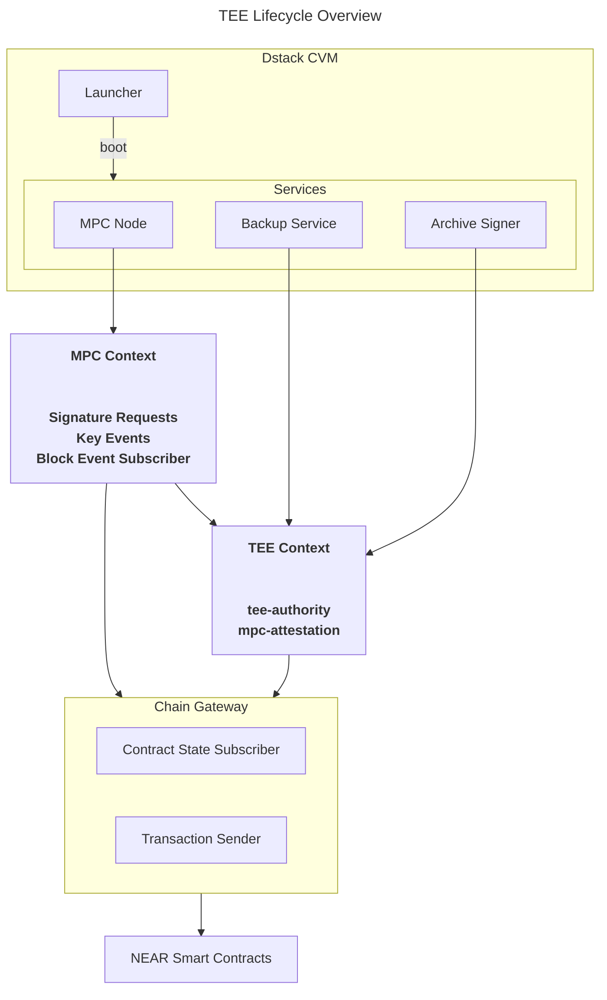
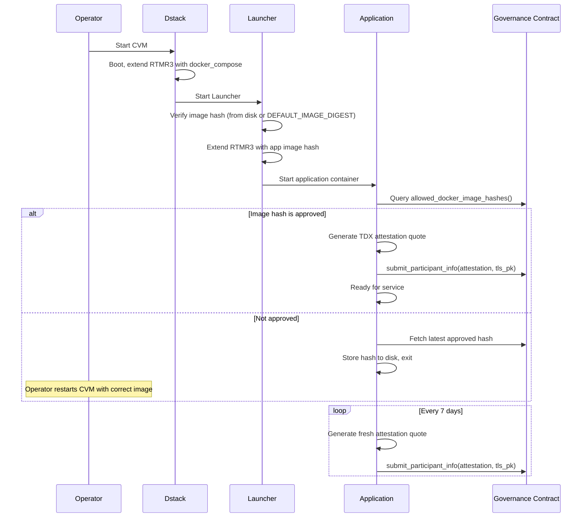

# TEE Lifecycle

Multiple TEE services in this repository — the [MPC node][mpc-node], the [Backup Service][backup-service], and the [Archive Signer][archive-signer] — run inside [Dstack][dstack] CVMs on Intel TDX hardware. They share the same boot, attestation, governance, and upgrade patterns. This document is the single source of truth for those shared patterns.

For MPC-network-specific TEE integration (threat model, participant management, resharing), see [Securing MPC with TEE][securing-mpc-with-tee].

[mpc-node]: https://github.com/near/mpc/trexe/ce53324f472aa89fdf702d7482211bbdb6a44967/crates/node
[backup-service]: https://github.com/near/mpc/tree/ce53324f472aa89fdf702d7482211bbdb6a44967/crates/backup-cli
[archive-signer]: hot-tee-signing-design.md
[securing-mpc-with-tee]: securing-mpc-with-tee-design-doc.md
[dstack]: https://github.com/Dstack-TEE/dstack

## Overview

Services run inside Dstack CVMs, booted through a [Launcher][launcher] that measures the application image (see [Boot](#boot)). All services share a dependency on the [TEE Context][tee-context-design] for attestation lifecycle management. The [Backup Service][backup-service] and [Archive Signer][archive-signer] use it directly; the [MPC node][mpc-node] accesses it through the [MPC Context][mpc-context], which wraps TEE Context and adds signature request handling and key events. Internally, TEE Context relies on [`tee-authority`] for TDX quote generation, [`mpc-attestation`] for on-chain DCAP verification, and the [Chain Gateway][chain-indexer] ([Contract State Subscriber][contract-state-subscriber] + [Transaction Sender][transaction-sender]) for governance contract communication.

[chain-indexer]: indexer-design.md
[`tee-authority`]: https://github.com/near/mpc/tree/ce53324f472aa89fdf702d7482211bbdb6a44967/crates/tee-authority
[`mpc-attestation`]: https://github.com/near/mpc/blob/ce53324f472aa89fdf702d7482211bbdb6a44967/crates/mpc-attestation/src/attestation.rs#L29
[contract-state-subscriber]: indexer-design.md#contract-state-subscriber
[transaction-sender]: indexer-design.md#transaction-sender


```mermaid
---
title: TEE Lifecycle Overview
---
flowchart TB

subgraph CVM["Dstack CVM"]
    LAUNCHER["Launcher"]

    subgraph SERVICES["Services"]
        direction LR
        MPC_NODE["MPC Node"]
        BACKUP["Backup Service"]
        HOT_APP["Archive Signer"]
    end

    LAUNCHER -->|boot| SERVICES
end

MPC_CTX[
<b>MPC Context</b><br/><br/>
<b>Signature Requests</b>
<b>Key Events</b>
<b>Block Event Subscriber</b>
]

TEE_CTX[
<b>TEE Context</b><br/><br/>
<b>tee-authority</b>
<b>mpc-attestation</b>
]

subgraph CHAIN["Chain Gateway"]
    direction LR
    CSUB["Contract State Subscriber"]
    TSEND["Transaction Sender"]
end

CONTRACTS["NEAR Smart Contracts"]

MPC_NODE --> MPC_CTX
BACKUP --> TEE_CTX
HOT_APP --> TEE_CTX

MPC_CTX --> TEE_CTX
MPC_CTX --> CHAIN

TEE_CTX --> CHAIN
CHAIN --> CONTRACTS
```

Depending on the service, the contract the _Chain Gateway_ communicates with is either the MPC signer contract (which embeds [governance](#governance-contract) alongside signing logic) or a standalone governance contract such as the [HOT TEE Governance][hot-tee-governance].

[hot-tee-governance]: hot-tee-signing-design.md#on-chain-contract-hot-tee-governance

## Boot

Every TEE service follows the same boot sequence. The [Launcher][launcher] ensures that only approved images run inside the CVM, with measurements recorded in the TDX attestation.


```mermaid
sequenceDiagram
    participant OP as Operator
    participant DS as Dstack
    participant LA as Launcher
    participant APP as Application
    participant SC as Governance Contract

    OP ->> DS: Start CVM
    DS ->> DS: Boot, extend RTMR3 with docker_compose
    DS ->> LA: Start Launcher
    LA ->> LA: Verify image hash (from disk or DEFAULT_IMAGE_DIGEST)
    LA ->> LA: Extend RTMR3 with app image hash
    LA ->> APP: Start application container

    APP ->> SC: Query allowed_docker_image_hashes()
    alt Image hash is approved
        APP ->> APP: Generate TDX attestation quote
        APP ->> SC: submit_participant_info(attestation, tls_pk)
        APP ->> APP: Ready for service
    else Not approved
        APP ->> SC: Fetch latest approved hash
        APP ->> APP: Store hash to disk, exit
        Note over OP: Operator restarts CVM with correct image
    end

    loop Every 7 days
        APP ->> APP: Generate fresh attestation quote
        APP ->> SC: submit_participant_info(attestation, tls_pk)
    end
```

[launcher]: securing-mpc-with-tee-design-doc.md#launcher-pattern
[key-import]: hot-tee-signing-design.md#key-import-process

## Attestation

Each service generates a TDX attestation quote via [`tee-authority`] and submits it to the governance contract via `submit_participant_info()`. The contract verifies the quote using DCAP logic from [`mpc-attestation`] — checking cryptographic integrity, RTMR measurements, and that the image hashes match the allowed lists. For the full verification steps, see [Attestation verification on the contract][attestation-verification].

[attestation-verification]: securing-mpc-with-tee-design-doc.md#attestation-verification-on-the-contract

The [TEE Context][tee-context-design] crate automates this lifecycle — periodic submission, monitoring removal, hash polling, and `verify_tee` calls. See the [TEE Context design doc][tee-context-design] for the full interface, background tasks, and attestation protocol details.

[tee-context-design]: tee-context-design.md
[mpc-context]: indexer-design.md

## Governance Contract

Every TEE governance contract reuses the [`TeeState`][tee-state] structure from the MPC contract, along with the [`ForeignChainPolicy`][foreign-chain-policy-type] for cross-chain RPC governance. The policy maps [`ForeignChain`][foreign-chain] variants to sets of [`RpcProvider`][rpc-provider]s:

```rust
pub struct TeeState {
    pub(crate) allowed_docker_image_hashes: AllowedDockerImageHashes,
    pub(crate) allowed_launcher_compose_hashes: Vec<LauncherDockerComposeHash>,
    pub(crate) votes: CodeHashesVotes,
    pub(crate) stored_attestations: BTreeMap<near_sdk::PublicKey, NodeAttestation>,
}

/// Trusted RPC providers per chain. Governors vote on which providers
/// to trust for cross-chain operations (foreign TX verification,
/// off-chain authorization, etc.).
pub struct ForeignChainPolicy {
    pub chains: BTreeMap<ForeignChain, NonEmptyBTreeSet<RpcProvider>>,
}
```

[tee-state]: https://github.com/near/mpc/blob/ce53324f472aa89fdf702d7482211bbdb6a44967/crates/contract/src/tee/tee_state.rs#L92
[foreign-chain]: https://github.com/near/mpc/blob/ce53324f472aa89fdf702d7482211bbdb6a44967/crates/contract-interface/src/types/foreign_chain.rs#L541
[rpc-provider]: https://github.com/near/mpc/blob/ce53324f472aa89fdf702d7482211bbdb6a44967/crates/contract-interface/src/types/foreign_chain.rs#L591

### Common Methods

| Method | Type | Description |
|--------|------|-------------|
| `vote_code_hash(code_hash)` | Call | Vote for a new Docker image hash |
| `vote_foreign_chain_policy(policy)` | Call | Vote on trusted RPC providers per chain |
| `submit_participant_info(attestation, tls_public_key)` | Call | Submit TEE attestation |
| `verify_tee()` | Call | Re-validate all stored attestations |
| `allowed_docker_image_hashes()` | View | Query approved image hashes |
| `allowed_launcher_compose_hashes()` | View | Query approved launcher hashes |
| `get_tee_accounts()` | View | Query nodes with valid attestations |
| `get_foreign_chain_policy()` | View | Query active foreign chain RPC configuration |

Service-specific contracts add their own methods on top: the MPC signer contract adds `vote_new_parameters` for threshold changes; the HOT governance contract adds `vote_update_governors` for governor management.

### Launcher Compose Hash Derivation

When a Docker image hash is voted in via `vote_code_hash()` and reaches the vote threshold, the contract automatically derives the corresponding **launcher compose hash**:

1. A YAML template ([example: `launcher_docker_compose.yaml.template`][launcher-template]) contains a `{{DEFAULT_IMAGE_DIGEST_HASH}}` placeholder.
2. The placeholder is replaced with the approved Docker image hash.
3. The filled YAML is SHA256-hashed to produce the [`LauncherDockerComposeHash`][launcher-compose-hash].

During attestation verification, the contract replays the TDX event log to reconstruct RTMR3 and checks that both the Docker image hash and launcher compose hash match the allowed lists. This ensures the attesting CVM is running an approved image via an approved launcher configuration.

Each service has its own launcher compose template — the application Docker Compose configuration differs between the MPC node, backup service, and Archive Signer.

[launcher-compose-hash]: https://github.com/near/mpc/blob/ce53324f472aa89fdf702d7482211bbdb6a44967/crates/primitives/src/hash.rs#L121
[launcher-template]: https://github.com/near/mpc/blob/ce53324f472aa89fdf702d7482211bbdb6a44967/crates/contract/assets/launcher_docker_compose.yaml.template

Reference implementation: [`AllowedDockerImageHashes::get_docker_compose_hash`][tee-proposal].

[tee-proposal]: https://github.com/near/mpc/blob/ce53324f472aa89fdf702d7482211bbdb6a44967/crates/contract/src/tee/proposal.rs#L152

## Upgrade

Application upgrades follow the Launcher pattern:

1. Governors vote for a new Docker image hash on-chain via `vote_code_hash()`.
2. When `vote_threshold` is reached, the new hash is added to the allowed list.
3. The running app's Contract State Subscriber detects the new allowed hash.
4. The app stores the new hash to an encrypted file on disk.
5. The operator restarts the CVM.
6. On restart, the Launcher pulls the new image, verifies the hash, extends RTMR3, starts the container.
7. The new app submits a fresh attestation.
8. After the upgrade deadline (configurable, default 7 days), old image hashes expire. Any node still running an old image that has not reattested will be removed on the next `verify_tee()` call.

For the MPC-specific details (node kicking and resharing), see [Kicking out nodes with invalid attestation][kicking-nodes].

[kicking-nodes]: securing-mpc-with-tee-design-doc.md#kicking-out-nodes-with-invalid-attestation
