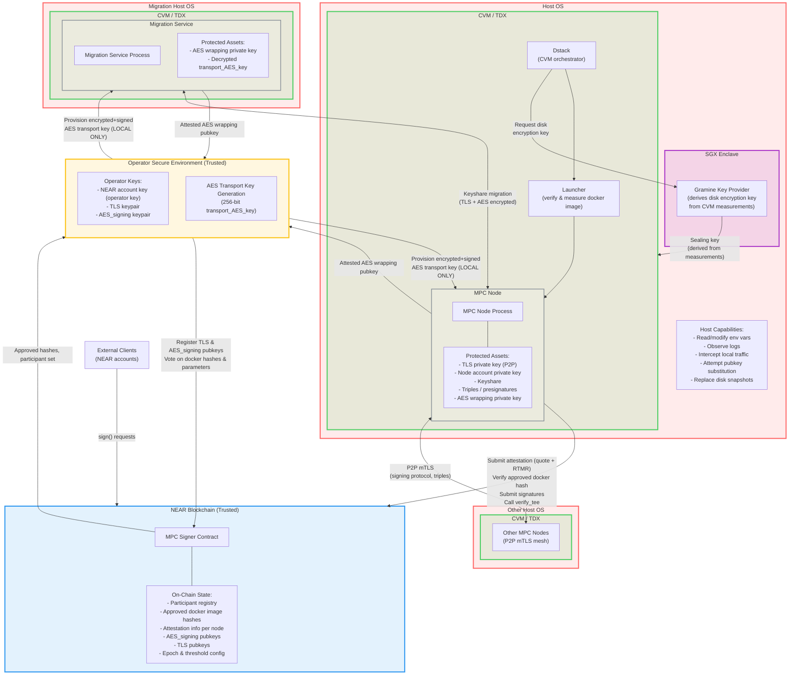
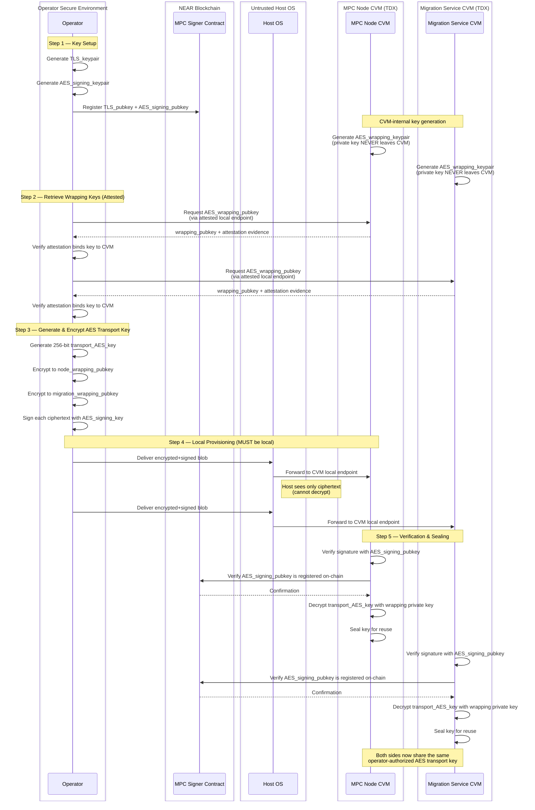
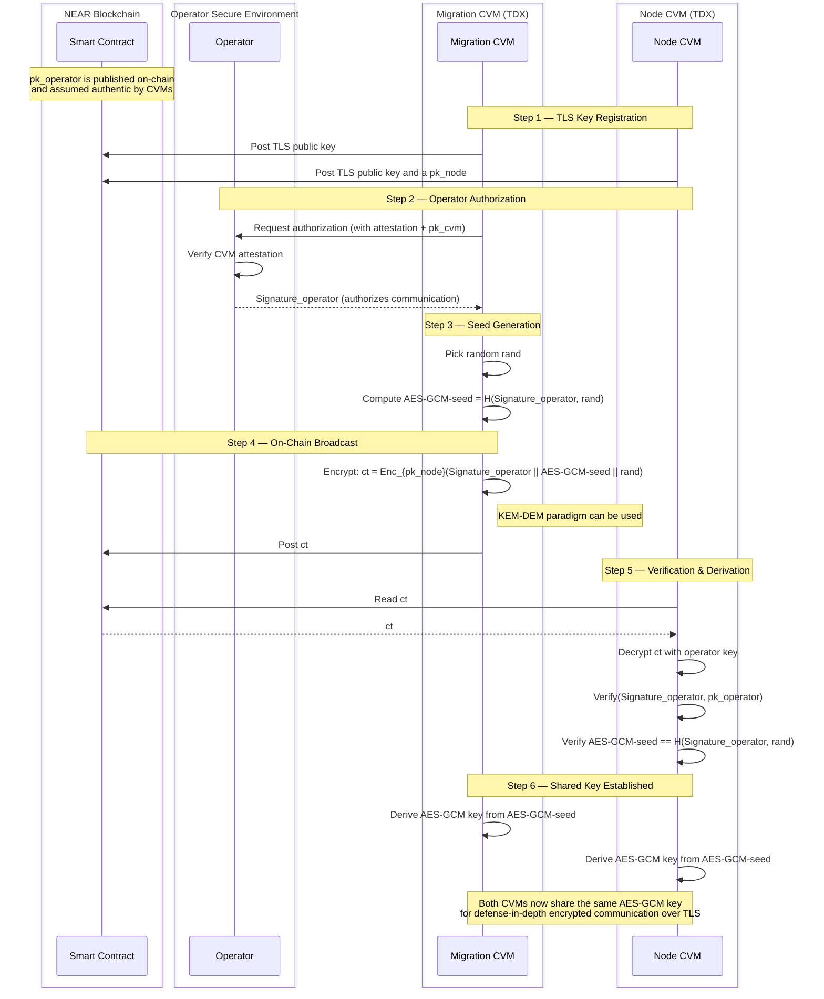

# MPC TEE + AES Transport Key — Threat Model

This document provides threat model diagrams for the MPC-in-TEE system and AES transport key provisioning flow. For full details see:
- [TEE Design Doc](securing-mpc-with-tee-design-doc.md)
- [AES Transport Key Provisioning](secure-aes-transport-key-provisioning-cvm.md)
- [TDX Deployment Guide](running-an-mpc-node-in-tdx-external-guide.md)

---

## 1. System-Level Threat Model

This diagram shows all components, trust boundaries, assets, and data flows across the system.

### Trust Boundary Legend

| Boundary | Color | Trust Level |
|----------|-------|-------------|
| CVM / TDX | Green | Trusted — HW-enforced isolation, attestation-bound |
| SGX Enclave | Purple | Trusted — Gramine Key Provider, separate enclave on same server |
| NEAR Blockchain | Blue | Trusted — immutable state, on-chain verification |
| Operator Environment | Yellow | Trusted — operator responsible for securing keys |
| Host OS | Red | **UNTRUSTED** — full root access assumed |

### Key Protection Summary

| Asset | At Rest | At Runtime |
|-------|---------|------------|
| TLS private key | Encrypted disk (Gramine sealed) | TDX CVM memory encryption |
| Node account key | Encrypted disk | TDX CVM memory encryption |
| Keyshare | Encrypted disk | TDX CVM memory encryption |
| Triples / presignatures | Encrypted disk | TDX CVM memory encryption |
| AES transport key | Sealed in CVM | TDX CVM memory encryption |
| Operator keys | Operator-managed (out of scope) | Operator-managed |

---

## 2. AES Transport Key Provisioning Flow

This diagram shows the step-by-step provisioning of the AES transport key, with trust boundaries and security checks.

### Security Properties Achieved

| Property | How It's Achieved |
|----------|-------------------|
| **Confidentiality vs Host** | AES key encrypted to CVM-held wrapping key; host sees only ciphertext |
| **Strong Authorization** | Only registered AES_signing_key can provision; verified on-chain |
| **Attestation Binding** | Wrapping pubkeys bound to CVM attestation; prevents host substitution |
| **Local Provisioning** | Must be executed locally; ensures operator physical control |
| **Separation of Duties** | TLS key != AES signing key; limits blast radius |

---

## 3. Threat-to-Mitigation Matrix

| # | Threat | Attack Vector | Component | Mitigation | Residual Risk |
|---|--------|--------------|-----------|------------|---------------|
| T1 | Host reads keyshare at runtime | Memory inspection / side-channel | Host OS -> CVM | TDX HW encrypts CVM memory | Side-channel attacks (out of scope) |
| T2 | Host reads keyshare at rest | Disk access | Host OS -> Encrypted Disk | Gramine-sealed disk encryption key derived from CVM measurements | Rollback to old snapshot (see T6) |
| T3 | Host substitutes wrapping pubkey | Intercept attested endpoint | Host OS -> CVM endpoint | Wrapping pubkey bound to CVM attestation evidence | None if attestation verified correctly |
| T4 | Operator NEAR key compromise | Stolen credentials | Attacker -> Contract | AES transport key = independent second factor; attacker needs both | If both keys compromised, no defense |
| T5 | TLS compromise during migration | MITM / misconfigured TLS | Network -> Migration flow | AES transport encryption layer (defense-in-depth) | If AES key also compromised, no defense |
| T6 | Rollback / replay attack | Replace disk with old snapshot | Host OS -> Encrypted Disk | **Open risk** — triples/presigs could be reused | Future mitigation needed |
| T7 | Rogue MPC docker image | Supply chain / operator error | Attacker -> Launcher | RTMR3 measurement + contract hash whitelist + participant voting | Compromised voting threshold |
| T8 | Contract bug: rogue TLS key registration | Smart contract exploit | Attacker -> Contract | AES key still required for keyshare decryption | If AES provisioning also flawed |
| T9 | Remote-only AES provisioning bypass | No physical access | Remote attacker -> CVM | Local-only provisioning requirement | Operator machine compromise |
| T10 | Single key compromise (TLS or AES signing) | Key theft | Attacker -> Operator | Separation of duties: TLS key != AES signing key | Both keys compromised simultaneously |
| T11 | Stale node running old binary | Operator neglect | Stale node -> Network | `verify_tee` kicks nodes after 7 days; resharing triggered | Below-threshold scenario pauses signing |
| T12 | Malicious migration service | Rogue endpoint | Attacker -> Migration | Contract validates migration service registration + AES key needed | Contract bug + AES compromise |

---

## 4. Attack Tree Summary

```mermaid
graph TD
    ROOT["Steal Keyshare"]

    ROOT --> A["Compromise CVM at Runtime"]
    A --> A1["Break TDX HW isolation<br/>(out of scope)"]
    A --> A2["Side-channel on CVM<br/>(out of scope)"]

    ROOT --> B["Compromise Keyshare at Rest"]
    B --> B1["Access encrypted disk"]
    B1 --> B1a["Need Gramine sealing key<br/>(derived from CVM measurements)"]
    B --> B2["Rollback disk snapshot<br/>(OPEN RISK)"]

    ROOT --> C["Compromise During Migration"]
    C --> C1["Break TLS"]
    C1 --> C1a["Still need AES transport key"]
    C --> C2["Obtain AES Transport Key"]
    C2 --> C2a["Compromise operator AES_signing key"]
    C2 --> C2b["Substitute wrapping pubkey<br/>(blocked by attestation)"]
    C2 --> C2c["Intercept provisioning<br/>(encrypted to CVM key)"]
    C --> C3["Must compromise BOTH<br/>TLS AND AES key"]

    ROOT --> D["Compromise via Contract"]
    D --> D1["Register rogue TLS key<br/>(contract bug)"]
    D1 --> D1a["Still need AES transport key"]
    D --> D2["Register rogue migration service"]
    D2 --> D2a["Still need AES transport key"]

    ROOT --> E["Compromise Operator Keys"]
    E --> E1["Steal NEAR account key"]
    E1 --> E1a["Can vote but still need<br/>AES key for migration"]
    E --> E2["Steal AES_signing key"]
    E2 --> E2a["Can sign but still need<br/>wrapping pubkey from real CVM"]

    style ROOT fill:#ff6b6b,color:#fff
    style B2 fill:#ff6b6b22,stroke:#ff6b6b,stroke-width:2px
    style C3 fill:#51cf6622,stroke:#51cf66,stroke-width:2px
```

### Reading the Attack Tree

- **Red node** = attacker goal (steal keyshare)
- **Red-bordered node** = open/residual risk (disk rollback)
- **Green-bordered node** = defense-in-depth success (requires multiple independent compromises)
- Leaf nodes show where attack paths are **blocked** by specific mitigations

---

## 5. Trust Assumptions Summary

| Entity | Trusted For | NOT Trusted For |
|--------|------------|-----------------|
| **CVM / TDX** | Integrity of execution, memory confidentiality (with caveat), attestation | N/A (HW root of trust) |
| **NEAR Blockchain** | State integrity, access-key validation, on-chain authorization | N/A (blockchain security model) |
| **Operator** | Protecting operator key, local physical access | Running MPC node securely, accessing CVM secrets |
| **Host OS** | Nothing | Everything — assumed adversarial with root access |
| **Dstack** | CVM orchestration, RTMR measurements, filesystem encryption | N/A (trusted framework) |
| **MPC Node Code** | Correct execution | N/A (code is trusted, verified via hash) |

> **Conservative TEE assumption**: We assume TDX protects **integrity** but treat **confidentiality** as best-effort due to historical side-channel attacks. This affects future protocol optimization choices but not current security guarantees.

---

## 6. Simon's Solution Proposal

An alternative AES transport key establishment protocol that eliminates direct operator provisioning of the AES key. Instead, the migration CVM generates the key material and posts it encrypted on-chain, allowing any authorized node CVM to derive the shared AES-GCM key independently.

### Assumptions

- There is an authenticated communication channel between the operator and CVMs.
   - **From the CVM perspective:** the operator public key (`pk_operator`) posted on the smart contract is assumed to be authentic. -- Here better using pk_operator to be a fresh signing key.
   - **From the operator perspective:** each CVM provides attestation evidence together with its public key (`pk_cvm`).
- As long as the Smartcontract is honest, everything that is posted there is signed. When the information is read from there the signature is verified - which authenticates the posting party.

### Protocol

1. **TLS key registration** — Both the migration CVM and the node CVM post their TLS public keys on the blockchain.
2. **Operator authorization** — Either CVM communicates with the operator, who returns a signature (`Signature_operator`) authorizing the start of communication.
3. **Seed generation** — The migration CVM picks a random value `rand` and computes `AES-GCM-seed = H(Signature_operator, rand)`. Mixing the operator signature into the hash ensures the seed cannot be produced without prior operator authorization.
4. **On-chain broadcast** — The migration CVM posts the following on the blockchain:
   - `ct = Enc_{pk_operator}(Signature_operator || AES-GCM-seed || rand)` — the seed material encrypted to the operator's public key so that only authorized CVMs (who can obtain decryption via the operator) can recover it.
5. **Node-side verification & derivation** — The node CVM reads the ciphertext from the blockchain, confirms `ct` coming from the migration CVM, decrypts it, verifies `Signature_operator`, checks that `AES-GCM-seed == H(Signature_operator, rand)`.
6. **Shared key** — Both CVMs independently derive the AES-GCM key from `AES-GCM-seed`. From this point they can use AES-GCM encrypted communication over TLS (defense-in-depth).

### Security Properties

| Property | How It's Achieved |
|----------|-------------------|
| **Operator authorization required** | AES-GCM-seed is derived from `H(Signature_operator, rand)` — cannot be produced without a valid operator signature |
| **Confidentiality vs Host** | Seed material is encrypted to `pk_operator`; host and on-chain observers see only ciphertext |
| **Migration CVM authenticity** | Ciphertext is signed by the migration CVM; node CVM verifies before decryption |
| **No direct key provisioning** | Operator never handles the AES key itself — only authorizes its creation via a signature |
| **On-chain availability** | Encrypted seed is posted on the blockchain, allowing any authorized node CVM to derive the key without a direct channel to the migration CVM |
| **Attestation binding** | Operator verifies CVM attestation before issuing the authorization signature |

### Trust Assumptions Matrix

In the following senarios, two trust assumptions are made;
- As long as the Smartcontract is honest, everything that is posted there is signed. When the information is read from there the signature is verified - which authenticates the posting party.
- The operator's  (MPC) public key stored in advance on the smart contract is authentic.

| Entity | Scenario 1 | Scenario 2 | Scenario 3 | Scenario 4 | Scenario 5 | Scenario 6 | Scenario 7 | 
|--------|:-:|:-:|:-:|:-:|:-:|:-:|:-:|
| Network | ✗ | ✗ | ✗ | ✗ | ✗ | ✗ | ✗ |
| Node CVM | ✓ | ✓ | ✓ | ✓ | ✓ | ✓ | ✓ |
| Node Host | ✗ | ✗ | ✗ | ✗ | ✗ | ✗ | ✗ |
| Migration Service CVM | ✓ | ✓ | ✓ | ✓ | ✓ | ✓ | ✓ |
| Migration Service Host | ✗ | ✗ | ✗ | ✗ | ✗ | ✗ | ✗ |
| NEAR Blockchain / Smart Contract | ✓ | ✓ | ✗ | ✗ | ✗ | ✓ | ✗ | 
| Operator | ✓ | ✗ | ✓ | ✓ | ✓ | ✗ | ✗ |
| TLS connection between CVMs | ✓ | ✓ | ✓ | ✗ | ✗ | ✗ | ✓ |
| **Protocol Needed** | **(1)** | **(2)** | **(3)** | **(4)** | **(5)** | **(6)** | **(7)** |

1. Baseline — all trusted components honest. No need for special AES transport key -- a basic TLS between the CVMs works. The TLS keys are stored in the smart contract.
2. Operator compromised — attacker has operator credentials.
Similarly to (1) a basic TLS between the CVMs works. The TLS keys are stored in the smart contract.
3. Smart Contract cannot be trusted  -- The CVMs can communicate over the TLS securely as long as they receive their TLS keys from the operator.
4. TLS compromised — If only the TLS is compromised/misconfigured, it would be sufficient to double layer the TLS communication of the CVMs with another similar secure communication channel such as Quick. The keys can be stored in the smart contract.
5. Both the Smart contract is compromised and the TLS channel is misconfigured -- Barak's proposal should do the job.
6. Both the operator is malicious and the TLS channel is misconfigured. The solution of (4) should apply well.
7. Both the smart contract is compromised and the operator is malicious: This is an extreme case which we cannot allow as this would break the MPC assumption. -- Might need a more detailed argument

**Last Senario**: Knowing that Senario 7 is not possible, we should build a protocol that defends for both "worst-case" senarios Senario 5 + Senario 6. In this regard, Simon claims that his proposal should be enough. Left to study in depth his proposal.