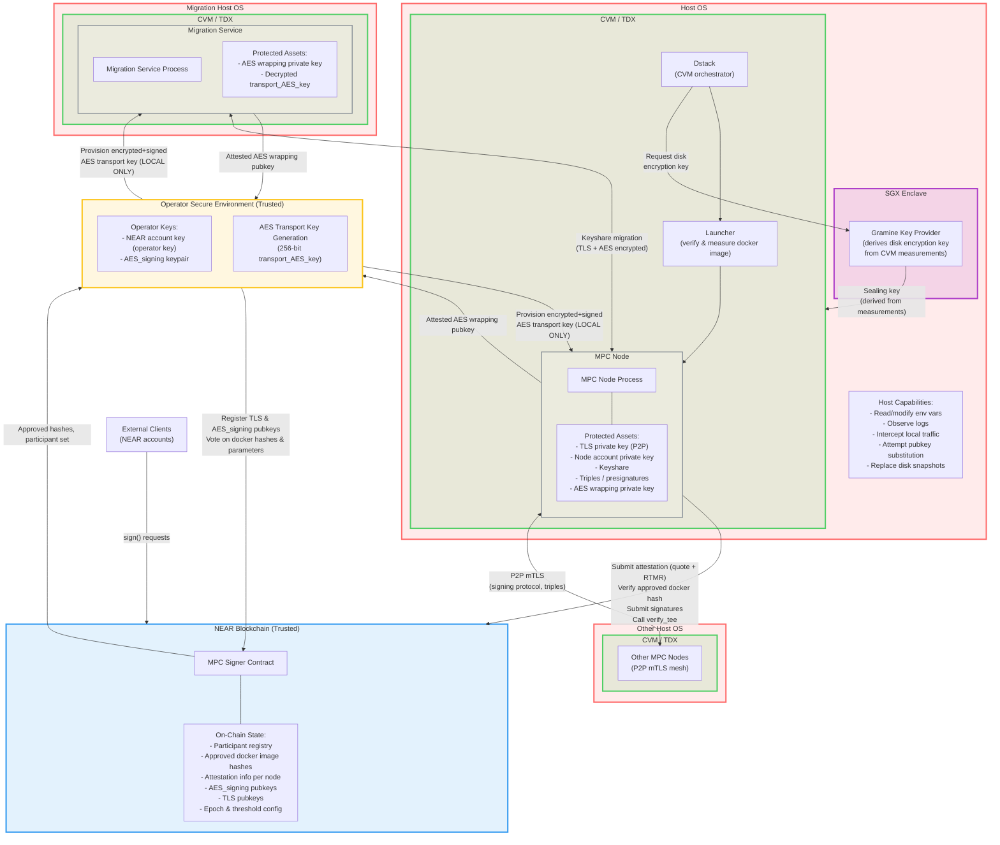
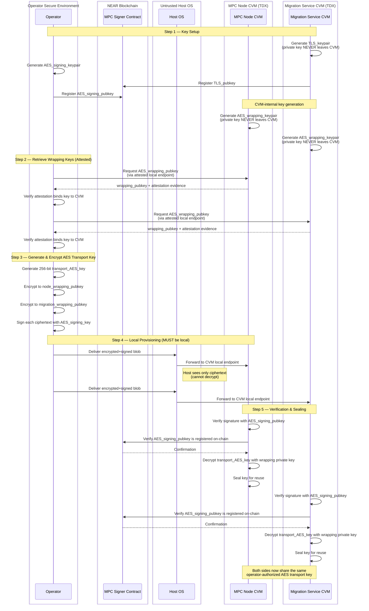
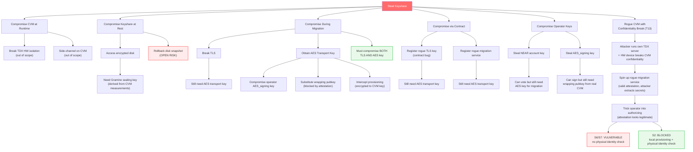
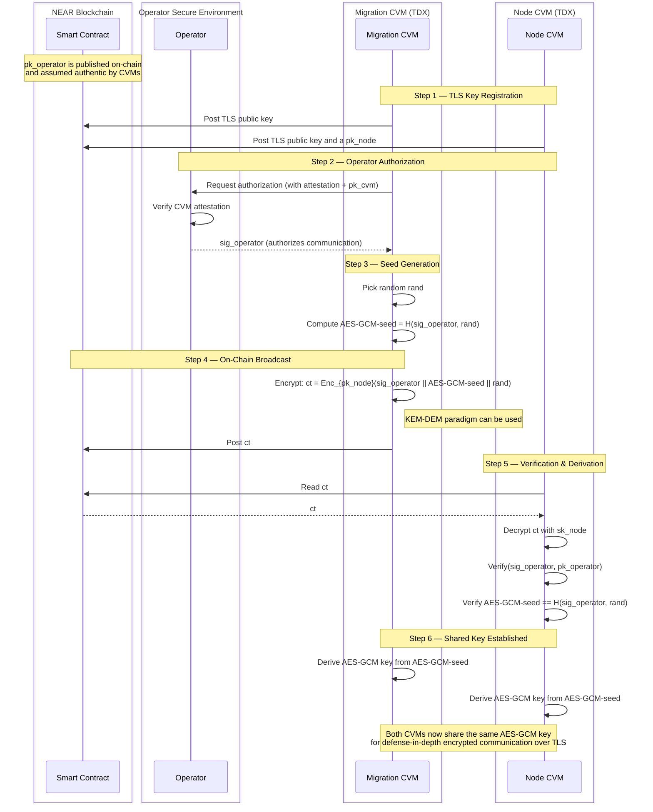
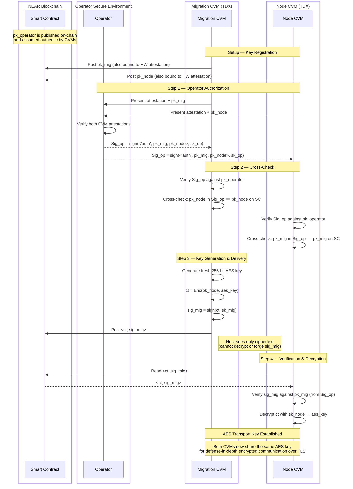

# MPC TEE + AES Transport Key — Threat Model

This document provides threat model diagrams for the MPC-in-TEE system and AES transport key provisioning flow. For full details see:
- [TEE Design Doc](securing-mpc-with-tee-design-doc.md)
- [TDX Deployment Guide](running-an-mpc-node-in-tdx-external-guide.md)
- [Migration Service](https://github.com/near/mpc/blob/main/docs/migration-service.md) — defines the full migration flow and the role of the AES key

## Summary

MPC nodes run inside Intel TDX Confidential VMs (CVMs) to protect cryptographic key shares from the untrusted host OS. The system relies on three trust anchors: TDX hardware isolation, NEAR blockchain for on-chain coordination and attestation verification, and operator authorization for governance actions. During keyshare migration between nodes, an AES transport key provides a defense-in-depth encryption layer on top of TLS, ensuring that no single point of failure can expose key material. This document covers the system architecture, trust boundaries, the AES transport key provisioning flow, a threat-to-mitigation matrix, and three concrete protocol proposals for establishing the AES transport key.

> **Note:** This document is a work in progress and under active architecture evaluation. Three concrete protocol proposals are presented below (sections 2, 6, and 7), but the decision on which one to adopt has not been made yet.

---

## 1. System-Level Threat Model

This diagram shows all components, trust boundaries, assets, and data flows across the system.

### Trust Boundary Legend

| Boundary | Color | Trust Level |
|----------|-------|-------------|
| CVM / TDX | Green | Trusted — HW-enforced isolation, attestation-bound |
| SGX Enclave | Purple | Trusted — Gramine Key Provider, separate enclave on same server |
| NEAR Blockchain | Blue | Trusted — immutable state, on-chain verification |
| Operator Environment | Yellow | Trusted — operator responsible for securing keys |
| Host OS | Red | **UNTRUSTED** — full root access assumed |

### Key Protection Summary

| Asset | At Rest | At Runtime |
|-------|---------|------------|
| TLS private key | Encrypted disk (Gramine sealed) | TDX CVM memory encryption |
| Node account key | Encrypted disk | TDX CVM memory encryption |
| Keyshare | Encrypted disk | TDX CVM memory encryption |
| Triples / presignatures | Encrypted disk | TDX CVM memory encryption |
| AES transport key | Sealed in CVM | TDX CVM memory encryption |
| Operator keys | Operator-managed (out of scope) | Operator-managed |

---

## Defense-in-Depth: Why the AES Transport Key Matters

The AES transport key provides defense-in-depth protection during keyshare migration. Without it, a single point of failure during migration could expose keyshares. With it, an attacker must compromise **two independent layers** — the original protection mechanism (e.g., TLS, contract validation) **and** the AES transport key provisioning flow.

### Example Threat Scenarios

**TLS Compromise** — If TLS encryption is broken or misconfigured during key migration, keyshares would be directly exposed. With AES transport encryption, the keyshares remain protected unless the AES key is also independently compromised.

**Operator Key Compromise + Malicious Migration Service** — If the operator's NEAR account private key is leaked, an attacker could register a malicious migration service. Even with TEE protection, if the attacker controls the physical machine hosting the migration service, they may attempt to attack the TEE. The AES transport key adds a second independent failure requirement — the attacker must also obtain the AES key.

**Contract Bug Allowing Malicious TLS Key Registration** — If a bug in the migration contract allows arbitrary registration of a malicious migration service TLS key, an attacker could redirect migration traffic to a malicious endpoint. With AES transport encryption, the malicious service still cannot decrypt keyshares unless it also receives a valid operator-provisioned AES key.

---

## 2. AES Transport Key Provisioning Flow (Barak's Proposal)

This diagram shows the step-by-step provisioning of the AES transport key, with trust boundaries and security checks.

### Protocol

1. **Key setup** — The migration service CVM generates a TLS keypair (private key never leaves the CVM) and registers the TLS public key on-chain. The operator generates an AES_signing keypair and registers the AES_signing public key on-chain. Both the node CVM and migration service CVM generate AES_wrapping keypairs internally (private keys never leave the CVM).
2. **Retrieve wrapping keys (attested)** — The operator retrieves the AES_wrapping public key from each CVM via attested local endpoints. The operator verifies that each public key is bound to a genuine CVM attestation.
3. **Generate & encrypt AES transport key** — The operator generates a 256-bit transport_AES_key, encrypts it to each CVM's wrapping public key, and signs each ciphertext with the AES_signing key.
4. **Local provisioning** — The operator delivers the encrypted+signed blobs locally to the node and migration service. Provisioning MUST be performed locally on the machine running the CVM, ensuring the operator has physical control.
5. **Verification & sealing** — Each CVM verifies the operator's signature, confirms the AES_signing public key is registered on-chain, decrypts the transport_AES_key with its wrapping private key, and seals the key for reuse.

### Security Properties Achieved

| Property | How It's Achieved |
|----------|-------------------|
| **Confidentiality vs Host** | AES key encrypted to CVM-held wrapping key; host sees only ciphertext |
| **Strong Authorization** | Only registered AES_signing_key can provision; verified on-chain |
| **Attestation Binding** | Wrapping pubkeys bound to CVM attestation; prevents host substitution |
| **Local Provisioning** | Must be executed locally; ensures operator physical control |
| **Separation of Duties** | TLS key != AES signing key; limits blast radius |

---

## 3. Threat-to-Mitigation Matrix

| # | Threat | Attack Vector | Component | Mitigation | Residual Risk |
|---|--------|--------------|-----------|------------|---------------|
| T1 | Host reads keyshare at runtime | Memory inspection / side-channel | Host OS -> CVM | TDX HW encrypts CVM memory | Side-channel attacks (out of scope) |
| T2 | Host reads keyshare at rest | Disk access | Host OS -> Encrypted Disk | Gramine-sealed disk encryption key derived from CVM measurements | Rollback to old snapshot (see T6) |
| T3 | Host substitutes wrapping pubkey | Intercept attested endpoint | Host OS -> CVM endpoint | Wrapping pubkey bound to CVM attestation evidence | None if attestation verified correctly |
| T4 | Operator NEAR key compromise | Stolen credentials | Attacker -> Contract | AES transport key = independent second factor; attacker needs both | If both keys compromised, no defense |
| T5 | TLS compromise during migration | MITM / misconfigured TLS | Network -> Migration flow | AES transport encryption layer (defense-in-depth) | If AES key also compromised, no defense |
| T6 | Rollback / replay attack | Replace disk with old snapshot | Host OS -> Encrypted Disk | **Open risk** — triples/presigs could be reused | Future mitigation needed |
| T7 | Rogue MPC docker image | Supply chain / operator error | Attacker -> Launcher | RTMR3 measurement + contract hash whitelist + participant voting | Compromised voting threshold |
| T8 | Contract bug: rogue TLS key registration | Smart contract exploit | Attacker -> Contract | AES key still required for keyshare decryption | If AES provisioning also flawed |
| T9 | Remote-only AES provisioning bypass | No physical access | Remote attacker -> CVM | Local-only provisioning requirement | Operator machine compromise |
| T10 | Single key compromise (TLS or AES signing) | Key theft | Attacker -> Operator | Separation of duties: TLS key != AES signing key | Both keys compromised simultaneously |
| T11 | Stale node running old binary | Operator neglect | Stale node -> Network | `verify_tee` kicks nodes after 7 days; resharing triggered | Below-threshold scenario pauses signing |
| T12 | Malicious migration service | Rogue endpoint | Attacker -> Migration | Contract validates migration service registration + AES key needed | Contract bug + AES compromise |
| T13 | Rogue CVM with confidentiality break | Attacker runs own TDX server with HW device that breaks CVM confidentiality; spins up rogue migration service with valid attestation | Attacker -> Node CVM | See analysis below (S2: local provisioning; S6/S7: **vulnerable**) | Attestation proves WHAT, not WHO |

---

### T13 — Rogue Migration Service with CVM Confidentiality Break

**Attack:** An attacker has their own TDX-capable server equipped with a physical device that breaks CVM confidentiality (e.g., hardware probe, bus sniffer). They spin up a legitimate migration service CVM on that machine. The CVM produces valid attestation — real TDX hardware, correct code, correct RTMR measurements — making it indistinguishable from a genuine migration service via remote attestation. However, the attacker can extract all secrets from inside the CVM.

The attacker's goal is to trick the legitimate MPC node into migrating its keyshare to this rogue migration service, then extract the AES transport key from the compromised CVM to decrypt it.

**Root cause:** Attestation proves **WHAT** is running (correct code on real TDX hardware), but not **WHO** owns the physical machine. Without a physical identity check, protocols that rely solely on remote attestation are vulnerable.

**Impact per proposal:**

| Protocol | Physical identity check | Protected? | Why |
|----------|:-:|:-:|-----|
| **Barak (S2)** | Yes — local provisioning | **Yes** | The honest operator must physically provision the AES key on the machine. The operator won't go to the attacker's machine — they only provision to machines they own/control. Without the AES transport key, the rogue migration service can't decrypt the keyshare. |
| **Simon (S6)** | No | **No** | The attacker's CVM contacts the operator with valid attestation. The operator cannot distinguish it from a legitimate migration service. If the operator authorizes it (`sig_operator`), the attacker's CVM generates the AES seed and the attacker extracts it via the confidentiality break. |
| **Simplified (S7)** | No | **No** | Same issue. The operator verifies attestation from both CVMs and signs `<'auth', pk_mig, pk_node>`. The attacker's CVM presents valid attestation. If the operator endorses it, the attacker's CVM generates the AES key and the attacker extracts it. |

**Possible mitigations for S6/S7:**
- Add a local provisioning step (converges toward Barak's approach)
- Require an operator-controlled secret injected locally before the migration CVM can participate
- Include a machine-identity binding in the attestation that goes beyond software measurements

---

## 4. Attack Tree Summary

### Reading the Attack Tree

- **Red node** = attacker goal (steal keyshare)
- **Red-bordered node** = open/residual risk (disk rollback, vulnerable protocol)
- **Green-bordered node** = defense-in-depth success (attack blocked by mitigation)
- Leaf nodes show where attack paths are **blocked** by specific mitigations

---

## 5. Trust Assumptions Summary

| Entity | Trusted For | NOT Trusted For |
|--------|------------|-----------------|
| **CVM / TDX** | Integrity of execution, memory confidentiality (with caveat), attestation | N/A (HW root of trust) |
| **NEAR Blockchain** | State integrity, access-key validation, on-chain authorization | N/A (blockchain security model) |
| **Operator** | Protecting operator key, local physical access | Running MPC node securely, accessing CVM secrets |
| **Host OS** | Nothing | Everything — assumed adversarial with root access |
| **Dstack** | CVM orchestration, RTMR measurements, filesystem encryption | N/A (trusted framework) |
| **MPC Node Code** | Correct execution | N/A (code is trusted, verified via hash) |

> **Conservative TEE assumption**: We assume TDX protects **integrity** but treat **confidentiality** as best-effort due to historical side-channel attacks. This affects future protocol optimization choices but not current security guarantees.

---

## 6. Simon's Solution Proposal

An alternative AES transport key establishment protocol that eliminates direct operator provisioning of the AES key. Instead, the migration CVM generates the key material and posts it encrypted on-chain, allowing any authorized node CVM to derive the shared AES-GCM key independently.

### Assumptions

- There is an authenticated communication channel between the operator and CVMs.
   - **From the CVM perspective:** the operator public key (`pk_operator`) posted on the smart contract is assumed to be authentic. -- Here better using pk_operator to be a fresh signing key.
   - **From the operator perspective:** each CVM provides attestation evidence together with its public key (`pk_cvm`).
- As long as the Smartcontract is honest, everything that is posted there is signed. When the information is read from there the signature is verified - which authenticates the posting party.

### Protocol

1. **TLS key registration** — Both the migration CVM and the node CVM post their TLS public keys on the blockchain.
2. **Operator authorization** — Either CVM communicates with the operator, who returns a signature (`sig_operator`) authorizing the start of communication.
3. **Seed generation** — The migration CVM picks a random value `rand` and computes `AES-GCM-seed = H(sig_operator, rand)`. Mixing the operator signature into the hash ensures the seed cannot be produced without prior operator authorization.
4. **On-chain broadcast** — The migration CVM posts the following on the blockchain:
   - `ct = Enc_{pk_node}(sig_operator || AES-GCM-seed || rand)` — the seed material encrypted to the node's public key so that only authorized node CVM can recover it.
5. **Node-side verification & derivation** — The node CVM reads the ciphertext from the blockchain, confirms `ct` coming from the migration CVM, decrypts it, verifies `sig_operator`, checks that `AES-GCM-seed == H(sig_operator, rand)`.
6. **Shared key** — Both CVMs independently derive the AES-GCM key from `AES-GCM-seed`. From this point they can use AES-GCM encrypted communication over TLS (defense-in-depth).

### Security Properties

| Property | How It's Achieved |
|----------|-------------------|
| **Operator authorization required** | AES-GCM-seed is derived from `H(sig_operator, rand)` — cannot be produced without a valid operator signature |
| **Confidentiality vs Host** | Seed material is encrypted to `pk_node`; host and on-chain observers see only ciphertext |
| **Migration CVM authenticity** | Ciphertext is signed by the migration CVM; node CVM verifies before decryption |
| **No direct key provisioning** | Operator never handles the AES key itself — only authorizes its creation via a signature |
| **On-chain availability** | Encrypted seed is posted on the blockchain, allowing any authorized node CVM to derive the key without a direct channel to the migration CVM |
| **Attestation binding** | Operator verifies CVM attestation before issuing the authorization signature |

### Trust Assumptions Matrix

In the following senarios, two trust assumptions are made;
- As long as the Smartcontract is honest, everything that is posted there is signed. When the information is read from there the signature is verified - which authenticates the posting party.
- The operator's  (MPC) public key stored in advance on the smart contract is authentic.

| Entity | Scenario 1 | Scenario 2 | Scenario 3 | Scenario 4 | Scenario 5 | Scenario 6 | Scenario 7 |
|--------|:-:|:-:|:-:|:-:|:-:|:-:|:-:|
| Network | ✗ | ✗ | ✗ | ✗ | ✗ | ✗ | ✗ |
| Node CVM | ✓ | ✓ | ✓ | ✓ | ✓ | ✓ | ✓ |
| Node Host | ✗ | ✗ | ✗ | ✗ | ✗ | ✗ | ✗ |
| Migration Service CVM | ✓ | ✓ | ✓ | ✓ | ✓ | ✓ | ✓ |
| Migration Service Host | ✗ | ✗ | ✗ | ✗ | ✗ | ✗ | ✗ |
| NEAR Blockchain / Smart Contract | ✓ | ✓ | ✗ | ✓ | ✗ | ✓ | ✗ |
| Operator | ✓ | ✗ | ✓ | ✓ | ✓ | ✗ | ✗ |
| TLS connection between CVMs | ✓ | ✓ | ✓ | ✗ | ✗ | ✗ | ✓ |
| **Protocol Needed** | **(1)** | **(2)** | **(3)** | **(4)** | **(5)** | **(6)** | **(7)** |

*Note 1: The Scenario with a broken CVM is void. In fact, if we assume the CVM is broken, this means that the adversary can access the secret key. It is thus impossible to defend against such a senario, meaning, preventing key leakage. Basically, there is nothing to defend against.*

*Note 2: When assuming a malicious contract, we never assume a fully malicious blockchain for all existent functionalities. The functionality that we assume remain intact (unbroken) show_operator_pk and TEE_attestestation.*

*Note 3: each time one wants to make a session one would run remote attestation of the TLS key.*

1. Baseline — all trusted components honest. No need for special AES transport key -- a basic TLS between the CVMs works. The TLS keys are stored in the smart contract.
2. Operator compromised — attacker has operator credentials.
Similarly to (1) a basic TLS between the CVMs works. The TLS keys are stored in the smart contract.
3. Smart Contract cannot be trusted  -- The CVMs can communicate over the TLS securely as long as they receive their TLS keys from the operator.
4. TLS compromised — If only the TLS is compromised/misconfigured, it would be sufficient to double layer the TLS communication of the CVMs with another similar secure communication channel such as Noise. The keys can be stored in the smart contract.
5. Both the Smart contract is compromised and the TLS channel is misconfigured -- Barak's proposal should do the job.
6. Both the operator is malicious and the TLS channel is misconfigured. The solution of (4) should apply well.
7. The smart contract is compromised, the operator is malicious, and the TLS communication is faulty: This is an extreme case which we cannot allow as this would break the MPC assumption. -- We agreed that this senario essentially is equivalent to a Diffie Hellmann key exchange but without any external trusted leverage. To our knowledge, this is not possible to solve.

**Last Scenario**: Knowing that Scenario 7 is not possible, we should build a protocol that defends for both "worst-case" scenarios Scenario 5 + Scenario 6. In this regard, Simon claims that his proposal should be enough. Left to study in depth his proposal.

---

## 7. Simplified Protocol

A simplified AES transport key establishment protocol that achieves the same security goals as Simon's proposal with fewer steps.

### Attacks on Simon's proposal under SC compromise (scenario 5)

Simon's protocol as described in section 6 is vulnerable when the smart contract is compromised, even if the operator is honest. There are two attacks:

**Attack 1 — pk_node substitution.** In Simon's protocol, the migration CVM reads `pk_node` from the smart contract and encrypts the seed material to it. If the smart contract is compromised, the adversary can register a fake `pk_node` (one they hold the private key for). The migration CVM has no way to distinguish the fake key from the real one — it encrypts to the adversary's key. The adversary decrypts and learns the seed. This attack is only possible because the operator is not checking the attestation from the node, which would make supplying a fake `pk_node` impossible.

**Attack 2 — Ciphertext forgery.** The operator's authorization signature `sig_operator` is sent over the network and is visible to the adversary (for example, by using the compromised host). Since the smart contract is also compromised, the adversary can:
1. Observe `sig_operator` on the network
2. Pick their own random value `rand'` and compute `seed' = H(sig_operator, rand')`
3. Construct a valid ciphertext `ct' = Enc(pk_node, sig_operator || seed' || rand')` — they know the real `pk_node` since it's public
4. Post `ct'` on the compromised smart contract, replacing the real ciphertext

The node reads `ct'`, decrypts, and all verification checks pass: the operator signature is genuine, and `seed' == H(sig_operator, rand')` holds. The node accepts `seed'` as the AES-GCM-seed — but the adversary knows it too.

Note that the hash-mixing step `H(sig_operator, rand)` does not help here. It was intended to bind the seed to the operator's authorization, but since `sig_operator` is publicly visible, any adversary who sees it can compute the hash with their own random value.

### Key simplifications vs Simon's proposal

- **No hash-mixing**: `AES-GCM-seed = H(sig_operator, rand)` adds no security because `sig_operator` is visible on the network. The AES key is simply a fresh random value generated by the migration CVM.
- **No on-chain ciphertext broadcast as a separate concept**: The ciphertext can be delivered via any channel — it's encrypted and signed, so the delivery channel doesn't matter.
- **No separate seed/key distinction**: One fresh random value serves as the AES key directly.

### Hardening against attacks 1 and 2

The simplified protocol addresses both attacks with three mechanisms:

| Mechanism | Blocks attack |
|-----------|--------------|
| **Operator reads from attestation, not SC** — CVM keys are bound to hardware attestation. The operator verifies attestation of both CVMs before endorsing their keys. SC compromise cannot poison the operator's view. | pk_node substitution (attack 1) |
| **Operator endorses both pk_mig and pk_node** — `sign(<'auth', pk_mig, pk_node>, sk_op)`. Each CVM cross-checks the **other's** key from the signature against the SC. If the SC has been tampered with, the cross-check fails. | pk_node substitution (attack 1) |
| **MIG signs the ciphertext** — `sign(ct, sk_mig)`. The node verifies MIG's signature using `pk_mig` from the operator's endorsement. Since `sk_mig` never leaves the CVM, the adversary cannot forge a ciphertext that passes this check. | ct forgery (attack 2) |

To substitute `pk_node`, the adversary would need to compromise **both** the SC (to change the on-chain key) **and** the operator (to get a signature endorsing the fake key). To forge a ciphertext, the adversary would need `sk_mig`, which is protected by TDX hardware isolation.

### Assumptions

- `pk_operator` on the smart contract is always authentic (pre-provisioned trust anchor).
- CVM attestations are unforgeable (hardware root of trust).
- CVMs execute correctly (code verified via RTMR measurements).

### Protocol

1. **Operator authorization** — Both CVMs present attestation evidence and their public keys to the operator. The operator verifies both attestations and sends `Sig_op = sign(<'auth', pk_mig, pk_node>, sk_op)` to **both** CVMs.
2. **Cross-check** — Each CVM verifies `Sig_op` against `pk_operator` and cross-checks the **other** CVM's public key from the signature against the value on the SC. If the SC has been tampered with, the cross-check fails.
3. **Key generation & delivery** — The migration CVM generates a fresh 256-bit AES key, encrypts it to `pk_node`, signs the ciphertext with `sk_mig`, and delivers `<ct, sig_mig>` to the node.
4. **Verification & decryption** — The node CVM verifies `sig_mig` against `pk_mig` (extracted from `Sig_op` it already received), and decrypts the AES key.

### Security Properties

| Property | How It's Achieved |
|----------|-------------------|
| **Key secrecy** | AES key encrypted to CVM-held pk_node; host sees only ciphertext |
| **Agreement** | MIG signs ct — adversary cannot forge; node verifies both signatures |
| **Operator authorization** | Both CVMs verify operator signature; MIG won't generate key without it, NODE won't accept key without it |
| **Secrecy under SC compromise (scenario 5)** | Operator reads from attestation (not SC); both CVMs cross-check the other's key against Sig_op — catches fake pk_node or pk_mig; MIG's signature on ct prevents forgery |
| **Secrecy under OP compromise (scenario 6)** | pk_node on honest SC is authentic; adversary lacks sk_node and sk_mig |
| **Scenario 7 breaks (expected)** | Adversary controls both SC and operator — can substitute keys and forge signatures |