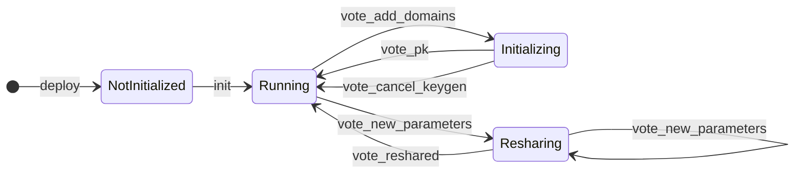

# MPC Contract

This folder contains the code for the **MPC Contract**, which is deployed on the [NEAR blockchain](https://nearblocks.io/address/v1.signer).

This code will be moved to its own repository in the near future (c.f. [issue #417](https://github.com/Near-One/mpc/issues/417)).

### Role of the contract in Chain Signatures:

This contract serves as an API-endpoint to the MPC network. Users can submit signature requests via this contract and MPC Participants can vote on changes to the MPC network, such as:

- Changing the set of MPC participants
- Adjusting the crypographic threshold
- Generating new distributed keys
- Updating the contract code


### Contract State

The contract tracks the following information:
- Pending signature requests
- Current participant set of the MPC network
- Current set of keys managed by the MPC network (each key is associated to a unique `domain_id`)
- (Currently unused) metadata related to trusted execution environments
- Current protocol state of the MPC network (see [Protocol State and Lifecycle](#protocol-state).


## Usage

### Submitting a signature Request

Users can submit a signature request to the MPC network via the `sign` endpoint of this contract. Note that a **deposit of 1 yoctonear is required** to prevent abuse by malicious frontends.

The sign request takes the following arguments:
* `path` (String): the derivation path (used for key-derivation).
* `payload_v2`: either
   * `{"Ecdsa": "<hex encoded 32 bytes>"}` or
   * `{"Eddsa": "<hex encoded between 32 and 1232 bytes>"}`
* `domain_id` (integer): identifies the key to use for generating the signature. Note that the payload type must match the associated signature scheme. 

Submitting a signature request costs approximately 7 Tgas, but the contract requires that at least 10 Tgas are attached to the transaction.

**Example**

_ECDSA Signature Request_
```Json
{
  "request": {
    "payload_v2": {
      "Ecdsa": "521da91dc9bddb625bd0679d9e735def558761a34653624f5954f44bce6443a9"
    },
    "path": "sepolia-1",
    "domain_id": 0
  }
}
```

_EDDSA Signature Request_
```Json
{
  "request": {
    "payload_v2": {
      "Eddsa": "521da91dc9bddb625bd0679d9e735def558761a34653624f5954f44bce6443a9"
    },
    "path": "sepolia-1",
    "domain_id": 0
  }
}
```

#### Ecdsa palyoad restrictions
Note that an Ecdsa payload is subsequently represented as a Scalar on curve Secp256k1. This means that the payload must be strictly less than the field size `p = FFFFFFFF FFFFFFFF FFFFFFFF FFFFFFFF FFFFFFFF FFFFFFFF FFFFFFFE FFFFFC2F` (see also [curve parameters](https://www.secg.org/sec2-v2.pdf#subsubsection.2.4.1) and [k256 implementation details](https://docs.rs/k256/latest/k256/struct.Scalar.html#method.from_repr)).

### Changing the participant set

The set of MPC participants can be changed, subject to following restrictions:
- There must at least be `thershold` (the current threshold) number of current participants in the prospective participant set.
- The prospective threshold must be at least 60% of the number of participants (rounded upwards).
- The set of participants must have at least two participants.

In order for a change to be accepted by the contract, all prospective participants must vote for it using the `vote_new_participants` endpoint. Note that any new participants vote will only be accepted after at least `threshold` (the current threshold) old participants voted for the same participant set.


**Example**
```Json
{
  "prospective_epoch_id":1,
  "proposal":{
    "threshold":3,
    "participants":{
      "next_id":2,
      "participants":[
        [
          "mpc-participant0.near",
          0,
          {
            "sign_pk":"ed25519:2XPuwqhg71RXRiTUMKGapd8FYWgXnxVvydYBK9tS1ex2",
            "url":"http://mpc-service0.com"
          }
        ],
        [
          "mpc-participant1.near",
          1,
          {
            "sign_pk":"ed25519:2XPuwqhg71RXRiTUMKGapd8FYWgXnxVvydYBK9tS1ex2",
            "url":"http://mpc-service1.com"
          }
        ]
      ]
    }
  }
}


```
### Adding a Key
To generate a new threshold signature key, all participants must vote for it to be added via `vote_new_domain`. Only votes from existing participants will be accepted.

```Json
{
  "domains":[
    {
      "id":2,
      "scheme":"Secp256k1"
    },
    {
      "id":3,
      "scheme":"Ed25519"
    }
  ]
}
```


### Deployment 

After deploying the contract, it will first be in an uninitialized state. The owner will need to initialize it via `init`, providing the set of participants and threshold parameters.

The contract will then switch to running state, where further operations (like initializing keys, or changing the participant set), can be taken.

### Protocol State
The following protocol state transitions are allowed.


## Contract API
#### User API

| Function                                                                                     | Behavior                                                                                                 | Return Value               | Gas requirement | Effective Gas Cost |
| -------------------------------------------------------------------------------------------- | -------------------------------------------------------------------------------------------------------- | -------------------------- | --------------- | ------------------ |
| `sign(request: SignRequestArgs)`                                                             | Submits a signature request to the contract. Requires a deposit of 1 yoctonear. Re-submitting the same request before the original request timed out or has been responded to may cause both requests to fail. | deferred to promise        | `10 Tgas`       | `~7 Tgas`          |
| `public_key(domain: Option<DomainId>)`                                                       | Read-only function; returns the public key used for the given domain (defaulting to first).              | `Result<PublicKey, Error>` |                 |                    |
| `derived_public_key(path: String, predecessor: Option<AccountId>, domain: Option<DomainId>)` | Generates a derived public key for a given path and account, for the given domain (defaulting to first). | `Result<PublicKey, Error>` |                 |                    |

#### SignRequestArgs (Latest version)
The sign request takes the following arguments:
* `path` (String): the derivation path.
* `payload_v2`: either `{"Ecdsa": "<hex encoded 32 bytes>"}` or `{"Eddsa": "<hex encoded between 32 and 1232 bytes>"}`
* `domain_id` (integer): the domain ID that identifies the key and signature scheme to use for signing.

#### SignRequestArgs (Legacy version for backwards compatibility with V1)
* The legacy argument `payload` can be used in place of `payload_v2`; the format for that is an array of 32 integer bytes. This argument can only be used
  to pass in an ECDSA payload.
* The legacy argument `key_version` can be used in place of `domain_id` and means the same thing.

#### Participants API
These functions require the caller to be a participant or candidate.

| Function                                                                            | Behavior                                                                                                                                                                                                                                | Return Value              | Gas Requirement | Effective Gas Cost |
| ----------------------------------------------------------------------------------- | --------------------------------------------------------------------------------------------------------------------------------------------------------------------------------------------------------------------------------------- | ------------------------- | --------------- | ------------------ |
| `respond(request: SignatureRequest, response: SignatureResponse)`                   | Processes a response to a signature request, verifying its validity and ensuring proper state cleanup.                                                                                                                                  | `Result<(), Error>`       | 10Tgas          | ~6Tgas             |
| `vote_add_domains(domains: Vec<DomainConfig>)`                                      | Votes to add new domains (new keys) to the MPC network; newly proposed domain IDs must start from next_domain_id and be contiguous.                                                                                                     | `Result<(), Error>`       | TBD             | TBD                |
| `vote_new_parameters(prospective_epoch_id: EpochId, proposal: ThresholdParameters)` | Votes to change the set of participants as well as the new threshold for the network. (Prospective epoch ID must be 1 plus current)                                                                                                     | `Result<(), Error>`       | TBD             | TBD                |
| `vote_code_hash(code_hash: CodeHash)`                                               | Votes to add new whitelisted TEE Docker image code hashes.                                                                                                                                                                              | `Result<(), Error>`       | TBD             | TBD                |
| `start_keygen_instance(key_event_id: KeyEventId)`                                   | For Initializing state only. Starts a new attempt to generate a key (key_event_id must be the expected one)                                                                                                                             | `Result<(), Error>`       | TBD             | TBD                |
| `start_resharing_instance(key_event_id: KeyEventId)`                                | For Resharing state only. Starts a new attempt to reshare a key (key_event_id must be the expected one)                                                                                                                                 | `Result<(), Error>`       | TBD             | TBD                |
| `vote_pk(key_event_id: KeyEventId, public_key: PublicKey)`                          | For Initializing state only. Votes for the public key for the given generation attempt; if enough votes are collected, transitions to the next domain to generate a key for, or if all domains are completed, transitions into Running. | `Result<(), Error>`       | TBD             | TBD                |
| `vote_reshared(key_event_id: KeyEventId)`                                           | For Resharing state only. Votes for the success of the given resharing attempt; if enough votes are collected, transitions to the next domain to reshare for, or if all domains are completed, transitions into Running.                | `Result<(), Error>`       | TBD             | TBD                |
| `vote_cancel_keygen(next_domain_id: u64)`                                           | For Initializing state only. Votes to cancel the key generation (identified by the next_domain_id) and revert to the Running state.                                                                                                     | `Result<(), Error>`       | TBD             | TBD                |
| `propose_update(args: ProposeUpdateArgs)`                                           | Proposes an update to the contract, requiring an attached deposit.                                                                                                                                                                      | `Result<UpdateId, Error>` | TBD             | TBD                |
| `vote_update(id: UpdateId)`                                                         | Votes on a proposed update. If the threshold is met, the update is executed.                                                                                                                                                            | `Result<bool, Error>`     | TBD             | TBD                |
| `propose_join(proposed_tee_participant: TeeParticipantInfo, signer_pk: PublicKey)` | Submits the tee participant info for a potential candidate. c.f. TEE section | `Result<(), Error>` | TBD | TBD |

#### Developer API

| Function                                                                   | Behavior                                                                                                                                                                                                                                 | Return Value             | Gas Requirement | Effective Gas Cost |
| -------------------------------------------------------------------------- | ---------------------------------------------------------------------------------------------------------------------------------------------------------------------------------------------------------------------------------------- | ------------------------ | --------------- | ------------------ |
| `init(parameters: ThresholdParameters, init_config: Option<InitConfigV1>)` | Initializes the contract with a threshold, candidate participants, and config values. Can only be called once. This sets the contract state to `Running` with zero domains. vote_add_domains can be called to initialize key generation. | `Result<Self, Error>`    | TBD             | TBD                |
| `state()`                                                                  | Returns the current state of the contract.                                                                                                                                                                                               | `&ProtocolContractState` | TBD             | TBD                |
| `get_pending_request(request: &SignatureRequest)`                          | Retrieves pending signature requests.                                                                                                                                                                                                    | `Option<YieldIndex>`     | TBD             | TBD                |
| `config()`                                                                 | Returns the contract configuration.                                                                                                                                                                                                      | `&ConfigV1`              | TBD             | TBD                |
| `version()`                                                                | Returns the contract version.                                                                                                                                                                                                            | `String`                 | TBD             | TBD                |
| `update_config(config: ConfigV1)`                                          | Updates the contract configuration for `V1`.                                                                                                                                                                                             | `()`                     | TBD             | TBD                |


## Development
Note that due to the Rust compiler version used in this project and a lack of compatibility with the runtime version used in near-workspaces,
we need to use wasm-opt to strip the contract of unused features. Otherwise the contract cannot be deserialized by near-workspaces runtime.

```
cargo build --release --target=wasm32-unknown-unknown
wasm-opt -Oz -o target/wasm32-unknown-unknown/release/mpc_contract.wasm target/wasm32-unknown-unknown/release/mpc_contract.wasm
```


## TEE Specific information
The MPC nodes will eventually run inside a Trusted Execution Environments (TEE). The network is currently in a transitioning period, where both operation modes (TEE and non-TEE) are supported, however, the TEE support is at least as of June 2025, highly experimental and not stable.


Participants that run their node inside a TEE will have to submit the following TEE related data to the contract:
```
pub struct TeeParticipantInfo {
    /// TEE Remote Attestation Quote that proves the participant's identity.
    pub tee_quote: Vec<u8>,
    /// Supplemental data for the TEE quote, including Intel certificates to verify it came from
    /// genuine Intel hardware, along with details about the Trusted Computing Base (TCB)
    /// versioning, status, and other relevant info.
    pub quote_collateral: String,
    /// Dstack event log.
    pub raw_tcb_info: String,
}
```

The prospective node operator can retrieve that data from the web endpoint (`:8080/get_public_data`).

The process of doing so is as follows:
1. The prospective participants set up their MPC inside their TEE environment (todo: [#550](https://github.com/near/mpc/issues/550), documentation to follow).
2. The prospective participants fetch their TEE related information from their logs.
3. The prospective participants add the `near_signer_public_key` from the web endpoint (`:8080/get_public_data`) as an access key to their node operator account, eligible for calling the MPC contract (`v1.signer` on mainnet or `v1.signer-prod.testnet` on testnet). Participants should provide sufficient funding to this key.
4. The prospective participants add the `near_responder_public_keys` from the web endpoint to a different account and provide sufficient funding to it.
3. The participants submit their data to the contract via `propose_join`.
