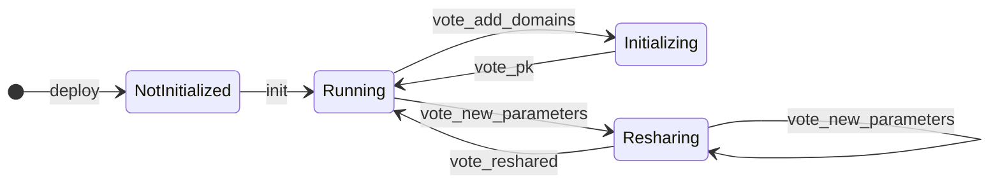

# MPC Contract

This folder contains the code for the **MPC Contract**, which is deployed on the NEAR blockchain.

The contract aims to reflect the current state of the MPC-Network and allows users to submit signature requests via the `sign` [endpoint](#user-api).

**Benchmarks:**

| Contract | avg. receipts | avg. gas [Tgas]   |
| -------- | ------------- | ----------------- |
| V0       | 8             | 11.30479597562405 |
| V1       | 4             | 6.131075775468398 |
| V2       | tbd           | tbd               |

**Migration Considerations:** Migration from `V1` to `V2` will not affect how **users** interact with the contract, but
will require the **MPC nodes** to switch to the newer compatible version at the same time.

### State and Lifecycle

The contract state tracks pending signature requests, the current configuration of the contract as well as any updates to the contract that are proposed by Participants of the MPC-Network via the `update` [endpoint](#participants-api).

```Rust
pub struct MpcContract {
    protocol_state: ProtocolContractState,
    pending_requests: LookupMap<SignatureRequest, YieldIndex>,
    request_by_block_height: Vector<(u64, SignatureRequest)>,
    proposed_updates: ProposedUpdates,
    config: Config,
}
```

The **Protocol State** of the contract should reflect the state of the MPC-Network:


### Contract API
#### User API

| Function                                                                                     | Behavior                                                                                                                                  | Return Value                                                              | Gas requirement | Effective Gas Cost              |
| -------------------------------------------------------------------------------------------- | ----------------------------------------------------------------------------------------------------------------------------------------- | ------------------------------------------------------------------------- | --------------- | ------------------------------- |
| `remove_timed_out_requests(max_num_to_remove: Option<u32>)`                                  | Removes at most `max_num_to_remove` timed out signature requests from the contract state (defaulting to the value defined in the config). | `32`: number of signature requests that have been removed from the state. | -               | `~0.4 Tgas` per removed request |
| `sign(request: SignRequest)`                                                                 | Submits a signature request to the contract. Requires a deposit of 1 yoctonear                                                            | deferred to promise                                                       | `10 Tgas`       | `~6 Tgas`                       |
| `public_key(domain: Option<DomainId>)`                                                       | Read-only function; returns the public key used for the given domain (defaulting to first).                                               | `Result<PublicKey, Error>`                                                |                 |                                 |
| `derived_public_key(path: String, predecessor: Option<AccountId>, domain: Option<DomainId>)` | Generates a derived public key for a given path and account, for the given domain (defaulting to first).                                  | `Result<PublicKey, Error>`                                                |                 |                                 |


#### Participants API
These functions require the caller to be a participant or candidate.

| Function                                                          | Behavior                                                                                                                                                                                                                                | Return Value              | Gas Requirement | Effective Gas Cost |
| ----------------------------------------------------------------- | --------------------------------------------------------------------------------------------------------------------------------------------------------------------------------------------------------------------------------------- | ------------------------- | --------------- | ------------------ |
| `respond(request: SignatureRequest, response: SignatureResponse)` | Processes a response to a signature request, verifying its validity and ensuring proper state cleanup.                                                                                                                                  | `Result<(), Error>`       | 10Tgas          | ~6Tgas             |
| `vote_add_domains(domains: Vec<DomainConfig>)`                    | Votes to add new domains (new keys) to the MPC network.                                                                                                                                                                                 | `Result<(), Error>`       | TBD             | TBD                |
| `vote_new_parameters(proposal: ThresholdParameters)`              | Votes to change the set of participants as well as the new threshold for the network.                                                                                                                                                   | `Result<(), Error>`       | TBD             | TBD                |
| `start_keygen_instance()`                                         | For Initializing state only. Starts a new attempt to generate a key                                                                                                                                                                     | `Result<(), Error>`       | TBD             | TBD                |
| `start_resharing_instance()`                                      | For Resharing state only. Starts a new attempt to reshare a key                                                                                                                                                                         | `Result<(), Error>`       | TBD             | TBD                |
| `vote_pk(key_event_id: KeyEventId, public_key: PublicKey)`        | For Initializing state only. Votes for the public key for the given generation attempt; if enough votes are collected, transitions to the next domain to generate a key for, or if all domains are completed, transitions into Running. | `Result<(), Error>`       | TBD             | TBD                |
| `vote_reshared(key_event_id: KeyEventId)`                         | For Resharing state only. Votes for the success of the given resharing attempt; if enough votes are collected, transitions to the next domain to reshare for, or if all domains are completed, transitions into Running.                | `Result<(), Error>`       | TBD             | TBD                |
| `vote_cancel_keygen()`                                            | For Initializing state only. Votes to cancel the key generation and revert to the Running state.                                                                                                                                        | `Result<(), Error>`       | TBD             | TBD                |
| `propose_update(args: ProposeUpdateArgs)`                         | Proposes an update to the contract, requiring an attached deposit.                                                                                                                                                                      | `Result<UpdateId, Error>` | TBD             | TBD                |
| `vote_update(id: UpdateId)`                                       | Votes on a proposed update. If the threshold is met, the update is executed.                                                                                                                                                            | `Result<bool, Error>`     | TBD             | TBD                |


#### Developer API

| Function                                                                   | Behavior                                                                                                                                                                                                                                 | Return Value             | Gas Requirement | Effective Gas Cost |
| -------------------------------------------------------------------------- | ---------------------------------------------------------------------------------------------------------------------------------------------------------------------------------------------------------------------------------------- | ------------------------ | --------------- | ------------------ |
| `init(parameters: ThresholdParmaeters, init_config: Option<InitConfigV1>)` | Initializes the contract with a threshold, candidate participants, and config values. Can only be called once. This sets the contract state to `Running` with zero domains. vote_add_domains can be called to initialize key generation. | `Result<Self, Error>`    | TBD             | TBD                |
| `state()`                                                                  | Returns the current state of the contract.                                                                                                                                                                                               | `&ProtocolContractState` | TBD             | TBD                |
| `get_pending_request(request: &SignatureRequest)`                          | Retrieves pending signature requests.                                                                                                                                                                                                    | `Option<YieldIndex>`     | TBD             | TBD                |
| `config()`                                                                 | Returns the contract configuration.                                                                                                                                                                                                      | `&ConfigV1`              | TBD             | TBD                |
| `version()`                                                                | Returns the contract version.                                                                                                                                                                                                            | `String`                 | TBD             | TBD                |
| `update_config(config: ConfigV1)`                                          | Updates the contract configuration for `V1`.                                                                                                                                                                                             | `()`                     | TBD             | TBD                |


## Development
Run tests with `cargo nextest run -p mpc-contract@2.0.0-alpha`
