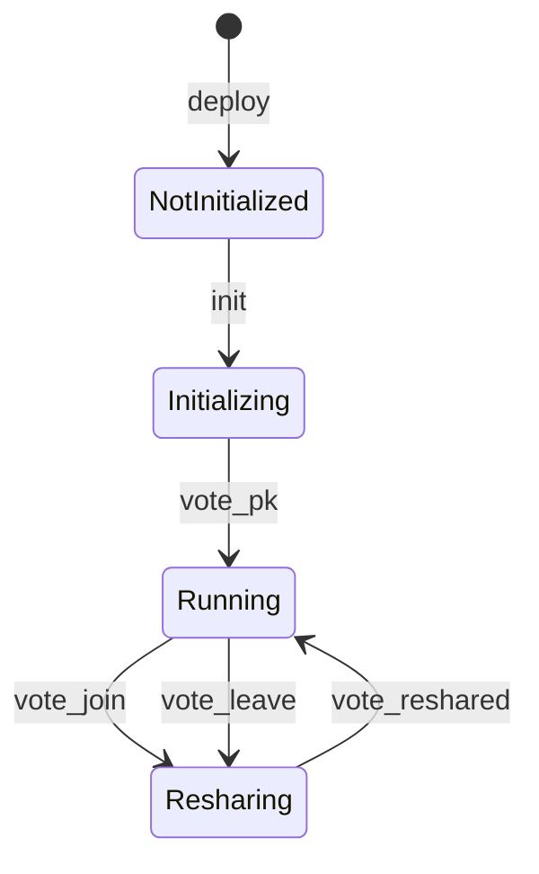

# MPC Contract

This folder contains the code for the **MPC Contract**, which is deployed on the NEAR blockchain.

The contract aims to reflect the current state of the MPC-Network and allows users to submit signature requests via the `sign` [endpoint](#user-api).

The currently deployed version of the contract is `V0`, with `V1` expected to be deployed in Q1 of 2025. Contract `V1` will introduce several efficiency improvements:

- **Lower gas costs**: Signature requests in `V1` will consume approximately half the gas compared to `V0`, mainly due to optimizations in state handling and reducing the number of receipts required per request. T
- **Removal of the signature request limit**: `V0` imposed a hard limit on the number of signature requests, which `V1` removes. This limit was necessary for [previous MPC nodes](https://github.com/near/mpc/releases/tag/1.0.0-rc.5), but is no longer required due to performance improvements by the [current release](https://github.com/Near-One/mpc/releases/tag/testnet-upgrade) (currently on testnet). 

**Benchmarks:**

| Contract  | avg. receipts | avg. gas [Tgas] |
| ------------- | ------------- | ------------- |
| V0  | 8  |11.30479597562405|
| V1  | 4  |6.131075775468398 |

**Migration Considerations:** Migration from `V0` to `V1` will not affect how users interact with the contract.

## `V1` Contract Details
### State and Lifecycle

The contract state tracks pending signature requests, the current configuartion of the contract as well as any updates to the contract that are proposed by Participants of the MPC-Network via the `update` [endpoint](#participants-api).

```Rust
pub struct MpcContractV1 {
    protocol_state: ProtocolContractState,
    pending_requests: LookupMap<SignatureRequest, YieldIndex>,
    request_by_block_height: Vector<(u64, SignatureRequest)>,
    proposed_updates: ProposedUpdates,
    config: ConfigV1,
}
```

The **Protocol State** of the contract should reflect the state of the MPC-Network:


### Contract API
#### User API

| Function | Behavior |  Return Value | Gas requirement | Effective Gas Cost |
| ---- | --- | --- | --- | --- |
| `remove_timed_out_requests(max_num_to_remove: Option<u32>)` | Removes at most `max_num_to_remove` timed out signature requests from the contract state (defaulting to the value defined in the config). | `32`: number of signature requests that have been removed from the state. | - | `~0.4 Tgas` per removed request |
| `sign(request: SignRequest)` | Submits a signature request to the contract. | deferred to promise | `10 Tgas` | `~6 Tgas` | 
| `public_key()` | | the aggregated public key used by all participants in the network. | `Result<PublicKey, Error>` | |
| `derived_public_key(path: String, predecessor: Option<AccountId>)` | Generates a derived public key for a given path and account. | `Result<PublicKey, Error>` | |
| `experimental_signature_deposit()` |  | `U128`: the required deposit for a signature request | |  |


#### Participants API
These functions require the caller to be a participant or candidate.

| Function | Behavior | Return Value | Gas Requirement | Effective Gas Cost |
| ---- | --- | --- | --- | --- |
| `respond(request: SignatureRequest, response: SignatureResponse)` | Processes a response to a signature request, verifying its validity and ensuring proper state cleanup. | `Result<(), Error>` | TBD | TBD |
| `join(url: String, cipher_pk: primitives::hpke::PublicKey, sign_pk: PublicKey)` | Allows a node to join the network by submitting necessary public keys and a URL. | `Result<(), Error>` | TBD | TBD |
| `vote_join(candidate: AccountId)` | Votes to accept a candidate node into the network. If the threshold is met, the candidate is added as a participant. | `Result<bool, Error>` | TBD | TBD |
| `vote_leave(kick: AccountId)` | Votes to remove a participant from the network. If the threshold is met, the participant is removed. | `Result<bool, Error>` | TBD | TBD |
| `vote_pk(public_key: PublicKey)` |  When the protocol is in `Initializing` state:<br>  - Stores votes to establish a new public key for the network to the protocol state.  <br>  - Changes the protocol state from `Initializing` to `Running` when a public key receives `threshold` votes. The participant set of the new protocol state will be the current candidate set.  <br><br> When the protocol is in `Running` or `Resharing` state:  <br>  - Allows the participant to verify if `public_key` matches the public key stored in the protocol state. | `Result<bool, Error>` | TBD | TBD |
| `vote_reshared(epoch: u64)` | Votes to complete the key resharing process for a new epoch. | `Result<bool, Error>` | TBD | TBD |
| `propose_update(args: ProposeUpdateArgs)` | Proposes an update to the contract, requiring an attached deposit. | `Result<UpdateId, Error>` | TBD | TBD |
| `vote_update(id: UpdateId)` | Votes on a proposed update. If the threshold is met, the update is executed. | `Result<bool, Error>` | TBD | TBD |


#### Developer API

| Function | Behavior | Return Value | Gas Requirement | Effective Gas Cost |
| ---- | --- | --- | --- | --- |
| `init(threshold: usize, candidates: BTreeMap<AccountId, CandidateInfo>, init_config: Option<InitConfigV1>)` | Initializes the contract with a threshold, candidate participants, and config values. Can only be called once. This sets the contract state to `Initializing`, where it will stay until `threshold` number of candidates have agreed on a public key by submitting their vote to `vote_pk`. | `Result<Self, Error>` | TBD | TBD |
| `state()` | Returns the current state of the contract. | `&ProtocolContractState` | TBD | TBD |
| `get_pending_request(request: &SignatureRequest)` | Retrieves pending signature requests. | `Option<YieldIndex>` | TBD | TBD |
| `config()` | Returns the contract configuration. | `&ConfigV1` | TBD | TBD |
| `version()` | Returns the contract version. | `String` | TBD | TBD |
| `update_config(config: ConfigV1)` | Updates the contract configuration for `V1`. | `()` | TBD | TBD |


